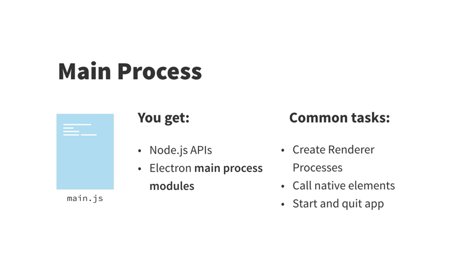
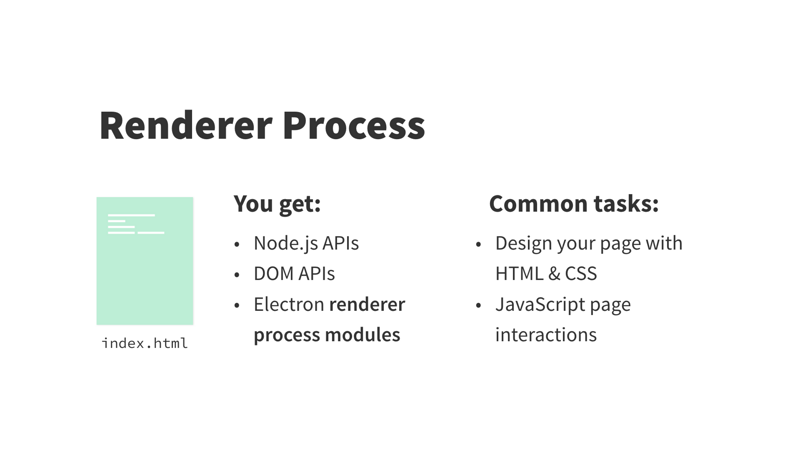

# Electron

Electron 是一个可以用 JavaScript、HTML 和 CSS 构建桌面应用程序的库。Electron 通过 Googles Chromium Content Module 来使用 Chromium 的功能，同时集成 Node 来授予网页访问底层系统的权限。

使用Electron开发的应用程序能打包到 Mac、Windows 和 Linux 系统上运行，也能上架到 Mac 和 Windows 的 App Store。

Electron 对底层代码进行抽象和封装，这样可以使用Web编程语言编写一次（JS）就可以使得程序能够在不同的操作系统上运行。

> * API：应用程序接口（Application Program Interface）描述了库提供的函数集。
> * Chromium：Google 创造的一个开源库，并用于 Google 的浏览器 Chrome。
> * Node.js（Node）：一个在服务器运行 JavaScript 的运行时（runtime），它拥有访问文件系统和网络权限

开发Electron应用的主要开发能力要求是：HTML, CSS 和 JS 。

# Electron进程

Electron有两种进程：主进程和渲染进程。

主进程在后台运行，通常是一个命名为 main.js 的文件，该文件是每个 Electron 应用的入口。它控制了应用的生命周期（从打开到关闭）。它既能调用原生元素，也能创建新的（多个）渲染进程。另外，Node API 是内置其中的。

渲染进程则是应用程序的各个窗口。能存在多个（注：一个 Electron 应用只能存在一个主进程）并且相互独立（它也能是隐藏的）。主窗口通常被命名为 index.html。它们就像典型的 HTML 文件，但 Electron 赋予了它们完整的 Node API。因此，这也是它与浏览器的区别。

> 出于安全考虑，渲染进程是不能直接访问本地资源的，因此打开 diglog 和其它操作系统的交互均等资源密集型操作都需要在主进程完成。

# 参考

* [【译】Electron 的本质](https://segmentfault.com/a/1190000007503495)
* [Electron 原理](https://blog.csdn.net/u011483206/article/details/74327939)