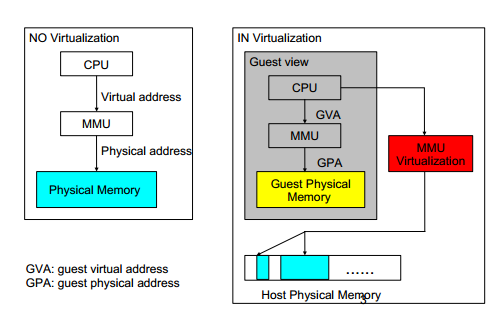
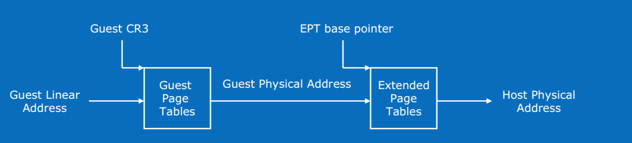

传统OS环境中，CPU对内存的访问都必须通过MMU将虚拟地址VA转换为物理地址PA从而得到真正的Physical Memory Access,即：VA->MMU->PA

# 内存虚拟化

MMU的虚拟化:

* 影子页表(Shadow Page Table)

影子页表是纯软件的MMU虚拟化方案，Guest OS维护的页表负责GVA到GPA的转换，而KVM会维护另外一套影子页表负责GVA到HPA的转换。真正被加载到物理MMU中的页表是影子页表。

在多进程Guest OS中，每个进程有一套页表，进程切换时也需要切换页表，这个时候就需要清空整个TLB，使所有影子页表的内容无效。但是某些影子页表的内容可能很快就会被再次用到，而重建影子页表是一项十分耗时的工作，因此又需要缓存影子页表。

* EPT(Extended Page Table)

为了解决影子页表的低效，VT-x(Intel虚拟化技术方案)提供了Extended Page Table(EPT)技术,直接在硬件上支持了GVA->GPA->HPA的两次地址转换，大大降低了内存虚拟化的难度，也大大提高了性能。

# EPT原理

* GVA: Guest Virtual Address
* GPA: Guest Physical Address
* HVA: Host Virtual Address
* HPA: Host Physical Address

* CPU首先查找Guest CR3指向的L4页表；
* 由于Guest CR3给出的是GPA，CPU需要查EPT页表；
* 如果EPT页表中不存在该地址对应的查找项，则Guest Mode产生EPT Violation异常由VMM来处理；
* 获取L4页表地址后，CPU根据GVA和L4页表项的内容，来获取L3页表项的GPA;
* 如果L4页表中GVA对应的表项显示为缺页，那么CPU产生Page Fault,直接交由Guest Kernel处理，注意这里不会产生VM-Exit；
* 获得L3页表项的GPA后，CPU同样查询EPT页表，过程和上面一样；
* L2，L1页表的访问也是如此，直至找到最终于与GPA对应的HPA。

> GPA到HPA的映射关系由EPT页表来维护

# 参考

* [KVM硬件辅助虚拟化之 EPT(Extended Page Table)](http://royluo.org/2014/06/18/KVM-EPT/)
* [intel EPT 机制详解](https://www.cnblogs.com/ck1020/p/6043054.html)
* [CPU硬件辅助虚拟化技术](http://blog.51cto.com/tasnrh/1736769)