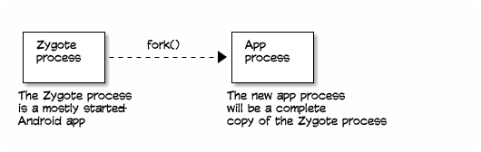
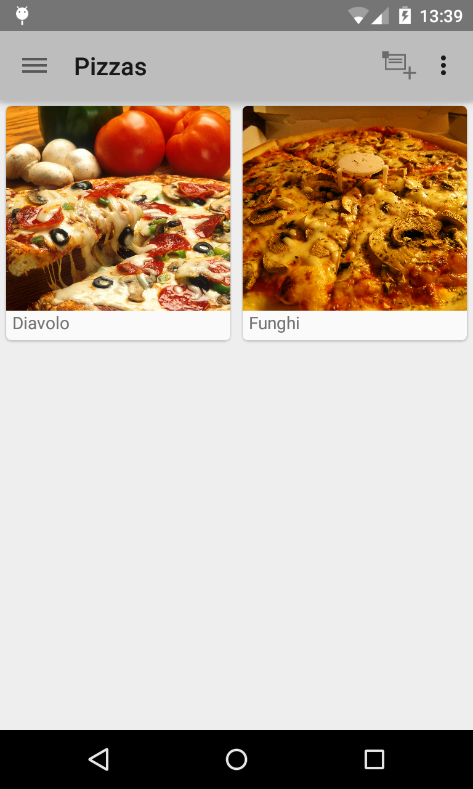

> Android Studio可以实现app的编译和运行，但是，按下`Run`按钮的背后发生了什么？

# 应用是如何编译的

## Java编译

你的(app)代码是使用Java编写的，但是这个Java编译和运行的方法，和web应用程序是一样的吗？

Android apps的编译过程和其他Java应用程序`非常不同`。但是开始过程是一样的：你的Java源代码使用`javac`命令被编译成`.class`文件。


这改变了Java代码类似

```java
public MainActivity() {
  super();
  currentPosition = 0;
}
```

转变成Java字节码表述类似：

```java
public com.hfad.bitsandpizzas.MainActivity();
  Code:
   0:	aload_0
   1:	invokespecial	#5; //Method android/app/Activity."<init>":()V
   4:	aload_0
   5:	iconst_0
   6:	putfield	#3; //Field currentPosition:I
   9:	return
```

## 转换成Dalvik字节码

`.class`文件包含了标准的Oracle JVM字节码。但是Android设备不是使用这种字节码各是。相反，Android使用自己的不同的称为`Dalvik`字节码格式。`Dalvik`字节码，类似Oracle JVM字节码，是面向一个理论处理器的主机代码指令。

编译过程需要转换`.class`文件，以及任何`.jar`库，转换成一个单一的包含Dalvik字节码的`classes.dex`文件。这个转换过程是通过`dx`命令实现的。


这个`dx`命令将所有的`.class`文件和`.jar`文件编译成一个单一的以`Dalvik`字节码格式`classes.dex`文件。

原始的Java代码被Dalvik编译成类似如下：

```
0x0000: iput-object v1, v0, Lcom/hfad/bitsandpizzas/MainActivity; com.hfad.bitsandpizzas.MainActivity$2.this$0 // field@4869
0x0002: invoke-direct {v0}, void java.lang.Object.<init>() // method@13682
0x0005: return-void
```

## 将`classes.dex`和资源加入到一个包文件

`classes.dex`文件和应用程序的资源，例如图片和layout，被打包压缩成一个类似zip的文件，称为Android包，或者`.apk`文件。这时通过Android Asset Packaging Tool，或称为`aapt`:


这个`.apk`文件就是用于分发的应用程序包。

## 进一步：也可以对`.apk`文件签名

当需要通过Google Play Store分发应用app，就需要对`.apk`文件签名。对一个app包签名就是在`.apk`文件中存储一个附加文件，即`.apk`文件内容的校验和以及独立生成的私钥。

这个`.apk`文件使用一个标准的`jarsigner`工具生成（该工具是Oracle Java Development Kit的一个组件）。这个`jarsigner`工具专用于对`.jar`文件签名，但是也可以对已经zip压缩过的`.apk`文件。

如果你签名`.apk`文件，你也会需要运行一个称为`zipalign`的工具，以确保压缩文件的部分在字节边界对齐。Android希望签名文件字节对齐，这样就可以直接读取而不需要解压缩文件。


# Android程序是如何部署的

## 如果`adb`服务器没有运行则启动

当使用Android Debug Bridge(adb)将一个app部署到Android时被是。这个过程在你的开发客户端运行了一个`adb`服务器进程以及在Android设备中运行相似的`adb`服务。如果在你的主机上没有运行`adb`进程，则`adb`命令会启动它。


`adb`进程将启动一个网络socket，并且监听在端口`5037`的命令。每个输入的`adb`命令都将发送指令给这个端口。

> 默认`adb`访问android是非root权限，所以有些目录不能直接读取。如果要访问需要root权限的目录，可以在主机上先执行`adb root`重启`adbd`服务使之具有root权限，就可以访问Android设备的任何目录。参考[Android: adb: Permission Denied](https://stackoverflow.com/questions/7399028/android-adb-permission-denied))

## `.apk`文件被传输到设备

`adb`命令用于传输`.apk`文件到Android设备的文件系统中。这个位置是在app的`package-name`定义的。所以，如果包的名字是`com.hfad.bitsandpizzas`，则这个`.apk`文件将位于`/data/app/com.hfad.bitsandpizzas`


# 如果运行Android app

最近Android apps运行方式有所修改。从API level 21开始，较为旧的Dalvik虚拟机被新的Android Runtime替代。以下是过程

## 当一个用户启动app

一个称为`Zygote`的进程用于加载app。Zygote是一个Android的非完整版本 - 它的内存空间包含了运行一个app所需要的所有核心库，但是它不包括任何针对特定app的代码。

Zygote通过`fork`系统调用创建一个自身的副本。Android是一个Linux系统，并且类似Zygote这样的`fork`出自己进程的副本是`非常`迅速的。这时因为Zygote进程用于：它比Zygote这样的半启动进程创建副本要快很多，然后它从主系统文件系统调用一个新的进程。Zygote意味着你的app启动更快。

> Zygote相当于基础库系统，始终运行。在加载应用前，它首先fork出自身的一个副本，这样就大大加快了库的加载（因为所有程序都需要这部分库）。



## Android转换`.dex`代码到原生的OAT格式

现在一个新的app进程需要加载特定app的代码。请记住，你的app代码是存储在`.apk`软件包中的`classes.dex`文件中。所以这个`classes.dex`文件被从`.apk`中解压缩并村存放到一个独立的目录。但是，并不是简单从`classes.dex`文件复制一个副本出来。Android将转换存储在`classes.dex`的Dalvik字节码成为`原生机器码`。

也就是，原先作为Java代码的所有代码被转换成一份原生的编译过的代码。技术上说，这个`classes.dex`将会被转换成ELF共享对象。Android成这个`OAT`格式的库和转换`classes.dex`文件的工具为`dex2oat`。


这个转换后的文件被存储在类似以下命名的目录中：

```
/data/dalvik-cache/x86/data@app@com.hfad.bitsandpizzas@base.apk@classes.dex
```

这个路径包括了app的包名字，以确保不会被其他app所覆盖。

这个转换后的代码是针对Android设备CPU的机器码。例如，如果Android设备是x86，则OAT文件将类似如下：

```
0x001db888:         85842400E0FFFF    	test    eax, [esp + -8192]
suspend point dex PC: 0x0000
GC map objects:  v0 (r5), v1 (r6)
0x001db88f:                 83EC1C    	sub     esp, 28
0x001db892:               896C2410    	mov     [esp + 16], ebp
0x001db896:               89742414    	mov     [esp + 20], esi
0x001db89a:               897C2418    	mov     [esp + 24], edi
0x001db89e:                   8BF8    	mov     edi, eax
0x001db8a0:                 890424    	mov     [esp], eax
...
```

## app加载原生库

原生库随后被直接映射到app进程所在的内存中：


从这里开始，app开始启动初始化动作，并且app显示在屏幕上：



# 参考

* [How Android Apps are Built and Run](https://github.com/dogriffiths/HeadFirstAndroid/wiki/How-Android-Apps-are-Built-and-Run) - 本文翻译自「Head First Android」的「How Android Apps are Built and Run」