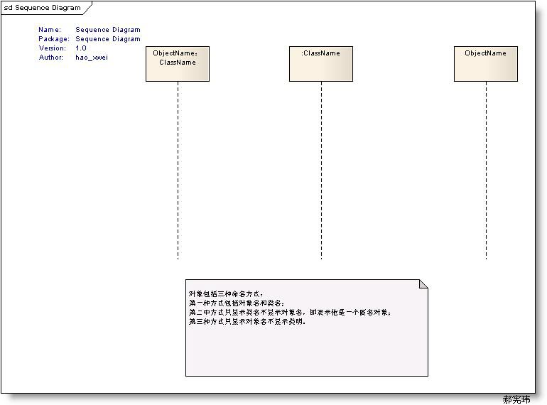
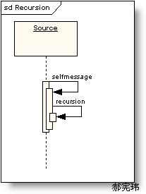

# UML类图

以下类图体现了类之间的关系

* 车的类图结构为`<<abstract>>`，表示车是一个抽象类；
* 它有两个继承类：小汽车和自行车；它们之间的关系为实现关系，使用带空心箭头的虚线表示；
* 小汽车为与SUV之间也是继承关系，它们之间的关系为泛化关系，使用带空心箭头的实线表示；
* 小汽车与发动机之间是组合关系，使用带实心箭头的实线表示；
* 学生与班级之间是聚合关系，使用带空心箭头的实线表示；
* 学生与身份证之间为关联关系，使用一根实线表示；
* 学生上学需要用到自行车，与自行车是一种依赖关系，使用带箭头的虚线表示；

# 类之间的关系

* 类的继承：类的继承结构表现在UML中为 泛化(generalize)与实现(realize)

## 泛化关系(generalization)

继承关系为 is-a的关系；两个对象之间如果可以用 is-a 来表示，就是继承关系：（..是..)

eg：自行车是车、猫是动物

泛化关系用一条带空心箭头的直接表示；如下图表示（A继承自B）；

> 注：最终代码中，泛化关系表现为继承非抽象类

> 我的理解：泛化的关系相当于父类已经是一个实现（真实存在的对象），然后对实现进行继承，就是泛化（再次实现）。

## 实现关系(realize)

实现关系用一条带空心箭头的虚线表示；

eg：”车”为一个抽象概念，在现实中并无法直接用来定义对象；只有指明具体的子类(汽车还是自行车)，才 可以用来定义对象（”车”这个类在C++中用抽象类表示，在JAVA中有接口这个概念，更容易理解）

> 注：最终代码中，实现关系表现为继承抽象类；

> 我的理解：实现关系表示父类是不存在的一个抽象，子类是将这个抽象真正实现出来，由虚转实就是实现。

## 聚合关系(aggregation)

聚合关系用一条带空心菱形箭头的直线表示，如下图表示A聚合到B上，或者说B由A组成：

聚合关系用于表示`实体对象`之间的关系，表示整体由部分构成的语义；例如一个部门由多个员工组成；

与组合关系不同的是，整体和部分不是强依赖的，即使整体不存在了，部分仍然存在；例如， 部门撤销了，人员不会消失，他们依然存在。

> 我的理解：聚合关系之所以采用`空心菱形箭头`就是表示实体对象之间没有强制的（生存）依赖关系

## 组合关系(composition)

组合关系用一条带实心菱形箭头直线表示，如下图表示A组成B，或者B由A组成：

与聚合关系一样，组合关系同样表示整体由部分构成的语义；比如公司由多个部门组成；

但组合关系是一种强依赖的特殊聚合关系，如果整体不存在了，则部分也不存在了；例如， 公司不存在了，部门也将不存在了；

> 我的理解：组合关系使用`实心菱形箭头`表示实体对象之间的强依赖（生存）关系，整体消失会导致组件消失。

## 关联关系(association)

关联关系是用一条直线表示的；它描述不同类的对象之间的结构关系；它是一种静态关系， 通常与运行状态无关，一般由常识等因素决定的；它一般用来定义对象之间静态的、天然的结构； 所以，关联关系是一种“强关联”的关系；

比如，乘车人和车票之间就是一种关联关系；学生和学校就是一种关联关系；

关联关系默认不强调方向，表示对象间相互知道；如果特别强调方向，如下图，表示A知道B，但 B不知道A；

> 注：在最终代码中，关联对象通常是以成员变量的形式实现的；

## 依赖关系(dependency)

依赖关系是用一套带箭头的虚线表示的；如下图表示A依赖于B；他描述一个对象在运行期间会用到另一个对象的关系；

与关联关系不同的是，它是一种临时性的关系，通常在运行期间产生，并且随着运行时的变化； 依赖关系也可能发生变化；

显然，依赖也有方向，双向依赖是一种非常糟糕的结构，我们总是应该保持单向依赖，杜绝双向依赖的产生；

> 注：在最终代码中，依赖关系体现为类构造方法及类方法的传入参数，箭头的指向为调用关系；依赖关系除了临时知道对方外，还是“使用”对方的方法和属性；

# 时序图

时序图（Sequence Diagram）是显示对象之间交互的图，这些对象是按时间顺序排列的。时序图中显示的是参与交互的对象及其对象之间消息交互的顺序。

时序图包括的建模元素主要有：对象（Actor）、生命线（Lifeline）、控制焦点（Focus of control）、消息（Message）等等。

## 时序图元素（Sequence Diagram Elements）

* 角色（Actor）

系统角色，可以是人、及其甚至其他的系统或者子系统。

* 对象（Object） - 对象包括三种命名方式：
  * 第一种方式包括对象名和类名；
  * 第二中方式只显示类名不显示对象名，即表示他是一个匿名对象；
  * 第三种方式只显示对象名不显示类明。

## 生命线（Lifeline）

生命线在顺序图中表示为从对象图标向下延伸的一条虚线，表示对象存在的时间，如下图

## 控制焦点（Focus of Control）

控制焦点是顺序图中表示时间段的符号，在这个时间段内对象将执行相应的操作。用小矩形表示，如下图。

## 消息（Message）

消息一般分为同步消息（Synchronous Message），异步消息（Asynchronous Message）和返回消息（Return Message）.如下图所示：

* 同步消息=调用消息（Synchronous Message）
  
消息的发送者把控制传递给消息的接收者，然后停止活动，等待消息的接收者放弃或者返回控制。用来表示同步的意义。
 
* 异步消息（Asynchronous Message）

消息发送者通过消息把信号传递给消息的接收者，然后继续自己的活动，不等待接受者返回消息或者控制。异步消息的接收者和发送者是并发工作的。
 
* 返回消息（Return Message）
  
返回消息表示从过程调用返回

* 自关联消息（Self-Message）

表示方法的自身调用以及一个对象内的一个方法调用另外一个方法。

## 框架

* 组合框架(Combined Fragments)

* Alternative fragment（denoted “alt”） 与 if…then…else对应
* Option fragment (denoted “opt”) 与 Switch对应
* Parallel fragment (denoted “par”) 表示同时发生
* Loop fragment(denoted “loop”) 与 for 或者 Foreach对应

# 参考

* [看懂UML类图和时序图](http://design-patterns.readthedocs.io/zh_CN/latest/read_uml.html)
* [UML建模之时序图（Sequence Diagram）](http://blog.51cto.com/smartlife/284874)