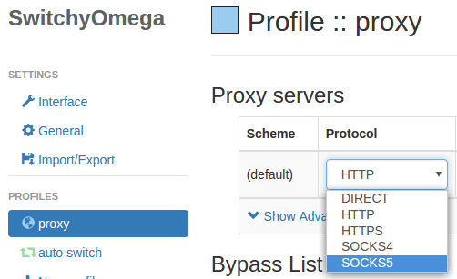

在Linux平台使用Google的Chromium或者Chrome，会遇到一个设置代理服务器的问题：

* 浏览器不支持杂爱GUI交互界面设置代理服务区器
* 需要使用系统级别的配置proxy，但是不是所有的Linux桌面都提供Proxy设置

通常，用户需要按汉族昂[Proxy SwitchyOmega](https://chrome.google.com/webstore/search/Proxy%20SwitchyOmega?utm_source=chrome-ntp-icon)来配置，但是如果已开始就不能通过代理访问Chrome Web store，则需要通过命令行配置代理。

# 从命令行配置代理

如果使用chromium（如我使用Fedora，软件仓库中提供了开源的chromium）:

```
chromium --proxy-server="socks5://127.0.0.1:1080"
```

chromium和Chrome都支持HTTP, HTTPS, socks4 和 socks5代理。如设置HTTPS代理：

```
chromium --proxy-server="https://proxy-ip:proxy-port"
```

也可以在`.bashrc`环境文件中设置：

```
alias chromium='chromium --proxy-server="proxy-scheme://proxy-ip:proxy-port"'
```

# 安装Proxy SwitchyOmega扩展

Proxy SwithcyOmege extension这个扩展非常灵活，提供了动态修改代理的方式。注意：每个chrome/chromium的tab可能是不同的proxy设置，最好设置自动切换代理的模式。



# 参考

* [Configure Proxy for Chromium and Google Chrome From Command Line](https://www.linuxbabe.com/desktop-linux/configure-proxy-chromium-google-chrome-command-line)