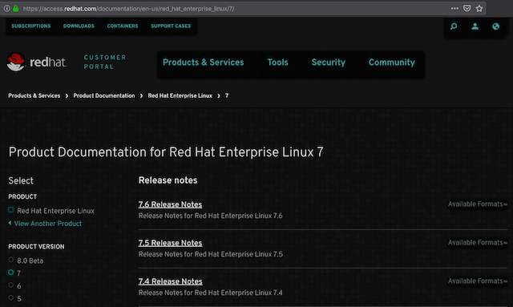

自从macOS Mojave开始提供了Dark风格桌面之后，对于计算机工作中来说，确实是一个福音。毕竟长时间面对屏幕，并不希望屏幕发出惨白的刺目光线。

很多桌面程序已经提供了Dark Theme，特别是开发工具、Termianl等常用软件。连Firefox也提供了Dark Theme以便能够很好融合到整个macOS风格中，但是，当是浏览网页时候，大多数网站依然是明快的浅色系风格，虽然美观，但是对于计算机工作者却是不友好的。

FireFox有一个非常巧妙的插件[Sytlish](https://addons.mozilla.org/en-US/firefox/addon/stylish/)，通过在[Stylish](https://userstyles.org/)官方网站提供针对不同网站（如Facebook, google, github等）定制CSS来实现独具风格的页面。

我比较喜欢其中的一个定制风格 [Global dark style - changes everything to DARK](https://userstyles.org/styles/31267/global-dark-style-changes-everything-to-dark) 非常具有黑客帝国的风格。总之，让很多网站显示出迷人的暗黑风格，既保护了视力也让自己有一个Cool的感觉。

