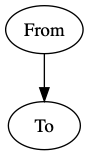

统一建模语言 UML（Unified Modeling Language，简称 UML）是面向对象软件开发中的一种通用、统一的图形模型语言，是用于软件系统规约化、可视化构造和建模的有效工具。

UML 由视图、图、模型元素和通用机制等几个部分组成:

* 视图是用于表达系统某一方面特征的 UML 建模元素的子集，由多个图构成，是在某一抽象层上，对系统的抽象表示。
* 图是模型元素集的图形表示。
* 模型元素代表面向对象中的类、对象、消息和关系等概念，是构成图的最基本的常用概念。
* 通用机制用于表示其他信息。

UML 有事物，关系和图三个基本构造块：

* 事物是实体抽象化的最终结果，是模型是中的基本成员；
* 关系是将事物联系在一起的方式；
* 图是事物集合的分类。

PlantUML 是一个用来绘制 UML 图的 Java 类库。支持的 UML 图包括：时序图、用例图、类图、组件图、活动图等。

在Sphinx中使用PlantUML需要基于graphviz把PlantUML转换成图片，所以需要安装多个组件。

# 使用 Graphviz

Sphinx使用 `sphinx.ext.graphviz` 这个扩展来渲染流程图。不过，需要首先安装Graphviz才能使用扩展。

* 安装Graphviz - 首先从 [Graphviz](http://graphviz.org/) 官方下载软件包，Linux可以从发行版，Mac则使用[MacPorts](http://www.macports.org/)或[Homebrew](http://mxcl.github.com/homebrew/)安装

```
brew install graphviz
```

* Sphinx已经包含了Graphviz扩展，但是需要在`conf.py`文件中激活：

```
extensions = ['sphinx.ext.graphviz']
```

* 在Sphinx文档中加入：

```
.. graphviz::

   digraph {
      "From" -> "To";
   }
```

就可以看到结果：



其他案例：

```
.. graphviz::

   digraph Flatland {
   
      a -> b -> c -> g; 
      a  [shape=polygon,sides=4]
      b  [shape=polygon,sides=5]
      c  [shape=polygon,sides=6]
   
      g [peripheries=3,color=yellow];
      s [shape=invtriangle,peripheries=1,color=red,style=filled];
      w  [shape=triangle,peripheries=1,color=blue,style=filled];
      
      }
```

图形：


详细对案例：

* https://en.wikipedia.org/wiki/DOT_(graph_description_language)
* http://www.graphviz.org/pdf/dotguide.pdf
* http://graphs.grevian.org/example.html

# 使用PlantUML

* 安装扩展

```
pip install sphinxcontrib-plantuml
```

# 参考

* [写文档？用Sphinx + PlantUML + readthedocs](https://www.jianshu.com/p/05c7289d4da2) - 介绍了在readthdocs网站使用sphinx+plantuml
* [PlantUML](https://www.jianshu.com/p/29e2e18ea17e) 介绍了plantuml的安装使用，这个文档写得比较详细有关本地实施对方法步骤
* [PlantUML —— 应用于 Eclipse 的简单快速的 UML 编辑软件](https://www.ibm.com/developerworks/cn/opensource/os-cn-ecl-plantuml/index.html) 较早期一篇介绍文档
* [使用 Sublime + PlantUML 高效地画图](https://www.jianshu.com/p/e92a52770832) - 介绍了较多对PlantUML的案例