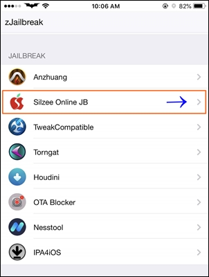
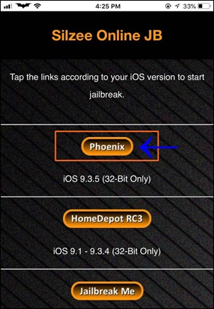
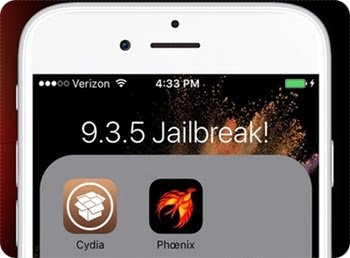

[Phoenix Jailbreak](https://pangu8.com/tools/phoenix/)工具支持所有32位设备的iOS 9.3.5/iOS 9.3.6(仅这两个版本)越狱，不过这个越狱是semi-untethered jailbreak，即每次设备重启则越狱实效，需要重新运行Phoenix jailbreak来越狱。

有两种Phoenix jailbreak方法：

- 免PC设备的[Online jailbreak](https://pangu8.com/nopc/)
- 需要PC设备越狱

免PC设备的[Online jailbreak](https://pangu8.com/nopc/)是通过在zJailbreak app store或者Xabsi app store中Silzee在线Jailbreak应用实现的。

# 使用Silzee在线Jailbreak

* 在 [Phoenix Jailbreak](https://pangu8.com/tools/phoenix/) 页面上提供了在线安装工具：
    * [Install zJailbreak](https://m.pangu8.com/zjailbreak.com/) 或者
    * [Install Xabsi](https://pangu8.com/xabsi.com/)

* 打开安装的app store，然后搜索 `Silzee online JB` 并安装

* 打开安装好的 `Silzee Online JB` ，然后点击 `Phoenix` 按钮

* 此时会安装Phoenix JB，安装完成后点击该程序运行
* 按照以下步骤执行 `“Prepare For Jailbreak”–> “Accept” ? “Proceed With jailbreak”—-> “Begin Installation”`

* 最后Cydia图标就会显示表明越狱成功

