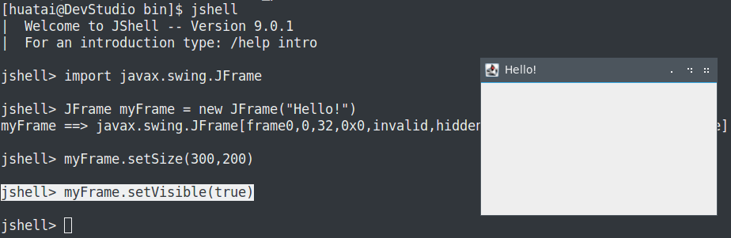

# JShell

Java 9内建了一个JShell，可以用来测试java命令，不过需要版本Java 9才能支持。在Fedora 27平台，安装`java-9-openjdk-devel`可以获得jshell。

> 在《Learn java the Easy Way》一书的第三章节，举例了一个使用jshell来探索GUI编程的例子，非常简单清晰。

JShell工作在命令行，接受文本命令并且通常相应以文本输出。但是，JShell也可以访问完整的Java库而不限于文本。以下是《Learn java the Easy Way》的[快速起步的一个例子：猜数字](a_guess_game_example)转换成一个在JShell中运行的简单GUI程序。

# 命令行创建GUI

* 通过JShell导入`javax.swing.JFrame`类

```java
jshell> import javax.swing.JFrame
```

* 然后使用导入的`javax.swing.JFrame`创建一个框架`frame`

```java
jshell> JFrame myFrame = new JFrame("Hello!")
```

此时显示创加了一个隐藏的框架，即`new`关键字创建了一个JFrame类的新对象。这里在GUI窗口的标题栏现实的是"Hello!"

```
myFrame ==> javax.swing.JFrame[frame0,0,32,0x0,invalid,hidden ... tPaneCheckingEnabled=true]
```

注意上述信息显示中，`myFrame`的大小是`0x0`并且是隐藏或不可见。需要更改一些属性使得这个myFrame有合适大小。下面来设置`myFrame`大小：

* 设置窗口的长宽

```java
jshell> myFrame.setSize(300,200)
```

* 最后，通过调用`setVisible()`方法使得这个窗口显示：

```java
jshell> myFrame.setVisible(true)
```



通过设置`setVisible(true)`可以显示窗口，设置`setVisible(false)`则隐藏窗口。

## 创建交互GUI

上述是一个简单的GUI，通过Shell的`/reset`来清除历史

```java
jshell> /reset
```

此时显示`|  Resetting state.`并销毁窗体

* 以下使用内建的JShell编辑器创建一个交互GUI程序:

```java
/edit
```

打开了JShell Edit Pad，就可以写多行代码。

```java
import javax.swing.*;
JFrame window = new JFrame("Bryson's Window");
JPanel panel = new JPanel();
JButton button = new JButton("Click me!");
panel.add(button);
window.add(panel);
window.setSize(300,100);
button.addActionListener(e -> System.out.println("Ouch! You clicked me!"));
window.setVisible(true);
```

以上：
  
  * import了所有Swing GUI类，包括`JFrame`, `JPanel` 和 `JButton`
  * 依次将新建的3个对象`button`, `panel` 和 `window`添加。其中的`window`和`button`都设置了字符显示
  * `button.addActionListener(）`添加了动作监听器，将"Ouch! You clicked me!"输出到控制台

确认无误后，在`JEdit`编辑器中点击`Accept`按钮，然后点击`Exit`按钮，此时上述10行程序就被接受并运行。