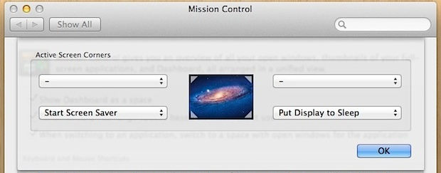

在Mac OS X（或者最新的macOS），快速锁定屏幕可以使用快捷键。此外，为了安全原因，以及节约电能（如果移动办公），快速锁定屏幕也不失为一个好方法。

要锁定屏幕，以及使用快捷键，售现需要激活macOS的Lock Screen功能。这个功能在

`System Preferences` => `Security & Privacy` => `General`面板

* 点击选择`Require password after sleep or screen saver begins`，并且在下拉选项中选择`immediately`（推荐）或者`5 seconds`作为要求密码的时间间隔。

* 激活Lock Screen之后就可以使用快捷键启用锁屏：
  * 如果系统有`enject`键，就使用`Control+Shift+Eject`
  * 如果系统使用`Power`键，就使用`Control+Shift+Power`

* 通过Hot Corner来锁屏

macOS还提供了通过Hot Corner来锁屏，也就是当鼠标移动到屏幕角上的时候触发一些动作，可以是设置锁屏或者将屏幕睡眠。

设置功能在 `System Preferences` => `Mission Control` => `Hot Corners`按钮

# 参考

* [Lock a Mac Screen](http://osxdaily.com/2011/01/17/lock-screen-mac/)