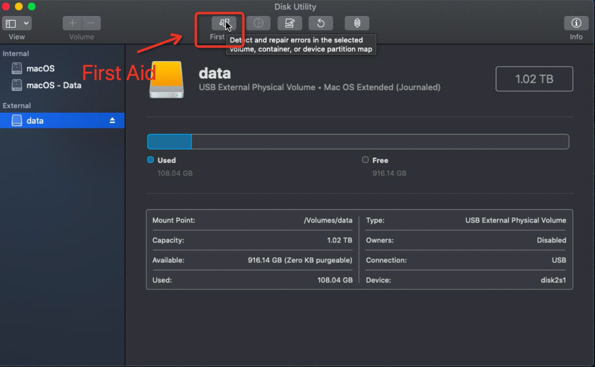
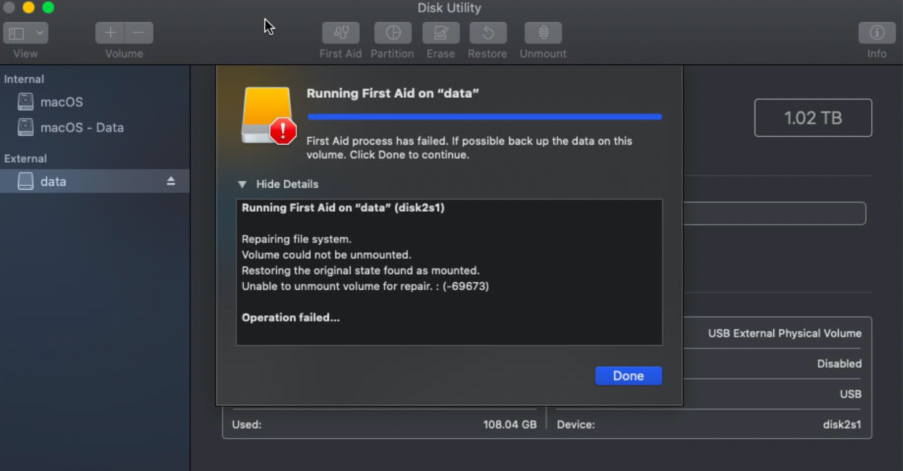
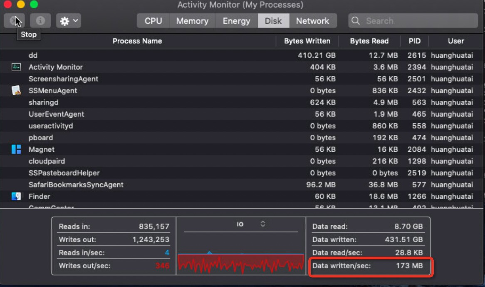

新购买的SSD移动硬盘，因为连接到树莓派上，使用Linux的dd命令测试出现报错，怀疑可能有硬件故障，但也怀疑可能是树莓派自身问题(例如同时连接两块ssd磁盘，USB接口问题，Linux的bug等)，所以考虑在MacBook Air上测试：

* 相信MacBook Air硬件可靠性较高，不存在电压不稳定情况
* 商业操作系统macOS可靠性较高

# macOS内置Disk Utility的First Aid

macOS内置Disk Utility的First Aid，可以用来检查Mac的内置和外部存储设备，First Aid提供了不同检查，如果发现问题，它会尝试修复。

执行First Aid功能时，Disk Utility会检查磁盘的分区map并检查每个卷，不过如果你只在一个卷上运行First Aid，则Disk Utility就只验证这个卷的内容。如果在磁盘上发现问题，Disk Utility会尝试修复。

> 如果Disk Utility告诉你磁盘或者卷将要故障(about to fail)，你应该立即备份并替换磁盘。

# 外接磁盘检测

## 通过dd测试磁盘写入

* 首先格式化磁盘，我这里命名为 data 卷，所以挂载目录是 `/Volumes/data` ，先测试写入10G数据

```bash
dd if=/dev/zero of=./testfile bs=100m count=1024
```

写入时观察maOS内置监控的磁盘性能，可以观察到写入速率大约410+MB/s，并且没有报错。这和之前在树莓派外挂移动磁盘不同



* 提示umount失败导致无法运行First Aid



这是因为有进程在使用磁盘（之前ssh登陆到主机上直接访问该磁盘目录，没有退出)，杀掉这个进程后就可以umount磁盘，然后运行FirstAid

```bash
# diskutil umount /Volumes/data
Volume data on disk2s1 failed to unmount: dissented by PID 2387 (/bin/zsh)
Disssenter parent PPID 2386 (/usr/sbin/sshd)
```

* 可以看到First Aid实际上就是fsck，执行终端命令有

```
fsck_hfs -fy -x /dev/rdisk2s1
```

# 启动盘检测和修复

要检测Mac的启动磁盘，需要将操作系统引导到Recovery Mode，这样才能从Recovery HD卷启动Disk Utility来检查和修复启动磁盘

* 重启macOS操作系统，启动时安装 `cmd+R` 按键，进入Recovery Mode

* 启动Mac以后，会看看到Utilites屏幕，选择Disk Utility

* 选择需要修复的磁盘，然后运行检查并尝试修复

# 通过dd命令验证

为了确保整个磁盘没有坏快，可以采用dd命令完整写一遍磁盘

```
dd if=/dev/zero of=./testfile bs=100m count=9216
```

刚开始峰值能达到500MB/s多一点，平均看大约 415MB/s；不过写入到40%左右容量，看到性能波动比较大，最低126MB/s，最高则可以冲到接近400MB/s。



测试结果

```
9216+0 records in
9216+0 records out
966367641600 bytes transferred in 3453.814808 secs (279797179 bytes/sec)
```

从总体上来看，磁盘性能全盘写平均性能 266.8MB/s

写完以后磁盘空间剩余5%

```
/dev/disk2s1   954Gi  901Gi   53Gi    95%      91 4294967188    0%   /Volumes/data
```

# 西部数据保修

在 [西部数据官方网站可以检查硬盘保修](https://support-cn.wd.com/app/warrantystatus) 情况

* WD My Passport SSD零件号如果以WDBKVX开头，保修政策 [WD My Passport SSD Support Information](https://kb.sandisk.com/app/answers/detail/a_id/20956/kw/20956)
  * 我的设备部件号是 WDBKVX0010PSL 保修3年

# 参考

* [What is the best free hard drive diagnostics app for Mac OS X?](https://apple.stackexchange.com/questions/5424/what-is-the-best-free-hard-drive-diagnostics-app-for-mac-os-x)
* [What does Disk Utility’s First Aid really check in Catalina? ](https://eclecticlight.co/2020/10/03/what-does-disk-utilitys-first-aid-really-check-in-catalina/)
* [How to repair a Mac disk with Disk Utility](https://support.apple.com/en-us/HT210898)