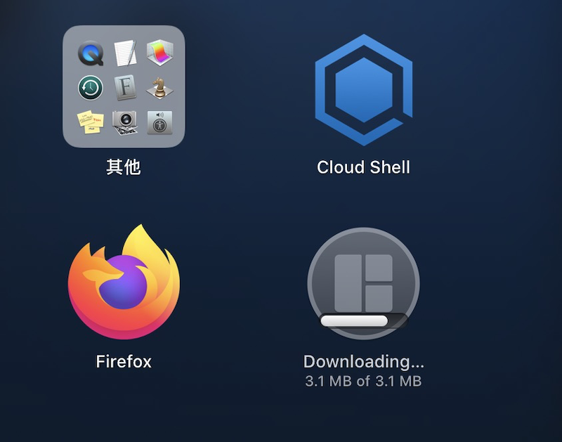

最近遇到一个比较奇怪的问题，在macOS上可以使用从各个WEB网站上下载软件安装包进行安装。但是，在AppStore上，点击任何一个程序进行安装，都会在下载完软件，进入暗转的最后阶段卡住。

最初我以为是因为杀毒和安全软件导致的问题，但是咨询了IT，了解到以下技巧

* 当安装过程始终听HI在安装过程的最后一一刻，很可能是因为前一个安装过程有残留的数据在 ``/Users/Shared/Image`` 目下。
* 例如这次问题就是因为Word在这个目录下遗留了程序文件，导致福啊紧凑型。
* 将上述目录下残留文件删除。
* ranhou chongqikeji 就可以恢复。