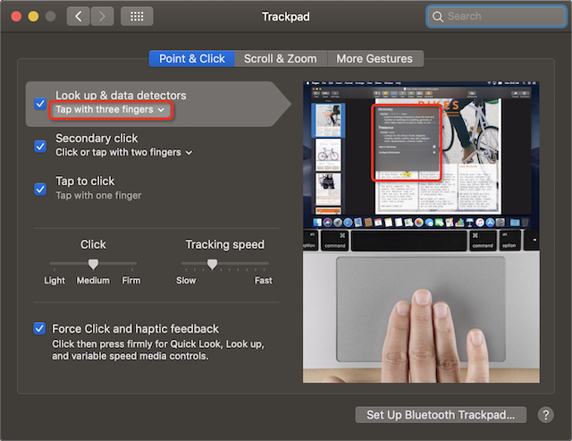

# 微调音量和亮度

调节音量-`F11`和`F12`快捷键，调节亮度-`F1`和`F2`快捷键，但其调节幅度是每次"一格"；调节音量时每次就会播放一个音效，有时候不想调节时候发声。

* 每次调节1/4：按住`Shift`和`Option`键，在按相应的功能键即可微调音量或亮度
* 调节声音时静音：按住`Shift`键，即`Shift+F11`和`Shift+F12`

# 手势（Gestures）

苹果电脑的硬件优势之一就是MagicPad，支持非常灵活的手势操作。

我最喜欢的手势操作：

* 三指轻点唤出字典查询 - 这对英语能力有限的我非常实用，在浏览英文网站时候，只需要三指轻点就可以查看中文释义。不过，最新的macOS把默认查询功能改成了单指长按，我不太习惯。还好，可以修改默认手势：

其他手势操作建议：

* 双指表示右键(Secondary click: Click or tap with two fingers)
* 激活轻点表示按下鼠标（Tap to click）

# 参考

* [Mac OS X 系统微调音量和亮度教程](http://www.ifunmac.com/2012/10/mac-os-x-weitiao/)