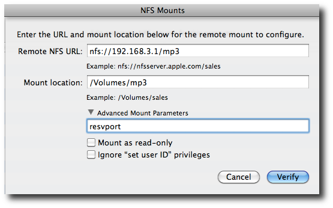

> 这里的案例是结合[Ubuntu 16 NFS设置](../../service/nfs/setup_nfs_on_ubuntu16)，将远程Linux服务器的Docker共享卷输出给macOS使用。这样就可以在Mac客户端，使用Jetbrains系列开发IDE来对远程Linux服务器开发程序。

*  首先检查服务器（这里服务器IP是`192.168.44.11`）输出的NFS

```
$ showmount -e 192.168.44.11
Exports list on 192.168.44.11:
/var/lib/docker/volumes/share-data/_data *
```

* 创建挂载目录

```
mkdir /Users/huatai/data
```

* 挂载目录

```
sudo mount -t nfs -o resvport,rw 192.168.44.11:/var/lib/docker/volumes/share-data/_data /Users/huatai/data
```

> 注意：一定要加上参数 `-o resvport`，否则在Mac上挂载Linux输出的NFS卷会提示错误：

```
mount_nfs: can't mount /var/lib/docker/volumes/share-data/_data from 192.168.44.11 onto /Users/huatai/data: Operation not permitted
```

## 建议的挂载参数

以下是建议的挂载参数：

```
sudo mount -t nfs -o soft,intr,rsize=8192,wsize=8192,timeo=900,retrans=3,proto=tcp nas01:/sales /private/sales
```

```
sudo mount -t nfs nfs -o soft,timeo=900,retrans=3,vers=3, proto=tcp nas01:/sales /private/sales
```

## Mac的GUI挂载方法

* macOS的`disk utility`提供了挂载远程NFS的方法：



# 问题

Linux上用户目录的`uid/gid`是`505`（admin），而本地Mac上的用户`uid/gid`是`501`，使用NFS认证的时候采用的是`uid`对应授权。强制去修改用户`uid`和`gid`会带来其他应用风险。

由于NFS服务器可以管理，所以修改服务器NFS输出，将服务器上账号`admin`的`uid`和`gid`映射成`anonuid`和`anongid`，

实际操作如下：

* 修改服务器上的`/etc/exports`

```
/var/lib/docker/volumes/share-data/_data *(rw,async,insecure,all_squash,no_subtree_check,anonuid=505,anongid=505)
```

> 注意：这是将服务器上用户目录的`uid`和`gid`映射成匿名id，会带来安全风险，所以务必做好安全控制。

# 参考

* [Mac Os X: Mount NFS Share / Set an NFS Client](https://www.cyberciti.biz/faq/apple-mac-osx-nfs-mount-command-tutorial/)
* [How to Connect Mac OS X to NFS Shares](http://www.serverlab.ca/tutorials/osx/administration-osx/how-to-connect-mac-os-x-to-nfs-shares/)