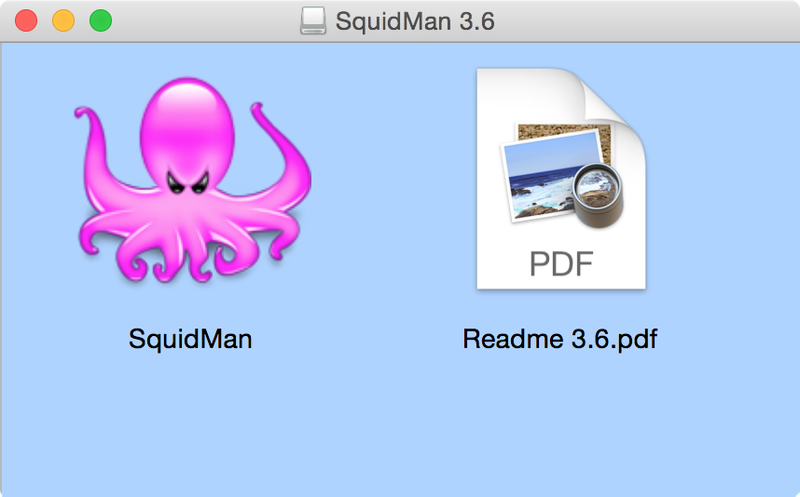
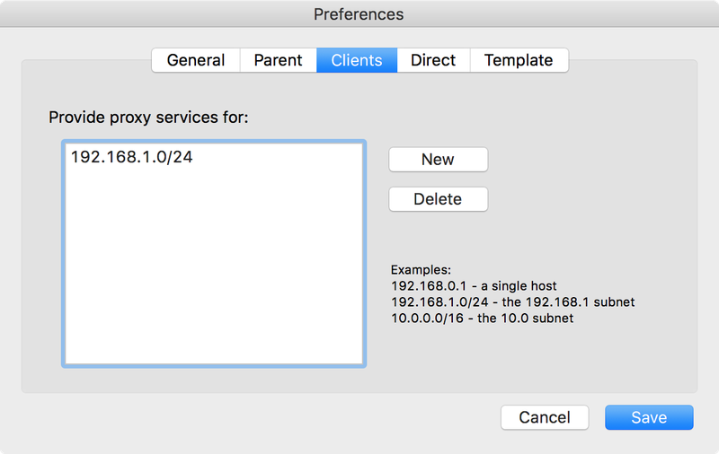

> MacOS X内建支持了共享网络（NAT）功能，如果macOS有两块网卡（例如无线网卡和有线网卡），则可以共享Internet。不过，这种方式对于开启了802.1x认证的网络无效，macOS会强制关闭802.1x网络访问的共享能力。

[Squid](http://www.squid-cache.org/)是开源的Web缓存代理服务器，支持HTTP，HTTPS和FTP等协议代理。这样可以降低带宽使用和提高缓存内容的访问性能。

> 开源缓存代理服务器主要是 [varnish](https://varnish-cache.org/)和[squid](http://www.squid-cache.org/)，从stackshare.io网站对比来看，varnish更为流行。

[SquidMan](http://squidman.net/squidman/)是在MacOS X上提供的Squid图形管理工具，并且提供了Squid代理软件。虽然版本不是很新，但是偶然使用还是可以应急的。

* 安装SquidMan

安装非常简单，直接将SquidMan拖放到Applications目录就可以：

* 设置代理

默认配置就可以运行起一个HTTP代理，默认代理端口8080，提供了最大4M对象的缓存。并且，Squid支持上级代理，即自己再向上访问其他代理服务器：

并且可以限制客户端的访问IP地址：

* 启动代理服务器

直接点击控制台`Start Squid`按钮就可以启动

# 参考

* [How to set up a proxy server on Mac OS X](https://howchoo.com/g/mwi3ntu1mjq/how-to-set-up-a-proxy-server-on-mac-os-x)