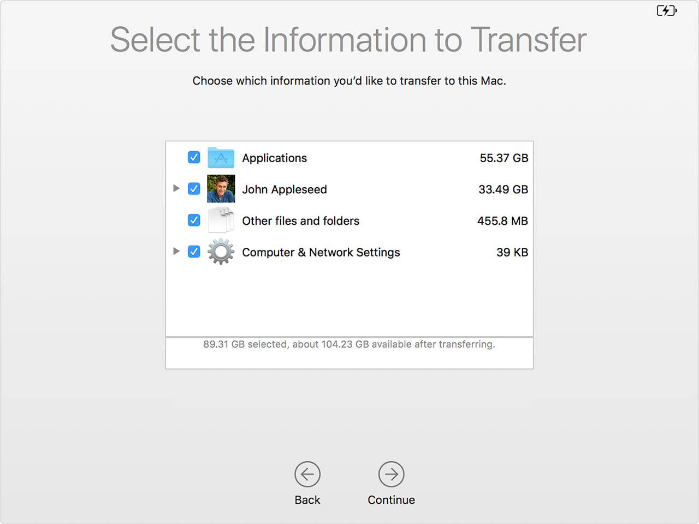

当使用Time Machine备份Mac系统时，你就为自己买了一份保险，可以随时回到之前某个状态。

使用Time Machine可以从备份中恢复所有文件，或者恢复Mac操作系统和所有文件。

# 恢复文件

* 确保Time Machine backup磁盘连接到主机
* 启动`Migration Assistant`应用程序，选择 `From a Mac, Time Machine backup, or startup disk`:


* 选择需要传输的文件内容，例如需要恢复 `Applications` 和 用户数据:



* 然后等待恢复就可以了。不过，这个恢复似乎只恢复到最近的一个时间点，怎么选择不通时间点？

# 恢复整个macOS系统和数据

要完整恢复macOS操作系统和数据，则：

* 先连接好Time Machine磁盘
* 按下主机电源的同时，按住 `Command (⌘)-R` 组合键进入`recovery`模式
* 当看到 `macOS Utilities` 界面时，选择 `restore from a Time Machine Backup`


* 选择恢复的来源磁盘(Time Machine磁盘)


* 选择恢复的哪次备份：


# VMware虚拟机从Time Machine恢复

VMware Fusion虚拟机软件也支持`Command (⌘)-R` 组合键进入`recovery`模式，但是这个按压组合键的时机不太好把握。不过，VMware虚拟机的磁盘配置可以修改成强制进入`recovery`模式。

* 在文件管理器中，选择VM虚拟机目录，并选择对应虚拟机。右击，然后选择 `Show Package Contents`
* 此时可以编辑虚拟机的 `.vmx` 配置文件，在其中添加一行配置:

```
macosguest.forceRecoveryModeInstall = "TRUE"
```

* 然后启动虚拟机，就会直接进入`recovery`模式

* 当完成恢复之后，关闭虚拟机，再次编辑`.vmx` 配置文件，删除掉上面添加的配置行就可以了。

# 参考

* [Restore your Mac from a backup](https://support.apple.com/en-us/HT203981)
* [How to Force a Mac VM to Boot in Recovery Mode in VMware Fusion](https://www.techjunkie.com/mac-vm-boot-recovery-mode-vmware-fusion/)