当使用Time Machine备份Mac系统时，你就为自己买了一份保险，可以随时回到之前某个状态。

使用Time Machine可以从备份中恢复所有文件，或者恢复Mac操作系统和所有文件。

# 恢复文件

> 注意：
>
> * 文件恢复方式只恢复到最近的一个时间点(如果有不同Mac备份，也只能恢复每个Mac的最近一次备份)
> * 只能恢复相同型号的主机(例如MacBook Pro只能恢复MacBook Pro的TimeMachine备份，不能恢复MacBook Aird的TimeMachine备份)

* 确保Time Machine backup磁盘连接到主机
* 启动`Migration Assistant`应用程序，选择 `From a Mac, Time Machine backup, or startup disk`:

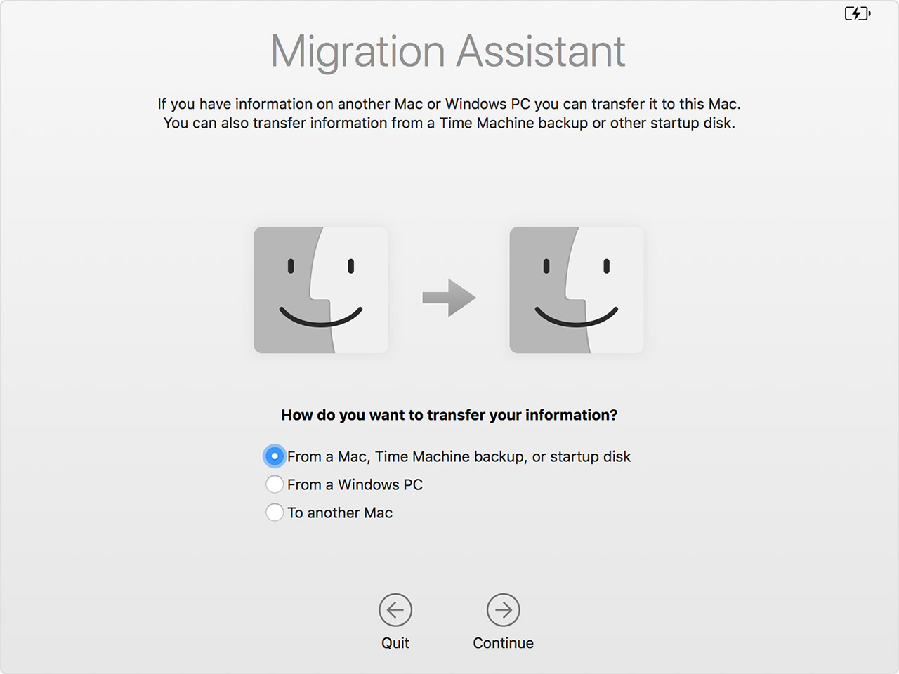

* 选择time machine的数据盘(这里只有一块)

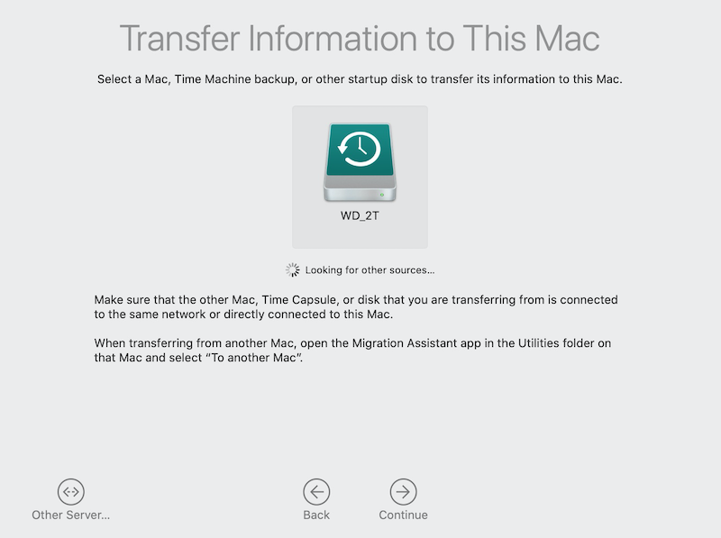

* 选择time machine中多个已经备份数据源（如果你备份过多台设备）中的一个

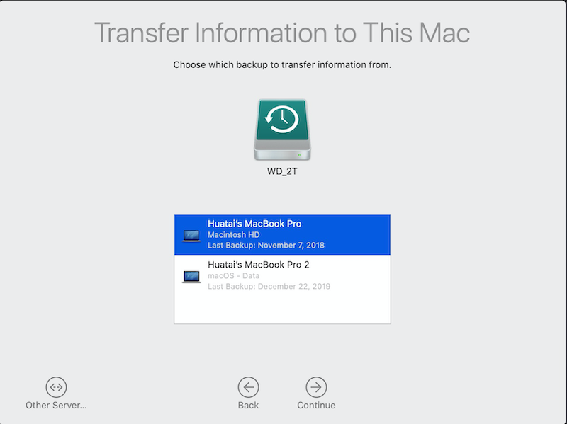

请等待一会，让系统计算出恢复数据需要的空间：

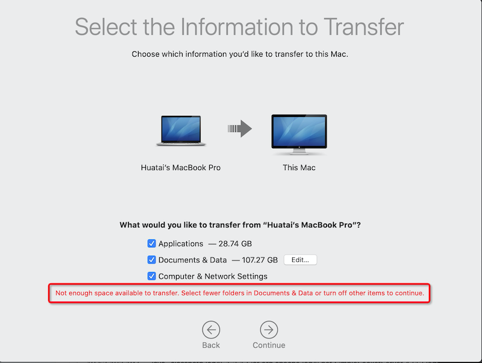

* 当计算出恢复所需的磁盘空间以后，还可以进一步点击`Documents & Data`旁边的`Edit...`按钮，只选择部分数据恢复

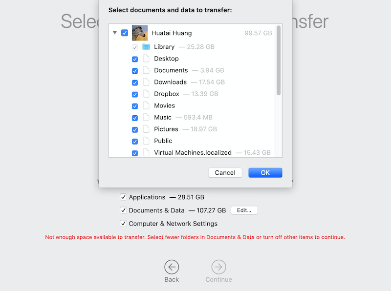

* 对于恢复数据中的系统管理员账号，还需要设置一个账号密码

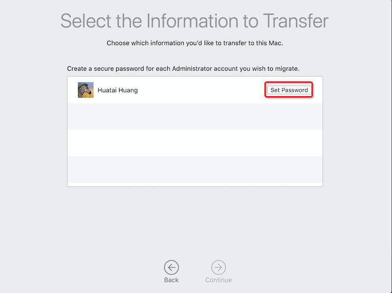

* 如果time machine中需要恢复数据的用户账号和目标主机上的用户账号重复，则有一个选项可以设置是否替换账号数据，或者同时保留两者

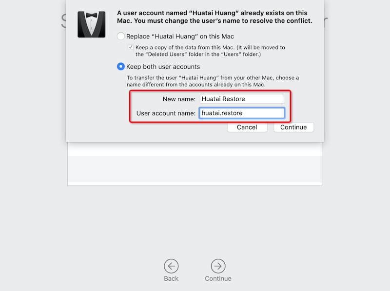

* 对于系统中已经有的用户账号，需要提供一个授权（表明已有账号用户同意）

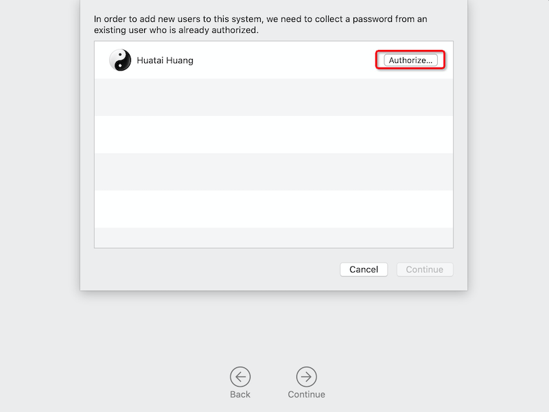

* 然后等待恢复就可以了

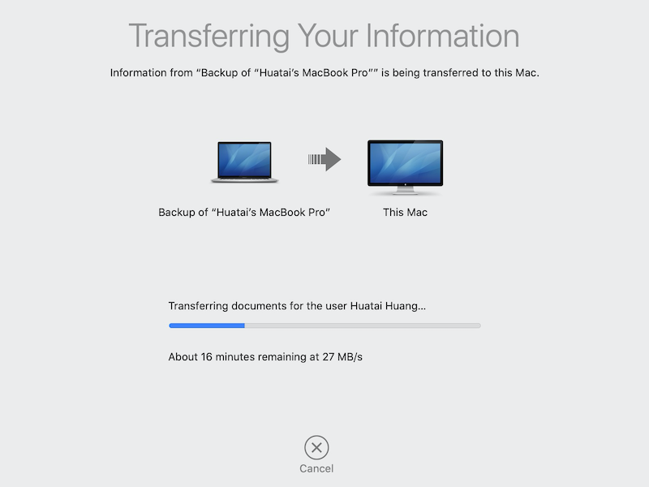

# 恢复整个macOS系统和数据

要完整恢复macOS操作系统和数据，则：

* 先连接好Time Machine磁盘
* 按下主机电源的同时，按住 `Command (⌘)-R` 组合键进入`recovery`模式
* 当看到 `macOS Utilities` 界面时，选择 `restore from a Time Machine Backup`

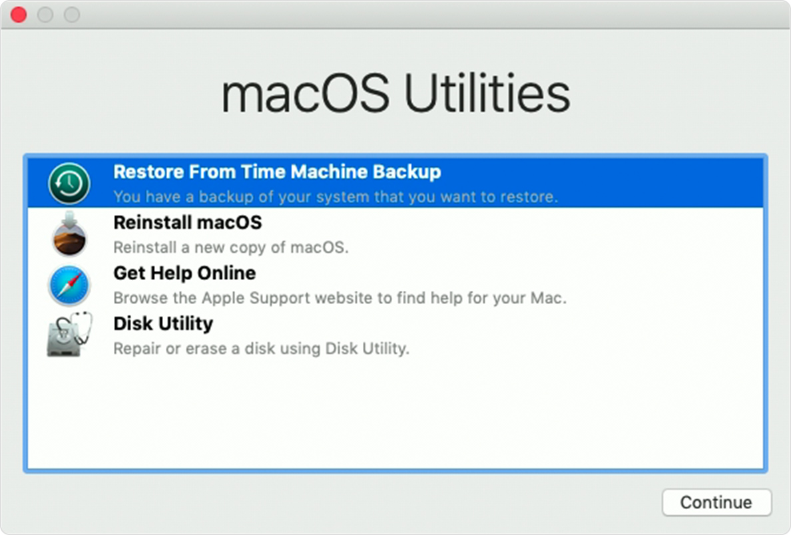

* 选择恢复的来源磁盘(Time Machine磁盘)

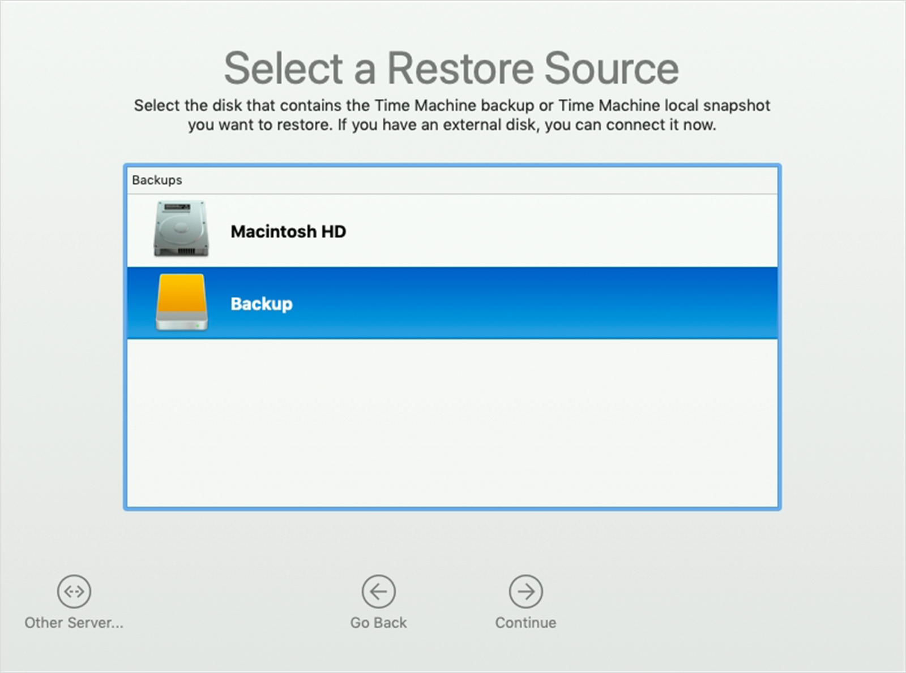

* 选择恢复的哪次备份：

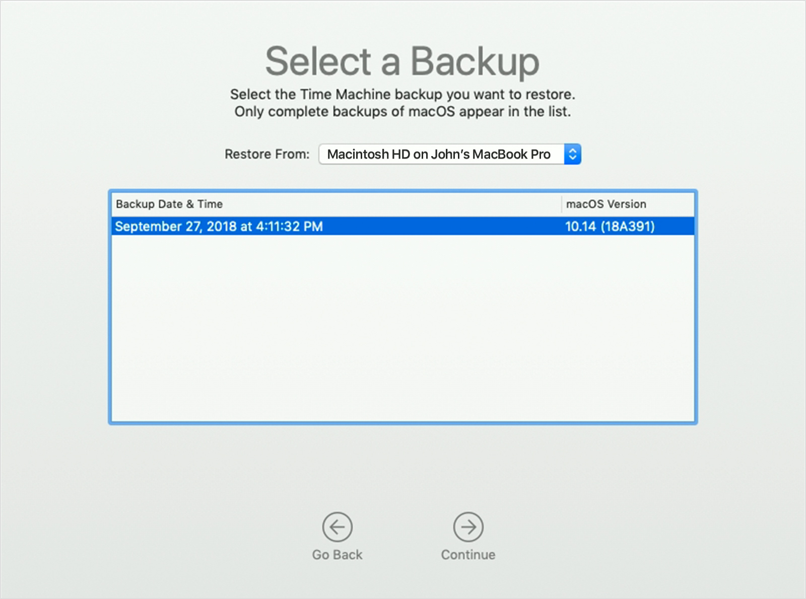

## Time Machine恢复要点

* 数据传输恢复：
    * 只能在MacBook Pro上恢复原先的MacBookPro上的数据，不能选择MacBook Air的备份数据
* 完整恢复操作系统+数据：
    * 只能恢复和recovery启动版本相等或者更低版本的macOS，例如，10.9 Mountain Lion启动光盘只能恢复 10.9的OS X或者更低版本备份，不能恢复高版本 High Sierra的备份。
    * 当前操作系统使用的文件系统需要和待恢复的操作系统的文件系统兼容
        * 如果系统当前使用的是APFS文件系统，而TimeMachine中备份使用的是没有启用APFS的系统，就无法恢复。这是因为从Sierra开始，文件系统已经更改为APFS，早期版本的Mac OS X无法识别。

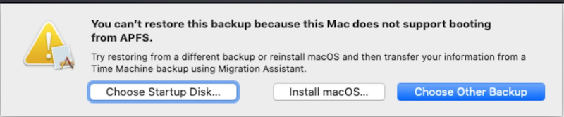

* 恢复的目标磁盘必须比原先备份的磁盘容量大，否则备份恢复时候会提示目标磁盘空间不足。

# VMware虚拟机从Time Machine恢复

VMware Fusion虚拟机软件也支持`Command (⌘)-R` 组合键进入`recovery`模式，但是这个按压组合键的时机不太好把握。不过，VMware虚拟机的磁盘配置可以修改成强制进入`recovery`模式。

* 在文件管理器中，选择VM虚拟机目录，并选择对应虚拟机。右击，然后选择 `Show Package Contents`
* 此时可以编辑虚拟机的 `.vmx` 配置文件，在其中添加一行配置:

```
macosguest.forceRecoveryModeInstall = "TRUE"
```

> 上述配置在Catalina版本测试成功，但是我最近安装的Mavericks则没有效果。

* 然后启动虚拟机，就会直接进入`recovery`模式

* 当完成恢复之后，关闭虚拟机，再次编辑`.vmx` 配置文件，删除掉上面添加的配置行就可以了。

> 注意：上述强制进入`recovery`模式要求磁盘上已经安装了macOS操作系统。

# 参考

* [Restore your Mac from a backup](https://support.apple.com/en-us/HT203981)
* [How to Force a Mac VM to Boot in Recovery Mode in VMware Fusion](https://www.techjunkie.com/mac-vm-boot-recovery-mode-vmware-fusion/)