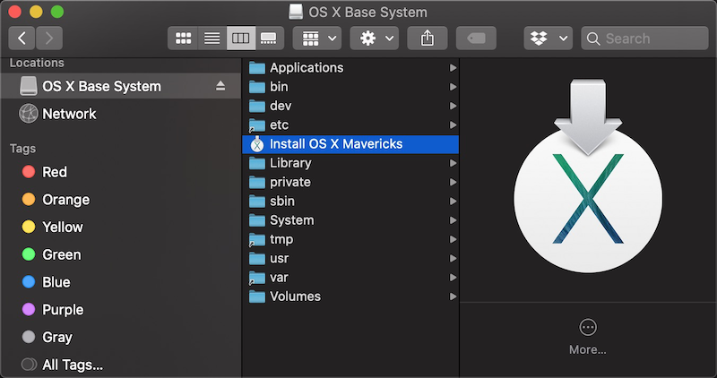
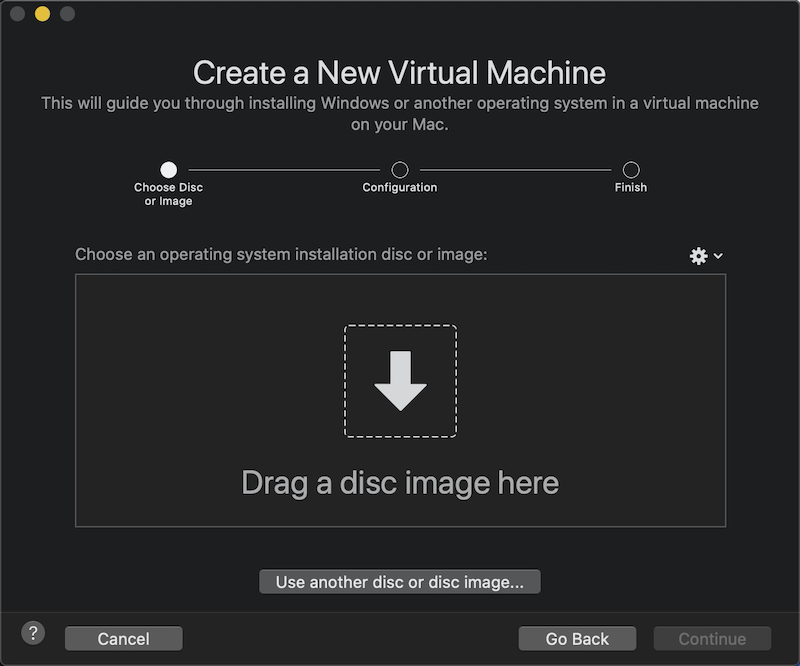
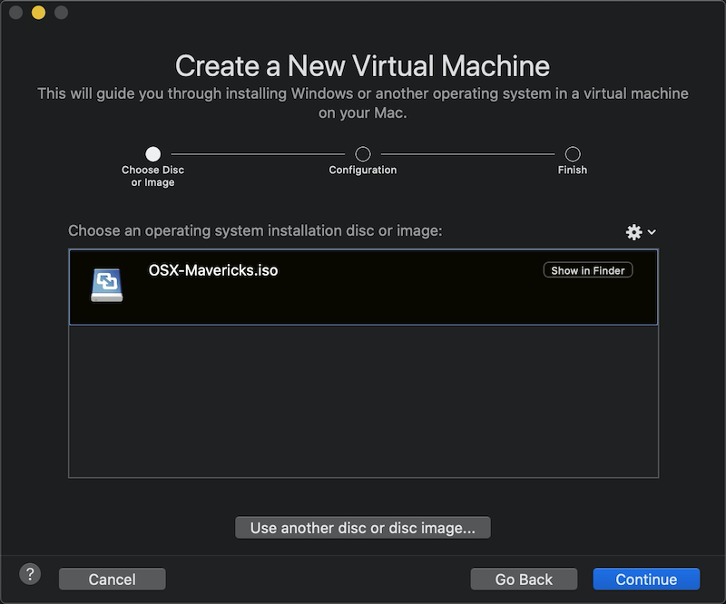
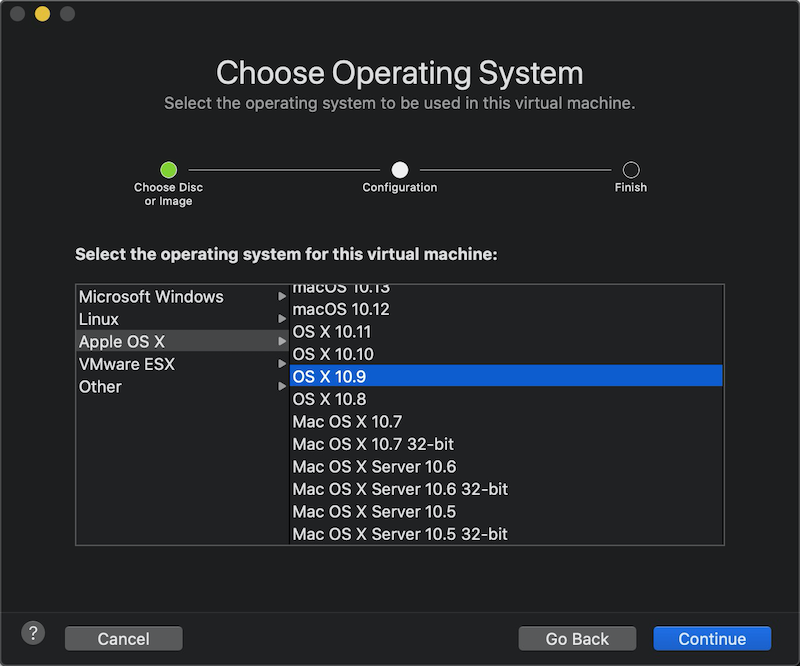
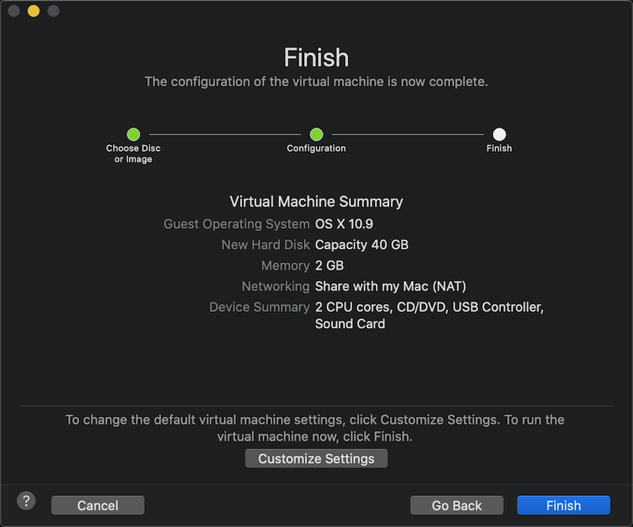

[拟物化的苹果生态系统Mavericks和iOS 6](mac_os_x_mavericks_and_ios_6)是我现在非常喜欢的怀旧系统，没有繁杂的功能，可以把自己的心神都沉浸在孤独花园中。

首次体验Mavericks，手头恰好没有合适硬件，所以采用VMware Fusion虚拟机安装运行。

# 安装

从 ISORIVER 提供的[Mac OS X Mavericks 10.9 ISO and DMG Image Download](https://isoriver.com/mac-os-x-mavericks-10-9-iso-dmg-image/)下载iso或dmg文件。

不过，我发现下载的dmg或iso文件直接拖放到 `Drag a disc image here` 对话框，启动以后无响应，启动到苹果图标之后，最后还是失败，显示界面如下：

由于几次直接拖放`[OSX] Mac OS X 10.9.4 Mavericks ESD.dmg`安装都失败，参考了YouTube上视频 [Installing OS X 10.9 Mavericks as a guest operating system in VMware Fusion 6](https://www.youtube.com/watch?v=6KXv6d0HHlI) 我发现实际上是拖放的`Install OS X Mavericks` application。那么这个Application是在哪里？看上去像是以前直接通过AppStore安装新版本时候安装到applications目录下的应用bundle。

> 我考虑采用 [创建macOS启动安装U盘](create_macos_boot_install_drive) 方法：因为我通过[降级macOS](downgrade_macos)，在MacBook Air上获得了一个可用的Lion版本，这样我就可以在Lion系统中，使用下载的[Mac OS X Mavericks 10.9 ISO and DMG Image Download](https://isoriver.com/mac-os-x-mavericks-10-9-iso-dmg-image/)安装一个就绪的`Install OS X Mavericks` application。此时，我可以在低端的MacBook Air上安装一个VMware虚拟机运行Mavericks版本，这个虚拟机可以保存起来，并且能够迁移到任何地方运行。

* 双击双击`[OSX] Mac OS X 10.9.4 Mavericks ESD.dmg`挂载，或者右击该文件，选择 `Open With > DiskImageMounter` 挂载该磁盘镜像。

挂载以后，可以看到一个 `OS X Base System` 目录，内容如下：

* 启动VMware Fusion软件，然后选择 `install from disk or image` 选项，然后点击 `Continue` 按钮：

* 此时看到一个 `Drag a disc image here` 对话框

* 把 `OS X Base System` 目录的 `Install OS X Mavericks` 文件图标拖放到VMware Fusion的`Drag a disc image here` 对话框中：

* 按照安装的操作系统版本选择 OS X 10.9

* 最后确认配置

# 参考

* [How to Install Mac OS X using VMware Fusion](https://www.online-tech-tips.com/mac-os-x/install-os-x-in-vmware-fusion/)