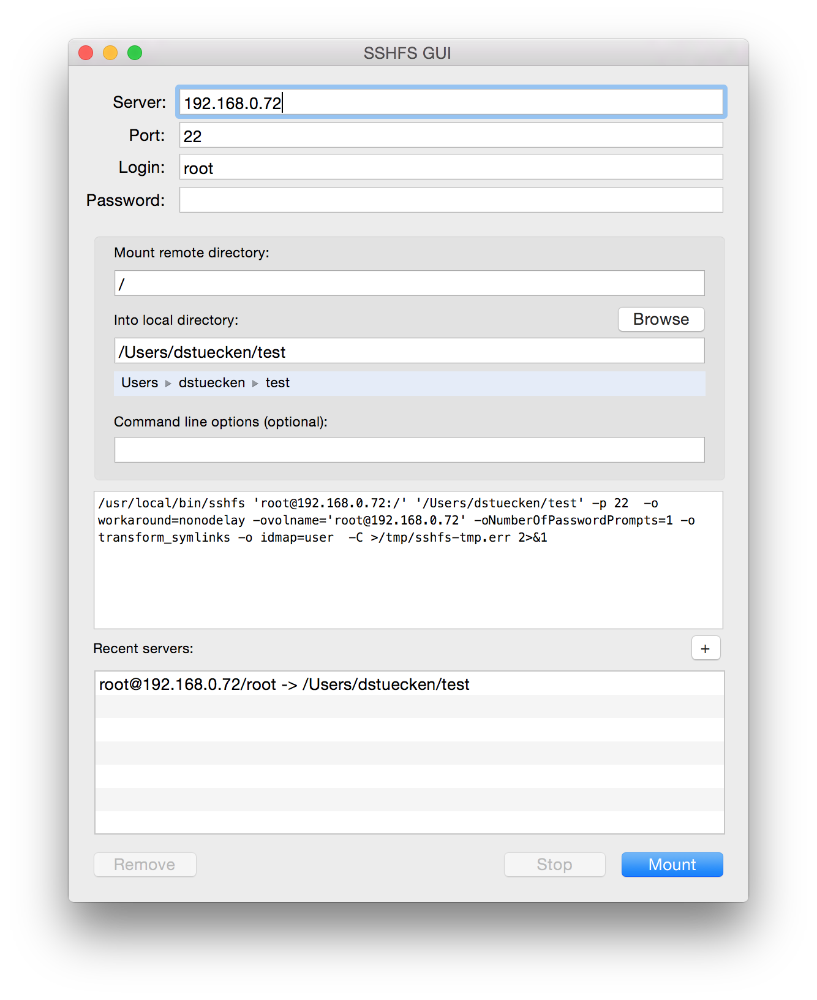

作为Linux开发者，大多数后台服务程序、脚本开发都需要远程ssh登录到服务器上完成。然而，在Linux终端实现一个非常完善的IDE开发环境，学习曲线非常陡峭。

有没有结合Mac平台优秀的开发工具 - Apple Xcode / Microsoft Code / JetBrains IDE 实现远程开发Linux服务器上软件的方法呢？

答案是：SSHFS

* 从 [FUSE for macOS](https://osxfuse.github.io/) 下载安装 FUSE for macOS 3.6.0

* 从 [SSHFS](https://github.com/osxfuse/sshfs) 下载安装 SSHFS 2.5.0

sshfs只提供了2.5.0的安装二进制包 - 可以从 [osxfuse/sshfs](https://github.com/osxfuse/sshfs/releases/) 下载，经过测试，在 Mac OS X 10.12.5 (macOS Sierra) 上工作正常。

最新版本2.9需要可以从 [libfuse/sshfs](http://github.com/libfuse/sshfs) 下载源代码编译，编译需要使用 [Meson](http://mesonbuild.com/) (version 0.38 or newer) 和 [Ninja](https://ninja-build.org) 步骤比较繁琐，未实践。

* 从 [SSHFS GUI Wrapper for Mac OS X](https://github.com/dstuecken/sshfs-gui) 下载 sshfs-gui 1.3.1

依次安装完成后，直接使用 SSHFS GUI图形界面就可以将远程ssh登录服务器上的目录挂载到本地目录上。

完成后可以在Mac OS X Finder文件管理器中浏览文件，复制文件。同时，本地的开发工具IDE可以将远程服务器上目录当成本地目录，也就能够实现程序文件编辑，git提交管理等操作。

> 由于跨平台，所以暂时没有找到在Mac平台交叉编译其他平台二进制程序的方法。不过，对于gcc，是支持跨平台编译，理论上LLVC等编译器应该也能够完成。

SSHFS不仅提供了远程开发Linux服务器上脚本、Java、C等语言的方法，甚至可以用来开发Swift for Linux。

> [Using SSHFS To Mount Remote Directories](https://www.linode.com/docs/networking/ssh/using-sshfs-on-linux) 提供了在Linux平台安装SSHFS的方法，可以参考实践。