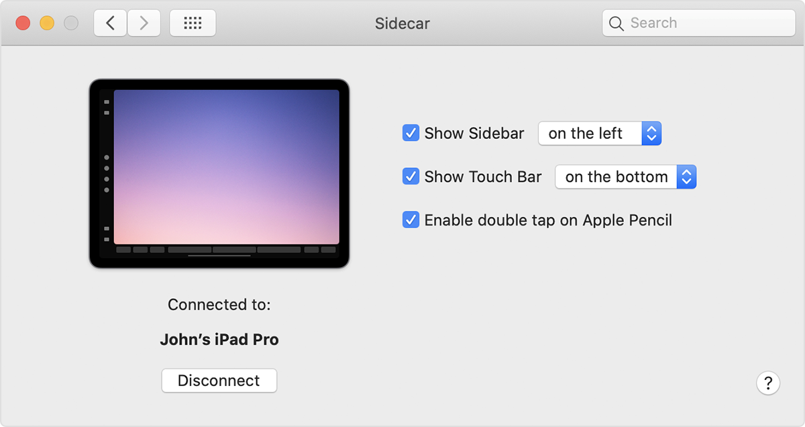

从macOS Catalina和iPadOS 13开始，支持一种称为sidecar的模式，iPad可以作为Mac电脑的第二块屏幕。

# 软硬件要求

* 软件：macOS Catalina / iPadOS 13
* 硬件：基本上需要2016/2018年版本的Mac硬件，iPad也差不多。具体见 [Sidecar system requirements](https://support.apple.com/en-me/HT210380#systemrequirements)

## 环境要求

* 两台设备都需要登陆相同的iCloud Apple ID账号，并且启用了双重认证
* 要无线使用Sidecar，两个设备必须相邻10m以内并且开启了蓝牙、无线和Handoff功能。并且需要确保iPad没有卡其共享蜂窝网络，Mac没有开启共享Internet连接。
* 要通过USB使用Sidecar，则要确保[iPad设置信任Mac](https://support.apple.com/kb/HT202778)

> 似乎iPad也需要连接无线网络，才在Mac上的Display配置中看到能够使用AirDisplay

# 启用SideCar

有两种方式可以启动Sidecar:

* 从Apple菜单 System Preferences 中选择Sidecar

* 从显示器选项中的 AirDisplay 中选择

# 参考

* [Use your iPad as a second display for your Mac with Sidecar](https://support.apple.com/en-me/HT210380#systemrequirements)