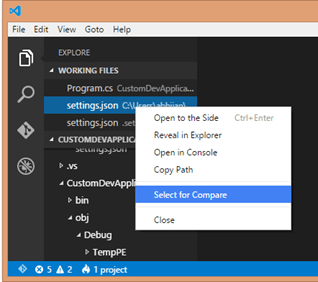
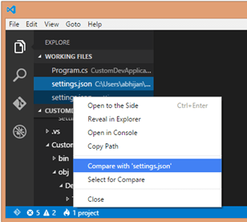

Visual Studio Code微软开发的开源编辑器，及其轻简，同时支持插件，功能强大且流畅至极。

> 参考知乎[Visual Studio Code如何编写运行C、C++？](https://www.zhihu.com/question/30315894)中介绍的[Code Runner](https://marketplace.visualstudio.com/items?itemName=formulahendry.code-runner)，可以比较简单安装好这个插件，不用进行任何配置就能直接编译并运行，默认情况下使用的是GCC和G++。有需要的话也可以更改配置文件来使用其他编译器，比如clang。

> 台湾微软blog的[Visual Studio Code 的 C/C++ 語言擴充功能](https://blogs.msdn.microsoft.com/msdntaiwan/2016/04/28/clang-extension-to-visual-studio-code/)介绍了C/C++扩展使用方法。

# 安装VS Code

> 参考 [Visual Studio Code on macOS](https://code.visualstudio.com/docs/setup/mac)

* 启动VS Code，打开Command Palette ( `⇧⌘P` )，然后输入`shell command`，就搜索到 `Shell Command: Install 'code' command in PATH`
* 确认安装到PATH之后，就可以命令行使用`code .`来启动当前目录下VS Code。

# 开发C/C++

参考 [C/C++ for VS Code](https://code.visualstudio.com/docs/languages/cpp)

* 安装Microsoft C/C++扩展：
  * 打开VS Code
  * 点击左边栏的Extensions View按钮
  * 搜索 `cpptools`
  * 点击`Install`然后点击`Enable`
  * 打开包含C/C++代码的文件目录

* 要激活代码自动完成和浏览，需要创建一个`c_cpp_properties.json`文件：
  * 在一个源代码文件等任何绿色波浪线上停留鼠标（例如：`#include`）
  * 点击这行鼠标所在行旁边的"提示灯泡"图标
  * 点击`Add include path to settins`

上述操作会在工作目录下创建一个`.vscode`目录并生成一个`c_cpp_properties.json`配置文件来允许你添加附加的include路径以便激活代码浏览和自动完成功能。

> 注意：你也可以在`Command Palette`(`⇧⌘P`)中使用`C/Cpp: Edit Configurations`命令来编辑一个`c_cpp_properties.json`文件。

* 要在VS Code中编译程序，需要生成一个`tasks.json`文件：
  * 打开`Command Palette`(`⇧⌘P`)
  * 选择`Tasks: Configure Task Runner`，此时会看到一系列任务运行模版。
  * 选择`Others`来创建一个运行扩展命令的人物
  * 修改`command`行来用于编译自己的应用程序（例如 `g++ -g main.cpp`）
  * 添加任何需要的参数（例如`-g`来编译的bugging）
  * 此时可以使用`⇧⌘B`来编译程序

上述操作在工作目录`.vscode`中创建的`tasks.json`类似如下

```
{
    "version": "0.1.0",
    "command": "g++",
    "isShellCommand": true,
    "showOutput": "always",
    "args": ["-g", "main.cpp"]
}
```

配置`c`的`tasks.json`可能如下

```
{
    "version": "0.1.0",
    "command": "cc",
    "isShellCommand": true,
    "args": ["-g", "${file}", "-o", "${file}.o"],
    "showOutput": "always"
}
```

这里`"-o", "${file}.o"`就是编译输出的可执行文件，不要直接使用`"${file}"`，否则会导致源代码文件被编译后的二进制文件覆盖。(参考[vscode配置C/C++的编译调试环境](http://jacean.github.io/2016/04/04/vscode%E9%85%8D%E7%BD%AEC-C-%E7%9A%84%E7%BC%96%E8%AF%91%E8%B0%83%E8%AF%95%E7%8E%AF%E5%A2%83/))。另外，可以参考知乎上[Visual Studio Code如何编写运行C、C++？](https://www.zhihu.com/question/30315894)

> 详细参考 [Integrate with External Tools via Tasks](https://code.visualstudio.com/docs/editor/tasks)

* 要激活debuggin，需要生成一个`launch.json`文件：
  * 在左边栏点击`Debug`按钮展开Debug视图
  * 在`Debug`视图中，点击`Configure`图标
  * 选择`C++ (GDB/LLDB)`（使用GDB or LLDB）或者`C++ (Windows)`(使用Visual Studio Windows Debugger)。此步骤会创建`launch.json`用于编辑以下两个配置：
    * `C++ Launch`定义启动debugging时候调用应用程序的参数
    * `C++ Attach`定义已经运行程序进程的附加属性
  * 更新`program`指向你debuging的程序的路径
  * 如果希望启动debugging的时候build程序，则在`tasks.json`中添加`preLaunchTask`属性并设置build任务的名字（例如，上例中的`g++`）

> 详细参考 [Configuring launch.json for C/C++ debugging](https://github.com/Microsoft/vscode-cpptools/blob/master/launch.md)

# 开发Python

VS Code通过插件可以非常好支持Python开发。不过，很多时候，我们会通过virtualenv虚拟环境来构建python开发环境，此时需要告诉VS Code在哪里找到特定版本的python，否则会导致VS Code无法找到对应python模块，就会错误高亮显示一些提示（如开发Django程序时候，提示`[pylint] E0401:Unable to import 'django.conf.'`），带来不必要的困扰。

## Linux平台配置

举例，开发Django，先使用如下命令构建一个django开发虚拟环境：

```
sudo dnf install python2-virtualenv
```

```
virtualenv venv2
source venv2/bin/active

pip install django
pip install djangorestframework
pip install mysqlclient
```

然后在VS Code中设置`Perference >> Settings`

```
{
    ...
    "python.pythonPath": "/home/huatai/venv2/bin/python"
}
```

之后，VS Code就能够正确识别Django的模块。

> 使用Python virtualenv虚拟环境开发Python有一个非常好的地方就是VS Code会根据Python代码的语法检查等功能安装对应插件模块，例如 `pylint`，就不需要安装到系统目录，避免了权限问题。

> 参考 [Python Path and Version](https://github.com/DonJayamanne/pythonVSCode/wiki/Python-Path-and-Version)

## Mac平台配置

> 安装Python3环境参考 [在macOS上安装Python3和virtualenv环境](../python/startup/install_python_3_and_virtualenv_on_macos)

> 参考 [Configuring Python environments](https://code.visualstudio.com/docs/python/environments)

* 安装VS Code的[Python扩展](https://marketplace.visualstudio.com/items?itemName=ms-python.python)

* 在项目目录下启动VS Code

```
mkdir hello
cd hello
code .
```

* 对于打开Python程序文件，VS Code会引导进行Python解析器设置。也可以启动`Command Palette`（`⇧⌘P`），然后输入 `Python: Select Interpreter`选择解析器

VS Code支持MacBook的Touch Bar，对于断点调试非常方便。

## Sphinx文档

在Python开发中，支持采用[Sphinx-doc](http://www.sphinx-doc.org/en/master/)作为开发文档。VS Code有一个[vscode-restructuredtext](https://github.com/vscode-restructuredtext/vscode-restructuredtext)支持reStructureText文档语法高亮和页面预览。

需要注意的是，这个插件不是安装完就可以直接实现预览的，必须完成以下几个步骤：

* 系统安装Sphinx支持 - 这里可以参考[使用Sphinx构建Python程序文档](../doc/sphinx/sphinx_for_python_doc)安装，以下是Mac上安装(切换到`root`用户)：

```bash
easy_install pip
pip install --ignore-installed six
pip install --ignore-installed pyparsing
pip install sphinx
pip install sphinx_rtd_theme
```

> 这里`--ignore-installed`两个模块是因为这两个模块是macOS内建的，不能通过`pip`卸载和升级

* 在VS Code中配置添加

```json
{
    "restructuredtext.builtDocumentationPath" : "${workspaceRoot}/build/html",
    "restructuredtext.confPath"               : "${workspaceRoot}/source"
}
```

> 参考 [nable to open 'Preview 'manual.rst'': Error #64](https://github.com/vscode-restructuredtext/vscode-restructuredtext/issues/64)

完成之后即可以在VS Code中预览


# 编辑代码

## 文件对比

> 参考[How to Compare files in Visual Studio Code ?](http://dailydotnettips.com/2015/06/04/how-to-compare-files-in-visual-studio-code/)

VS Code支持工作文件案的对比，并且允许以不同模式对比更改。可以使用文件导航侧边栏或者使用命令"`Files:Compare Opened File with`"。在代码对比窗口可以选择`In Line Mode`或者`Merged Mode`。

* 首先选择要对比的第一个文件`settings.json`（案例文件名），右击鼠标，选择菜单`Select for Compare`



* 然后再在文件侧边导航栏选择要对比的第二个文件，右击鼠标，选择菜单`Compare with 'settings.json'`（即和第一个选择文件对比）



默认时`side by side`对比，也可以切换成`Inline View`。

## 代码风格

`C/C++ extension for Visual Studio Code`支持[clang-format](http://clang.llvm.org/docs/ClangFormat.html)代码风格。

可以通过`Format Document` (`⇧⌥F`)或使用`Format Selection` (`⌘K ⌘F`)在右键关联菜单选择。也可以配置以下设置：

* `C_Cpp.clang_format_formatOnSave` - to format when you save your file.
* `editor.formatOnType` - to format as you type (triggered on the ; character).

## theme

默认的vscode配色比较淡雅，如果需要色彩艳丽对比强烈的风格，可以搜索安装 ``hopscotch`` ，比较有视觉冲击。(我同事的推荐)