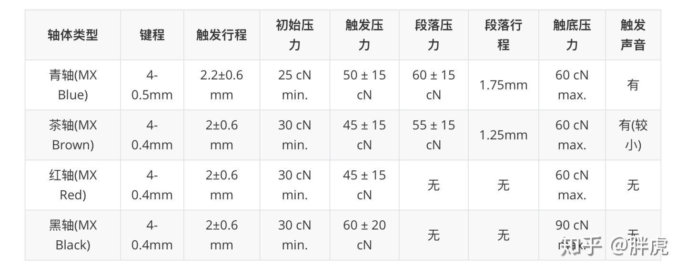
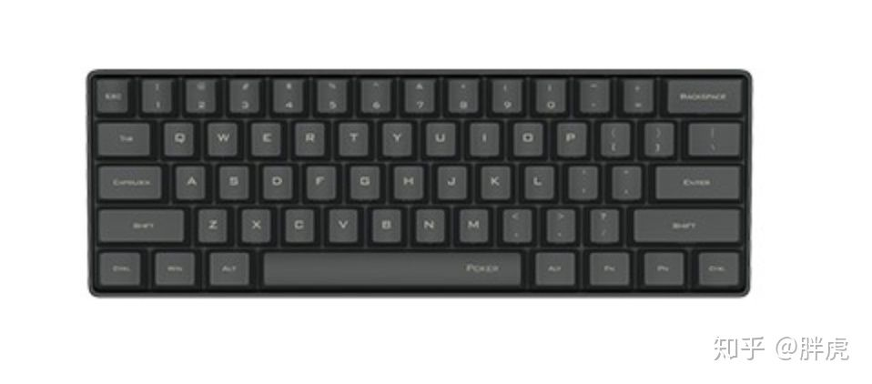

> 这篇文章和开发没有直接关系，毕竟开发靠的是头脑、技术、经验，使用设备硬件设备并不重要。不过，机械键盘对于编程还是有肉体和精神上的助力。

* 编程码字推荐有段落感的青轴或茶轴
  * 青轴最有机械手感，但是声音较大，是"友情审判器"
  * 茶轴兼顾了青轴的段落感和红轴的安静

* 红轴和黑轴无声且无段落(线性轴体)，适合游戏，但对于开发者来说，已经失去机械感的乐趣
  * 红轴按压触发压力较小，长时间码字不容易疲劳
  * 黑轴触发压力较大，长期使用可能会觉得手指较为疲劳

我比较看好61建的小键盘，颜值高，小巧紧凑 - 我很少纯输入数字(当然也不会像会计那样盲打数字小键盘)，上下键和翻页键使用频率也不高。

61键：

* 经济实惠国产轴 - 黑爵(AJAZZ) i610t 蓝牙+USB 茶轴 ¥159
* 原厂樱桃轴 - **富勒第九系 G610 蓝牙+USB 茶轴 ¥259~289**
* 原厂樱桃轴 - ikbc poker 61键 (pbt键帽) 茶轴 ¥369 (无蓝牙，感觉性价比略差)

> 61键在使用功能键时需要切换，好在vi专用键 `ESC` 默认启用

87键：

*  IKBC C87 茶轴 ¥330

# 樱桃轴(Cherry)

樱桃轴在机械键盘领域具有压倒性的占有率，所以巨大的销量让德国的樱桃在世界各地都有代工厂，中国的工厂在珠海，但是最核心的竞争力轴体MX开关都是德国工厂制造，严谨的工艺造就了樱桃几十年的口碑。

Cherry的温度测试会在室温65℃与零下25℃的环境交替测试，在大强度热胀冷缩的情况下保证产品的可靠性，标称5000万次的寿命，实际寿命会远超这个数字。苛刻的测试与高度自动化的量产，让国产轴体的成本难以与之抗衡，只不过樱桃当前设定的利润比较高，国产轴体只能压缩成本来抢占樱桃供货不足的200-400元市场，并利用外观的新颖性吸引玩家。

樱桃机械键盘特点是稳定：高强度长期使用能够保持稳定的手感。另外一个特点是："丑"，数十年不改变的设计外观，依然保留着上世纪80年代的键盘外观。

> 不过，Cherry键盘也满足了怀旧的心理，就像回到自己少年时在学校计算机房中按下的IBM终端键盘。

* 樱桃CHERRY MX 1.0白色背光104键位版本 ¥449 - 支持全键无冲，亮度可调等常规功能 （无光版本性价比较高 ¥299）
  * 个人感觉选择无光版CHERRY MX 1.0比较好，毕竟码字最重要的是手感不是背光
* 樱桃 G80-3000 - 经典款从1989年首次上市外观不变，并且已经有静音轴体的版本，更适合办公室与家庭使用，整体无螺丝，无钢板的设计然手感具有原始的机械触感 ¥699

# 参考

* [哪些机械键盘闭眼也可以入坑？](https://www.zhihu.com/question/380566492/answer/1191392767)
* [选择机械键盘前，你要懂樱桃轴和樱桃键盘区别](http://zhongce.sina.com.cn/article/view/14081/)
* [樱桃轴和国产轴的区别](https://product.pconline.com.cn/itbk/top/1905/12617898.html)
* [到底什么样的樱桃轴符合你的口味—十三种Cherry 樱桃 轴 上手体验](https://post.smzdm.com/p/610761/)
* [最适合苹果电脑的机械键盘](https://zhuanlan.zhihu.com/p/30720591) - 对比不同轴适合编程的特性
* [为 Macbook Pro 选择外接键盘](https://zhuanlan.zhihu.com/p/87032338) - 对比比较有意思
* [机械键盘使用心得(兼容mac)](https://www.jianshu.com/p/0e40a0c00520) - 使用体验