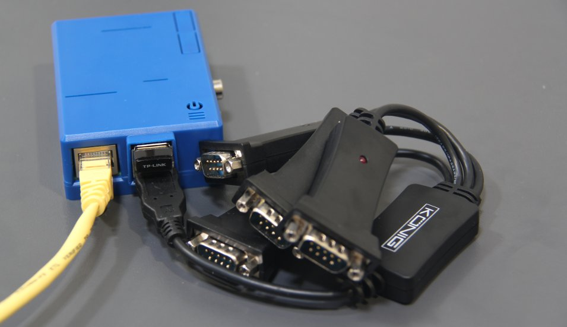

> 这是一个有意思的实现，对于远程管理Cisco路由器是一个解决之道。虽然现在我已经不再做网管，不再摆弄Cisco设备，不过这个实现方案还是很有借鉴意义的。
>
> 记得当年在IDC机房，也曾在Linux服务器上通过USB转串口设备连接到Cisco设备上，使用`minicom`做维护。而今树莓派的低成本和灵活性，已经成为通用微型PC的解决方案。加上千奇百怪的扩展附件，能够实现以往需要专有设备才能实现的方案。



使用的软件名为`ser2net`，可以将串口通讯转为TCP网络端口：

* `/etc/ser2net.conf`

```
BANNER:banner:NETWORKLESSONS.COM Terminal Server TCP port p device d rn
4001:telnet:0:/dev/ttyUSB0:9600 8DATABITS NONE 1STOPBIT banner
```

* 启动`ser2net`

```
ser2net -n
```

* 此时连接到树莓派的网络端口`4001`就可以访问到串口设备

```
telnet 10.56.100.3 4001
```

如果要记录`ser2net`日志，则修改配置

```
TRACEFILE:tr1:/var/log/ser2net/tr-p-Y-M-D-H:i:s.U
4001:telnet:0:/dev/ttyUSB0:9600 8DATABITS NONE 1STOPBIT banner tr=tr1 timestamp
```

# 无线AP访问

可以在树莓派上再安装一个无线网卡，并构建一个无线AP方便使用。

```
sudo apt-get install hostapd
```

修改`/etc/network/interfaces`，删除以下2行：

```
iface wlan0 inet manual
wpa-roam /etc/wpa_supplicant/wpa_supplicant.conf
```

然后替换成

```
iface wlan0 inet static
address 172.16.82.254
netmask 255.255.255.0
```

这样无线网卡就使用了静态IP地址`172.16.82.254/24`。

* 配置`hostapd`来设置AP

`/etc/hostapd/hostapd.conf`配置：

```ini
ssid=Console
wpa_passphrase=mysecurepassphrase
wpa=3
```

* 启动`hostapd`

```
sudo service hostapd start
```

* 如果要树莓派启动时启动`hostapd`责执行

```
sudo update-rc.d hostapd enable
```

现在树莓派就广播了无线SSID "Console"，但是此时因为没有DHCP服务哦，就需要客户端配置静态IP，所以不方便使用。为了解决这个问题，需要安装DHCP服务：

```
sudo apt-get install dnsmasq
```

* 在配置底部加上

```
interface=wlan0
dhcp-range=172.16.82.10,172.16.82.100,12h
```

然后启动`dnsmasq`服务

```
sudo service dnsmasq restart
sudo update-rc.d dnsmasq enable
```

# 设置防火墙

为了能够对树莓派做一个安全保护，设置iptables防火墙。编辑`/etc/iptables-rules`配置

```bash
*filter
:INPUT ACCEPT [0:0]
:FORWARD ACCEPT [0:0]
:OUTPUT ACCEPT [0:0]
-A INPUT -i lo -j ACCEPT
-A INPUT -m conntrack --ctstate RELATED,ESTABLISHED -j ACCEPT
# LAN Rules
-A INPUT -i eth0 -p tcp -m tcp --dport 4001 -j ACCEPT
-A INPUT -i eth0 -p tcp -m tcp --dport 10050 -j ACCEPT
# WIRELESS Rules
-A INPUT -i wlan0 -p udp -m udp --dport 67 -j ACCEPT
-A INPUT -i wlan0 -p tcp -m tcp --dport 4001 -j ACCEPT 
-A INPUT -i wlan0 -p tcp -m tcp --dport 10050 -j ACCEPT
# Allow ICMP packets necessary for MTU path discovery
-A INPUT -p icmp --icmp-type fragmentation-needed -j ACCEPT
# Allow echo request
-A INPUT -p icmp --icmp-type 8 -j ACCEPT
-A INPUT -j DROP
COMMIT
```

然后加载防火墙配置

```
sudo iptables-restore < /etc/iptables-rules
```

为了能够在启动时加载防火墙配置，修改`/etc/network/interfaces`在网卡接口`wlan0`配置段落最后加上：

```
pre-up /sbin/iptables-restore < /etc/iptables-rules
```

# 参考

* [Raspberry Pi as Cisco Console Server](https://networklessons.com/uncategorized/raspberry-pi-as-cisco-console-server/)
* 