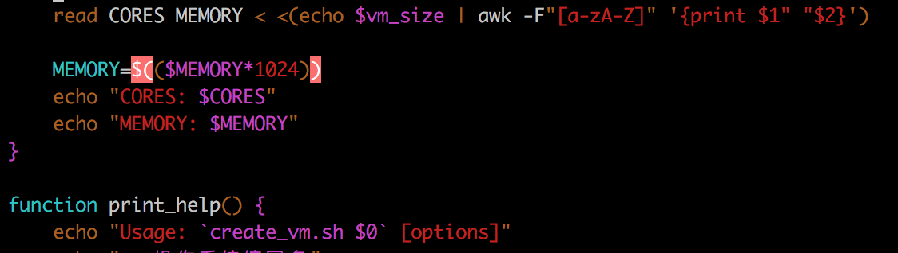

在shell中，经常会处理一些命令的输出内容，如果输出内容中有多个字符串需要截取出来赋值给多个变量，比较简单的方法是先将输出内容记录到一个临时文件，然后重复多次awk指令，将输出内容分别截取到不同变量中。

但是上述方法虽然逻辑简单，但是处理效率较低，重复执行的awk命令完全没有"营养"。

举例，需要将`uptime`指令输出的3个load值记录下来（1分钟，5分钟和15分钟），简餐的`uptime`输出类似如下

```
 09:12:11 up 494 days, 19:09,  1 user,  load average: 1.70, 1.60, 1.73
```

> 注意，上述输出内容中混合了多种分隔符号，例如`空格`，`:`，`,`，其中如果用空格来作为分隔符还需要注意多个空格。为了简化和明确分隔符，所以首先过滤掉`空格`，否则字符串中多少不一的空格符会让我们的`awk`无所适从。这里我们使用非常常规的`tr`命令

```bash
uptime | tr -d " "
```

此时输出结果

```
09:12:11up494days,19:09,1user,loadaverage:1.70,1.60,1.73
```

接下来就很容易结合使用`:`和`,`分隔符来过滤出3个负载值：

```bash
uptime | tr -d " " | awk -F "[:,]" '{print $8" "$9" "$10}'
```

输出内容就是

```
1.70 1.60 1.73
```

但是，问题来了，难道我还要一次次重复过滤赋值给变量么？

NO

# shell支持多变量同时赋值方法一

```bash
read a b c <<<$(echo 1 2 3) ; echo "$a|$b|$c"
```

这里采用了 `$(echo X Y Z)`，分别用空格符分隔的3个值`echo`出来后只要加上`$()`就可以转换成变量，就可以通过`<<<`读取到变量中。

所以，我们的脚本命令修改成

```bash
read load1 load5 load15  <<< $(echo $(uptime | tr -d " " | awk -F "[:,]" '{print $8" "$9" "$10}'))
```

> 注意：这里使用的第一次`$()`是为了将命令输出转换成变量，然后让`echo`指令打印出这个变量。然后再套上一个`$()`将`echo`输出的结果再次转换成变量。

此时可以非常容易就检查

```bash
$echo $load1
1.70

$echo $load5
1.60

$echo $load15
1.73
```

> 上述shell方法测试可行，不过有一个比较奇怪的地方，在vim中编辑显示`$()`会提示不正常的颜色，并且导致后续shell脚本代码代码高亮不正常，似乎存在语法问题：


但是，修改成下述方法二，则语法高亮显示正常：



# shell支持多变量同时赋值方法二

以下脚本是将虚拟机规格 `2c8g` 计算转换成实际的`CORES`和`MEMORY`变量值

```bash
read CORES MEMORY < <(echo $vm_size | awk -F"[a-zA-Z]" '{print $1" "$2}')

MEMORY=$(($MEMORY*1024))
echo "CORES: $CORES"
echo "MEMORY: $MEMORY"
```

第一个 `<` 是定向  第二个`<()`是进程替换

# 参考

* [Linux bash: Multiple variable assignment](https://stackoverflow.com/questions/1952404/linux-bash-multiple-variable-assignment)
* [shell给多个变量赋值的方法总结](https://www.cnblogs.com/sunss/archive/2011/02/09/1950268.html)