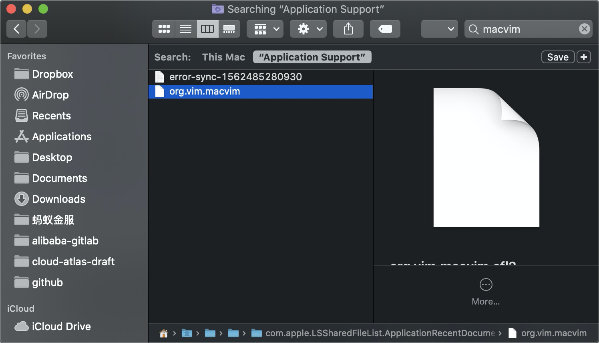

由于macOS不断发展，目前内置的vim软件包已经逐步采用了最新的社区版本，感觉已经满足了日常使用需要。所以准备采用macOS 10.15自带的vim来完成日常工作，卸载掉第三方的macvim。

* 卸载前退出macvim程序(可以通过Activity Monitor终止)

* 在Finder文件管理中，找到Applicatins目录，然后按下 `Cmd + Del` 按键删除

> 注意，此时在Louch中显示的 MacVim 图标加上了❓，无法正常使用，但是系统还没有清理干净。

* 在Finder中删除MacVim相关组件

访问 `~/Library` 目录 （同时按下 `Shift + Cmd + g` 可以打开 `Go` 菜单，输入目标目录，进入 `~/Library`) 

然后分别在以下目录中搜索 `macvim` 关键字

```
~/Library/Preferences/
~/Library/Application Support/
~/Library/Caches/
```

搜索到符合关键字 `macvim` 文件后删除



* 其他目录

```
    /Library/Preferences/
    /Library/Application Support/
    /Library/Caches/
```

# 参考

* [How to Uninstall MacVim 7.4 Application/Software on Your Mac](https://uninstallmacapp.com/macvim-7-4-removal.html) - 这个专业网站提供了卸载mac软件的各种指南