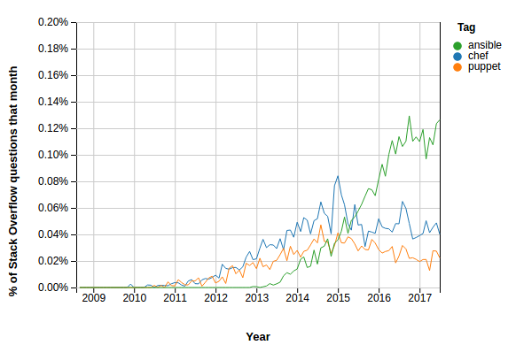

持续集成（自动测试）、持续交付、持续部署，是云计算的快速扩展和持续升级的基石。配置管理和自动化工具在云计算的时代，再次焕发出光彩。

> Docker的容器部署又带来了新的挑战和机遇，今后的持续集成将更强大和可定制化。在这个巨变的时代，技术的演进更为猛烈。

[DevOps](https://en.wikipedia.org/wiki/DevOps)是2008年出现的概念，将以往的持续集成进一步提炼和改进成一个完整的DevOps toolchain:

* 编程 - 代码开发和审查，源代码管理工具，代码合并等
* 编译 - 持续集成工具
* 测试 - 持续测试工具，能够提供商业风险的反馈
* 打包 - 软件仓库，应用程序预部署平台
* 发布 - 变更管理，发布确认，自动化发布
* 配置 - 基础架构的配置和管理，将基础架构视为代码工具
* 监控 - 应用程序性能监控，终端用户体验监控

# 主流DevOps

当前主要使用的DevOps配置管理工具有：

* Chef - 基于Ruby/Erlang开发，效率和速度较好，但文档和应用范围弱于Puppet
* Ansible - 基于Python，无Agent（通过ssh管理），灵活且功能强大，已经被Red Hat收购，未来发展可观
* Puppet - 基于Ruby开发，是目前使用最广泛，文档最丰富且具有海量企业级部署的开源平台工具
* CFEngine - 历史悠久的配置管理工具，有些复杂
* SaltStack - 基于Python，可使用Agent也可以无Agent

[Top 6 IT Automation Framework for DevOps (2017-2018)](https://vitalflux.com/top-6-it-automation-framework-for-devops-2017-2018/)提供了两个2017年分别统计StackOverflow和Google的趋势，大致可以看出：

* Puppet可能依然是企业级应用最广泛的DevOps平台（Gootle trends）

* Ansible最近两年在开发者使用活跃度上升较快，超过了chef和puppet

> 从[GitHub Collection - DevOps tools](https://github.com/collections/devops-tools)可以看到活跃开发的DevOps工具。

# 参考

* [DevOps](https://en.wikipedia.org/wiki/DevOps)
* [Top 6 IT Automation Framework for DevOps (2017-2018)](https://vitalflux.com/top-6-it-automation-framework-for-devops-2017-2018/)