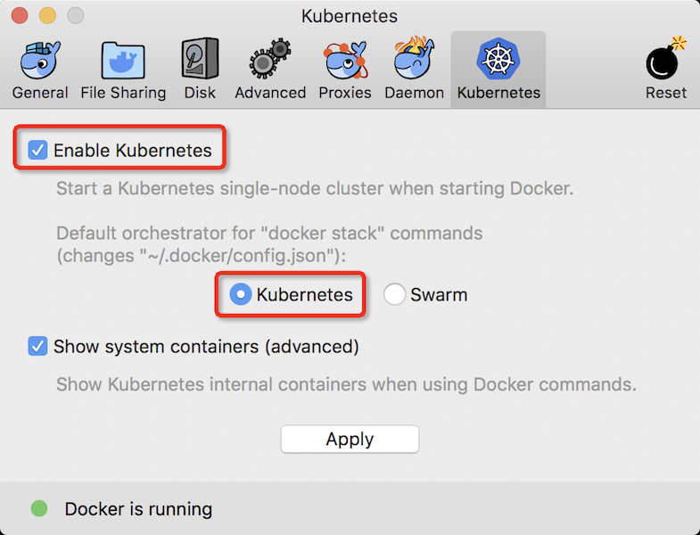

# 准备学习环境

开始学习Kubernetes时，通常可以采用虚拟机运行模拟，可以采用以下方式之一：

* [Minikube](https://kubernetes.io/docs/setup/minikube/)是一个方便在本地运行Kubernetes的工具，可以在笔记本中的一个虚拟机中运行一个单节点Kubernetes集群，用于尝试Kubernetes或者开发Kubernetes。

* 在[安装了Docker for mac](../../../virtual/docker/docker_for_mac/README)之后，就可以通过[Homebrew](https://brew.sh/)来安装Minikube。

> 当前最新版本的Docker for Mac已经内建安装了Kubernetes，也可以直接激活使用（通过Docker的Preferences菜单，其中`Kubernetes`页面有激活和设置功能）



* 在`VMware Fusion`（macOS平台虚拟化，在Windows平台对应可以使用VMware Workstation）中安装标准发行版操作系统，如CentOS 7，然后在虚拟机内部逐步手工搭建Kubernetes的运行环境。这种方法稍微麻烦一些，但是对Kubernetes模块会有更直观和细致的了解。

> 我的工作学习环境是macOS，所以上述方法中有`Docker for mac`和`VMware Fusion`，类似在Windows平台也有对应方法。
>
> 我个人学习采用`VMware Fusion`虚拟机最小化安装CentOS 7，然后分别构建单机和多机集群环境学习和测试Kubernetes。

## VMware虚拟机

* 在VMware虚拟机中安装CentOS 7，命名为 `centos7_base`，最小化安装，安装完成后立即通过 `yum update` 升级到最新状态。这个虚拟机是作为最基本的模版，后续我们将使用这个模版clone出需要的测试虚拟机，来部署Kubernetes的单机或集群所需要的OS系统，方便部署。

* VMware Fusion支持clone虚拟机方法（请参考[在VMware Fusion中复制虚拟机](../../../virtual/vmware/vmware_fusion_clone_vm)），首先clone出一个名为 `minikube` 的虚拟机。

* 登陆虚拟机完成以下基本设置（默认虚拟机DHCP分配地址改成静态分配`192.168.161.3`）

设置主机名

```
hostnamectl set-hostname minikube
```

修改`/etc/sysconfig/network-scripts/ifcfg-ens32` 

```
TYPE="Ethernet"
PROXY_METHOD="none"
BROWSER_ONLY="no"
BOOTPROTO="static"
DEFROUTE="yes"
IPV4_FAILURE_FATAL="no"
IPV6INIT="no"
IPV6_AUTOCONF="no"
IPV6_DEFROUTE="no"
IPV6_FAILURE_FATAL="no"
IPV6_ADDR_GEN_MODE="stable-privacy"
NAME="ens32"
UUID="9661c638-e460-4dd5-95cf-94fc725853a9"
DEVICE="ens32"
ONBOOT="yes"
IPADDR=192.168.161.3
NETMASK=255.255.255.0
GATEWAY=192.168.161.2
DNS1=192.168.161.2
```

`/etc/hosts` 修改或添加

```
192.168.161.3 minikube minikube.x.org
```

# 安装Kubernetes
