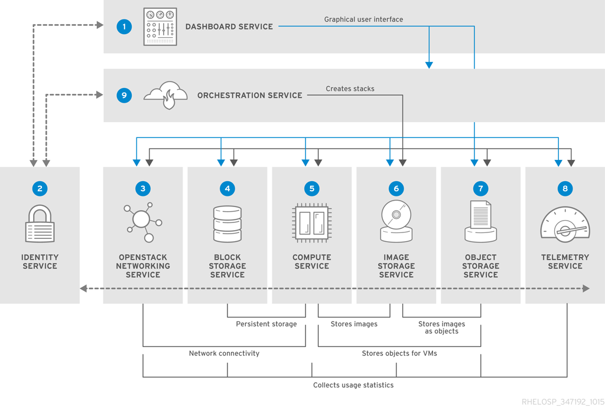

OpenStack IaaS是集成了计算，存储和网络资源的服务，提供扩展API的平台：

| 服务 | 项目名 | 描述 |
| ---- | ---- | ---- |
| Dashboard | horizon | 基于Web的管理控制台 |
| Identity | keystone | 为验证和授权提供集中管理的服务 |
| Networking | neutron | 提供链接服务管理 |
| Block Storage | cinder | 管理虚拟机的持久化存储卷 |
| Compute | nova | 在hypervisor节点管理虚拟机 |
| Image | glance | 存储虚拟机镜像和卷快照的资源注册服务 |
| Object Storage | swift | 允许用户存储和检索文件和随机数据 |
| Telemetry | ceilometer | 提供云计算资源的检测 |
| Orchestration(编排) | heat | 基于模版的编排引擎支持自动创建戏院堆栈 |

# 网络

OpenStack网络处理创建和管理虚拟网络架构，包括网络，子网和路由器。并且可以部署防火墙或者虚拟私有网络（VPN）。

OpenStack网络提供了可伸缩的不同服务，所有服务进程可以运行在单一物理服务器也可以运行在不同的多个服务器提供容灾。网络结构是软件定义的，所以可以实时改变，例如创建和修改IP地址。

OpenStack网络的优点包括：

* 用户可以自己创建网络，控制流量并连接服务器或设备
* 可伸缩的网络模型适合不同的网络划分和租户
* IP地址可以是分离或者浮动的，当使用浮动IP可以动态路由流量。
* 当使用VLAN网络，可以设置最多4096个VLAN，4096=2^12(减去2个没有使用的VLAN)网络地址，VLAN受到12位头部限制
* 如果使用VXLAN隧道网络，则VNI(Virtual Network Identifier)就可以使用24位头部，这样就可以使用160万独立地址网络。

## OpenStack网络组件

| 组件 | 描述 |
| ---- | ---- |
| Network agent | 运行在每个OpenStack节点的服务提供本地网络配置用于节点虚拟主机和网络服务，例如Open vSwitch |
| neutron-dhcp-agent | 为租户网络提供DHCP服务的代理 |
| neutron-ml2 | 管理网络驱动程序和提供路由、交换服务的插件，例如Open vSwitch 或 Ryu网络 |
| neutron-server | 管理用户请求和输出网络API的Python服务。默认服务配置使用一个插件来设置网络机制来实现网络API。一些插件，例如`openvswitch`和`linuxbridge`插件，使用原生的Linux网络机制，而其他一些插件则使用扩展设备或SDN控制器 |
| neutron | 访问API的命令行客户端 |

上图中：

* 两个计算节点运行Open vSwitch(`ovs-agent`)，并且一个OpenStack网络节点执行以下网络组件：
  * L3 routing
  * DHCP 
  * 包括了FWaaS和LBaaS的NAT
* 计算节点使用了2块物理网卡，一个网卡处理租户数据流量，另一个网卡用于管理连接
* OpenStack网络节点使用了第三方王凯分离提供流量

# 存储

## OpenStack块存储（cinder）

OpenStack块存储提供了持久化的块存储设备管理服务于虚拟硬盘。块存储使得用户能够创建和删除块设备，并且管理服务器的块设备。

| 组件 | 描述 |
| ---- | ---- |
| openstack-cinder-api | 响应请求并将请求加入到消息队列。当API服务接收到请求就会标志请求是否符合并转换成包含块设备请求的消息。消息被发送到消息处理器由其他块存储服务处理 |
| openstack-cinder-backup | 备份一个块设备卷岛一个外部扩展的存储仓库。默认OpenStack使用对象存储服务存储备份。可以使用Ceph或NFS后端来作为存储仓库用于备份 |
| openstack-cinder-scheduler | 设置任务到队列并确定提供服务的卷服务器。调度服务从消息队列中读取请求斌确定哪个块存储设备来执行请求活动。调度器然后和这个被选择的主机上的openstack-cinder-volume服务通讯来处理请求 |
| openstack-cinder-volume | 虚拟机的制定存储。卷服务管理和块存储设备等交互。当请求从调度器接收到之后，卷管理服务就创建，修改或删除卷。这个卷服务包括一些驱动来和块存储设备，例如NFS，Red Hat Storage, Dell Equallogic设备交互。 |
| cinder | 访问块存储API的命令行工具 |

# 参考

* [Red Hat OpenStack Platform Archecture Guide - COMPONENTS](https://access.redhat.com/documentation/en/red-hat-openstack-platform/10/paged/architecture-guide/chapter-1-components)