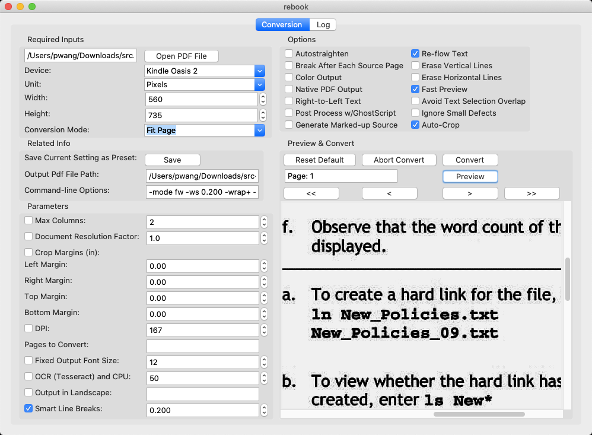

# pdf切边

如果你和我一样，只是需要对现有pdf文件进行白边切除，以便能够适应较小屏幕的kindle阅读，那么我推荐你使用 [briss](http://sourceforge.net/projects/briss/) 。只需要一条命令就可以实现白边切除:

```bash
java -jar briss-0.9/briss-0.9.jar -s myfile.pdf -d myfile-crop.pdf
```

如果要实现复杂的pdf文件处理，例如重排文本，则建议使用开源的 [K2pdfopt](https://www.willus.com/k2pdfopt/) 可以实现定制开发。

# k2pdfopt

[K2pdfopt](https://www.willus.com/k2pdfopt/)是一个优化PDF/DJVU文件来适合电子阅读器(如Kindle)和智能手机的工具。K2pdfopt可用于多列PDF/DJVU文件并且可以重排扫描的PDF文件的文字，也可以用于作为通用的PDF复制/裁边/重制/OCR识别等多功能工具。k2pdfopt可以使用一个可选的OCR层来生成原生的或者bitmapped的PDF输出。

k2pdfopt是一个开源软件，可以工作在MS Windows，Mac OSX和Linux平台。

> 在Mac OSX平台，第三方工具 [rebook](https://github.com/pwang7/rebook) 通过Tcl/Tk提供了图形界面，非常方便使用。

k2pdfopt是一个就有非常多参数的命令行工具，不过[第三方贡献了很多GUI程序来配合使用k2pdfopt](https://www.willus.com/k2pdfopt/contrib/)。例如Pu Wang开发了基于Python Tck/Tk的图形界面方便使用。

目前我使用体验还是不方便，k2pdfopt切边实际上是对文字进行了重新排版，虽然能够适合移动设备，但是丢失了原先的排版，看起来非常不舒服。

> 目前我还没有很好使用k2pdfopt来很好解决pdf切边功能，不过，从文档来看，这个开源工具是目前持续开发的开源软件，提供了很多pdf文档分析功能。



## rebook

[rebook](https://github.com/pwang7/rebook) 使用 Python3 和 Tcl/Tk 8.6 开发，需要注意Python 3必须在编译时内建支持 ``tkinter`` 才能运行这个程序。在macOS内建提供的Python3是不支持Tcl/Tk的，所以需要使用 Python官方提供 [Python 3.9.1](https://www.python.org/downloads/release/python-391/) (内建支持就可以非常顺滑使用。

将 `rebook.py` 复制到 `k2pdfopt` 同一个目录，然后执行：

```bash
python3 rebook.py
```

图形界面操作。

# 其他工具

## briss(最佳选择)

[briss](http://sourceforge.net/projects/briss/) 是一个开源跨平台软件，参考 [Are there tools available for trimming PDF margins?](https://superuser.com/questions/205126/are-there-tools-available-for-trimming-pdf-margins) 应该是一个比较实用的工具，并且在 [k2pdfopt](http://www.willus.com/k2pdfopt/) 也有引用这个工具的实用方法，说明这个工具的影响较大。虽然这个工具早在2012年就停止开发，但是直到今天(2020年底)依然可以看到每周有数百次下载记录，足以见得这个软件的生命力。

虽然briss不再开发，但是GitHub上有持续开发的 [Briss 2.0](https://github.com/mbaeuerle/Briss-2.0) 提供了GUI方便使用，切边命令相同:

```bash
./bin/Briss-2.0 -s dogeatdog.pdf -d dogcrop.pdf
./bin/Briss-2.0 -s dogeatdog.pdf
```

如果针对行或者列进行切分，则使用 `--split-col` 和 `--split-row` :

```bash
./bin/Briss-2.0 -s dogeatdog.pdf -d dogcrop.pdf --split-col
```

## pdfCropMargins

Python的模块 `pdfCropMargins` 是一个非常简单的pdf切边工具，不过这个工具实际上依赖 `pdftoppm` 或者 `Ghostscript` 来实现转换。但是 `pdftoppm` 是一个将pdf文档转成Portable Pixmap (PPM)图片，所以并不是合适作为pdf文档阅读。

```
pip install pdfCropMargins --upgrade

pdf-crop-margins -v -p 0 -a -6 input.pdf

-v : Verbose
-p : how much percentage of margin to be retained. We want the bounding box triming all the white margins on all sides. So say 0%
-a : Note: first -p is applied to create a bounding box. 
     IN this option it applies further on the bounding box after -p is applied. we can remove or add margin. Negative means add margin to the bounding box. So it will add 10bp all around after cliping
```

## goodreader

[GoodReader](https://goodreader.com/)是我使用过最好的iOS平台PDF阅读器，我特别喜欢这个软件具有的crop功能，可以非常方便调整视图，不显示pdf的空白部分，相当于放大了文字部分。

不过，不知道为何，最新的GoodReader 5已经不再提供之前的crop后的输出，也即是只有显示功能，如果文件输出以后还是和之前原生文档一样保留了白边。所以非常遗憾。目前只能在iOS平台上阅读，不能切边以后放到Kindle上阅读。

# 参考

* [Is there a Linux tool that can autocrop the white margins in a PDF file](https://superuser.com/questions/1487564/is-there-a-linux-tool-that-can-autocrop-the-white-margins-in-a-pdf-file)