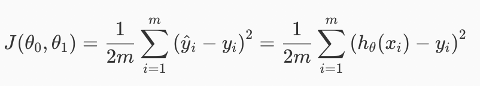
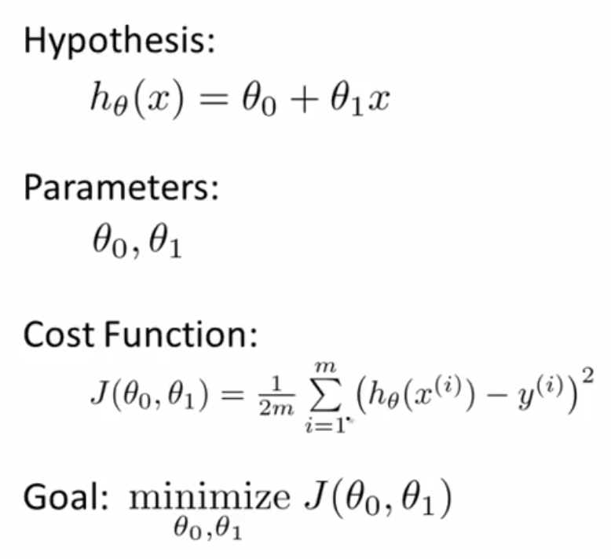

监督学习（给出正确的答案），在数据集中作出单变量的线性回归。

* regression(回归)
* linear regression(线性回归)

# 符号

* m = 训练案例的数量
* x's = 输入变量/输入特性（也称为特征量）
* y's = 输出变量/目标变量（也就是我们的预测结果）

我们用(x,y)表示表格中单独的一行对应于一个训练样本

(x上标(i),y上标(i))来表示第i个训练样本，这个上标i表示索引，也就是训练集中的第i行。通过这种方式的一对(x上标(i),y上标(i))来表示训练样本，一系列的训练样本m，称为训练集。

* h = hypothesis(假设)，h表示一个函数

输入变量x，经过h函数，输出预测结果y。我们的目标就是给定一个训练集，学习得到这个h函数。

h(x) = θ0 + Θx

> 单变量线性回归

# 代价函数（cost function）

代价函数（J）也称为平方误差函数，或者平方误差代价函数。通过代价函数来测量hypothesis函数（h函数）的精确性：

预测值和实际值的差的平方，按照数据集m累加起来，然后乘以 1/2m 。我们的目标是尽可能降低这个值，也就是减少预测值和实际值之间的差距。

平方误差代价函数可能是解决回归问题最常用的手段。

简化的假设：假设 θ0 = 0 ，即回归函数直线经过0原点

轮廓图（contour plot) 是包含很多轮廓线

# 梯度下降算法（Gradient descent）

梯度下降算法来解决代价函数最小化

梯度下降算法的特点：起始点略有不同，会得到非常不同的局部最优解。

斜率等于0，导数项等于0，局部最优解。当斜率减小（导数减小），更新幅度要降低（移动幅度不断降低），直到接近局部最低点，导数值会越来越小，直到0。