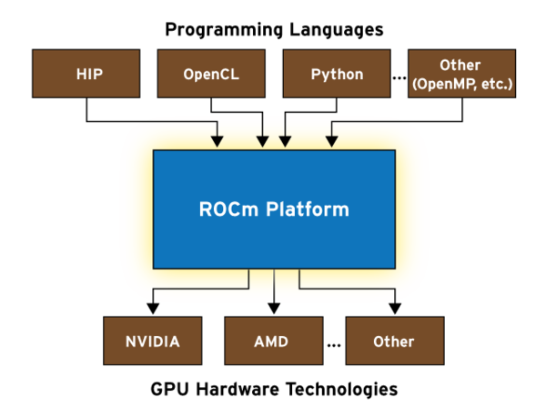
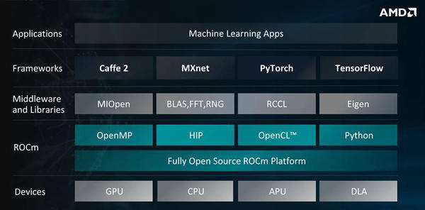

[ROCm](https://rocm.github.io/)是AMD推出的GPU计算开源框架，其实现和nVidia的CUDA类似。2016年AMD推出了ROCm计算平台，提供了硬件加速的并行计算环境。由于在GPU和机器学习上落后于nVidia，AMD推出的ROCm采用了开源、多平台的方式进行竞争。

2018年，AMD实现了Vega 7nm技术来制造GPU，提升了第二代高性能计算性能。

ROCm是统一的GPU加速计算，集成了多种程序语言支持，例如OpenCL, Python, HIP 等。ROCm甚至提供了将CUDA代码转换成原生ROCm的工具。

ROCm平台的核心是混合计算编译器（Heterogeneous Compute Compiler, HCC)，开源HCC基于Clang C++预处理器的LLVM编译器。HCC比传统的C++优势是带来全功能的AMD GPU环境的编程能力。

ROCm的特点是平台支持不同的开发语言并且接口可以工作在不同的GPU硬件环境，直接提供了OpenCL，Python以及一系列公共的C++变体。最具革新意义的平台是可移植性混合计算接口Heterogeneous-Compute Interface for Portability(HIP)工具，提供了厂商无关的C++支持，这样就可以在AMD或CUDA/NVIDIA GPU环境进行编译。

ROCm不仅支持C和C++，而且还支持Python Anaconda。Anaconda是一种特殊的Python版本，定制了科学计算和大规模数据处理。ROCm还原生支持OpenCL框架。OpenCL(Open Compute Lanaguage)是一种支持CPU和GPU并行计算怨言环境的一种混合框架，由非盈利组织Khronos负责。

AMD的ROCm内建了机器学习和AI加速，这是基于GPU的计算加强，最重要的是MIOpen机器学习库。MIOpen加入了错综复杂的神经网络加速。MIOpen库服务是一个在AI框架和ROCm平台之间的中间层，同时支持OpenCL和基于HIP编程环境。

ROCm支持TensolFlow机器学习框架，也支持Caffe2，PyTorch，MXNet以及其他机器学习框架。

# 参考

* [Exploring AMD’s Ambitious ROCm Initiative](http://www.admin-magazine.com/HPC/Articles/Discovering-ROCm)
