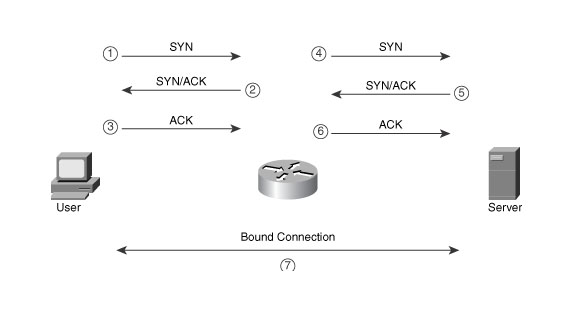

# TCP拦截（TCP Intercept）

针对TCP SYN洪水攻击的一个处理方法是部署Cisco IOS TCP拦截功能。TCP拦截是处理针对
TCP连接建立绘画的三段握手协议落点引发的攻击。

## TCP SYN Flood Attacks

TCP SYN洪水攻击是非常容易实现的黑客攻击，针对每个连接的三段握手发出大量准备完成的TCP SYN请求，典型是采用IP欺骗，即伪造每个数据包的源地址（无效地址或实际是其他人使用的地址），这样服务器需要承担巨量的半开放连接，直到连接TCP超市才能够释放。这将导致服务器拒绝正常的TCP连接。

## TCP拦截模式

TCP Intercept是Cisco IOS功能，用于防止TCP SYN flood attack。支持两种模式保护：intercept 和 watch。

### Intercept Mode

* 拦截模式采用主动处理TCP SYN洪水攻击



在`拦截模式`（Intercept Mode）下，路由器会拦截所有的TCP连接请求。当外部用户尝试使用TCP连接访问一个内部服务器是，路由器会拦截请求并假装自己就是内部服务器，以便能够完成和外部用户的完整TCP连接。（步骤1~3）

当路由器和外部用户间完整的三段握手成功结束，路由器就会发起第二个TCP连接到后端真实服务器（步骤4~6）。然后路由器捆绑这两个连接，创建一个单一连接。（步骤7）

大多数情况，这个处理过程对最终TCP连接的两端设备是完全透明的。通过这种主动方式，如果发生了TCP SYN洪水攻击，路由器提供一个到内部服务器的缓存，这样内部服务器就不会受到攻击：路由器会处理半开放连接，在time out时从路由器TCP连接表中移除连接。基本上，路由器发送一个RST给请求源设备。这意味着，正常请求将持续被路由器允许，这样正常的外部用户就可以完成三段握手。

> **注意**
>
> 在拦截模式下有一个限制，就是任何TCP参数协商都是在外部用户和路由器之间完成的，例如 RFC 1323 window scaling，是不会从路由器传递给内部TCP服务器。这是因为路由器是不知道这些TCP选项的，直到第一次和外部用户的三段握手完成并且路由器开始和内部TCP服务器发起第二次三段握手。通常，这个限制并不会导致问题，因为TCP允许在会话的常规操作中动态协商这些参数。

### Watch Mode

和拦截模式采用了一种主动处理TCP SYN洪水攻击的方式不同，`查看模式`（Watch Mode）采用一种被动处理（reactive approach）方式。在拦截模式下的主要优点是去除了内部服务器受到TCP SYN洪水攻击导致的负载增大，但是，这种方式也是双刃剑。当TCP SYN flood不再发生的时候，路由器仍然在执行拦截处理，导致在路由器上沉重的负担。

为避免这个问题，另外一种Watch模式采用了被动处理TCP SYN flood攻击的方式。路由器被动地观察用户到服务器的TCP连接的建立。此时路由器会监控这些连接，跟踪这些处于待定状态的初始连接。然后路由器比较一个预先配置的timeout值（默认是30秒）。如果一个TCP连接在这个时间范围内没有完成TCP三段握手，Cisco IOS就发送一个TCP reset给服务器来移除这个连接。对于一个针对内部服务器的TCP攻击，这就移除了半开放连接，降低了服务器负载以便服务器能够处理正常的连接。

# TCP Intercept配置和验证

* 激活TCP Intercept

第一步是指定TCP会话设置TCP Intercept：

```
Router(config)# ip tcp intercept list extended_ACL_#
```

注意这个命令是全局配置模式，不是子啊接口配置

* 使用一个扩展ACL来指定哪种流量采用TCP Intercept。例如，如果要监控所有TCP创建连接，则使用如下命令：

```
Router(config)# access-list 100 tcp permit tcp any any
Router(config)# ip tcp intercept list 100
```

**`通常这个配置是一个非常糟糕的，因为路由器变成了所有进出连接的代理`**

正确的设置是针对应用服务设置TCP Intercept，例如邮件服务器或者WEB服务器，设置只监控端口25流量和80端口流量的TCP Intercept。这样可以大大降低路由器监控的TCP连接数量。

* 定义模式

```
Router(config)# ip tcp intercept mode {intercept | watch}
```

* 更改计时器

对于萌芽计时器，连接重置计时器和连接idle计时器，有3个配置命令

```
Router(config)# ip tcp intercept watch-timeout seconds
Router(config)# ip tcp intercept finrst-timeout seconds
Router(config)# ip tcp intercept connection-timeout seconds
```

* 修改阀值

在拦截和观察模式，TCP Intercept使用阀值来处理TCP SYN洪流攻击的超出的TCP连接：一个基于初始连接的总数量，一个基于在最近一分钟内连接请求数。

当阀值达到时，路由器将丢弃最老的初始连接。在拦截模式时，路由器通过`减半`方式降低初始SYN字段的超时重传时间。在Watch模式，路由器则按照配置值的一半自动降低watch时间（例如你配置30秒，则变成15秒）。

```
outer(config)# ip tcp intercept max-incomplete high number
Router(config)# ip tcp intercept max-incomplete low number
```

```
Router(config)# ip tcp intercept one-minute high number
Router(config)# ip tcp intercept one-minute low number
```

* 修改丢弃模式：

```
Router(config)# ip tcp intercept drop-mode {oldest | random}
```

# 验证配置

```
Router# show tcp intercept statistics
intercepting new connections using access-list 100
12 incomplete, 5 established connections (total 17)
1 minute connection request rate 2 requests/sec
```

检查拦截的连接统计：

```
Router# show tcp intercept connections 
Incomplete:
Client      Server      State  Create  Timeout Mode
201.1.1.1:33772  200.1.1.30:80  SYNRCVD 00:00:09 00:00:05 I
201.1.1.1:33773  200.1.1.30:80  SYNRCVD 00:00:09 00:00:05 I
     
Established:
Client       Server     State  Create  Timeout Mode
201.1.1.2:33771  200.1.1.2:23  ESTAB  00:00:08 23:59:54 I
```

# TCP Intercept配置案例

```
Router(config)# access-list 100 tcp permit tcp any host 192.1.1.1 eq 80
Router(config)# access-list 100 tcp permit tcp any host 192.1.1.2 eq 25
Router(config)# ip tcp intercept list 100
Router(config)# ip tcp intercept mode watch
Router(config)# ip tcp intercept watch-timeout 20
Router(config)# ip tcp intercept connection-timeout 120
Router(config)# ip tcp intercept max-incomplete high 600
Router(config)# ip tcp intercept min-incomplete low 500
Router(config)# ip tcp intercept one-minute high 800
Router(config)# ip tcp intercept one-minute low 600
```


# 参考

* [Cisco Router Firewall Security: DoS Protection](http://www.ciscopress.com/articles/article.asp?p=345618&seqNum=3)
* [Configuring TCP Intercept (Preventing Denial-of-Service Attacks)](https://www.cisco.com/c/en/us/td/docs/ios-xml/ios/sec_data_dos_atprvn/configuration/15-mt/sec-data-dos-atprvn-15-mt-book/sec-cfg-tcp-intercpt.pdf)
* [Configuring Connection Settings](https://www.cisco.com/c/en/us/td/docs/security/asa/asa90/configuration/guide/asa_90_cli_config/conns_connlimits.pdf)
* [Cisco ASA TCP SYN Checks](https://damn.technology/cisco-asa-tcp-syn-checks) - 提供通过ACL方式构建针对某段IP地址不检测TCP SYN，如果发现ASA影响了正常业务（如随机SYN丢包）可以尝试通过排除方法，暂时关闭特定业务IP段的TCP SYN检查来对比排查。