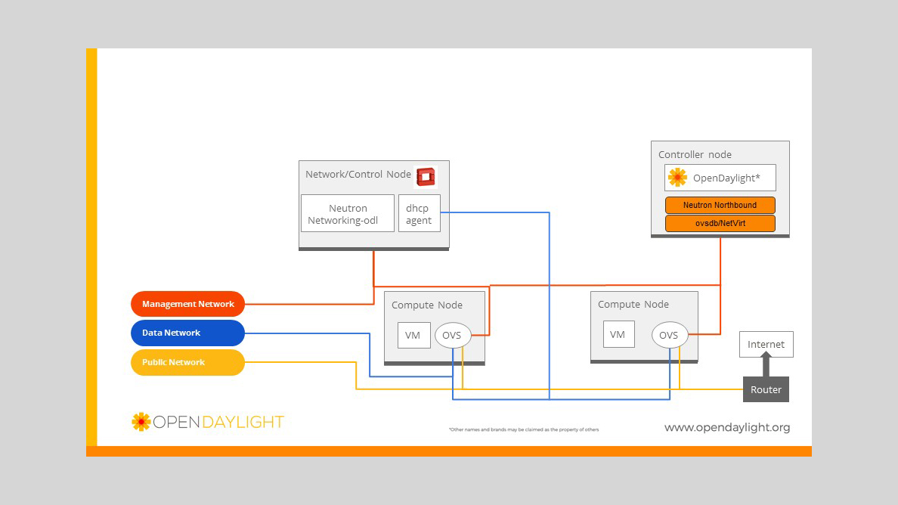

# ntop的开源替代产品

[As ntop is now useless, what are the alternatives?](http://www.linuxquestions.org/questions/linux-software-2/as-ntop-is-now-useless-what-are-the-alternatives-4175471001/) 讨论了一些ntop的替代产品，其中开源软件部分实现：

* [nethogs](https://github.com/raboof/nethogs)

nethogs是基于`/proc`实现`针对进程统计带宽`的'net top'工具（也支持通过libcap的抓包模式），对于特定网络环境分析非常有用。

注意使用最新版本以确保准确监控和性能。

* [vnStat](http://humdi.net/vnstat/)

vnStat是一个控制台网络流量监控程序，但是这个工具不是通过捕捉数据包来分析流量，而是通过内核提供的网络接口状态来实现统计，所以系统资源消耗非常少。

支持按照小时、天、周、月来统计网络流量，也可以显示实时流量

```
vnstat -l
```

> 不过没有看到端口

* [Collectl](http://collectl.sourceforge.net/)

综合了cpu、内存、磁盘、网络、nfs等监控的控制台程序，优点是支持监控的内容比较全，但是没有详细的协议分析。

* 完善的网络监控平台 [observium](http://www.observium.org) 

observium 是基于SNMP的网络流量和设备问题度、服务器日志监控平台，偏向于监控Cisco网络设备情况。

# ntop的闭源替代产品

* [DATADOG](https://www.datadoghq.com/)

Datadog的客户端agent是开源的python程序，服务端则混合了一系列开源和闭源技术，如[D3.js](https://en.wikipedia.org/wiki/D3.js)、[Apache Cassandra](https://en.wikipedia.org/wiki/Apache_Cassandra)、[Kafka](https://en.wikipedia.org/wiki/Apache_Kafka)、[PostgreSQL](https://en.wikipedia.org/wiki/PostgreSQL)。


# 思考

ntop通过sniffer的抓包方式进行流量分析，虽然非常精确，但是带来极大的系统开销，对于高负载和高网络流量的环境会有比较大的局限性。估计需要配合特定的硬件以及闭源驱动来实现真实环境的监控分析。

通过内核提供的协议流量分析模块来实现，例如openflow, netflow协议，如果能够在主机实现，通过分布式统计方式来计算和展示集群数据流动情况。

[OpenDaylight](https://www.opendaylight.org/)结合OpensStack



# 参考

* [As ntop is now useless, what are the alternatives?](http://www.linuxquestions.org/questions/linux-software-2/as-ntop-is-now-useless-what-are-the-alternatives-4175471001/)