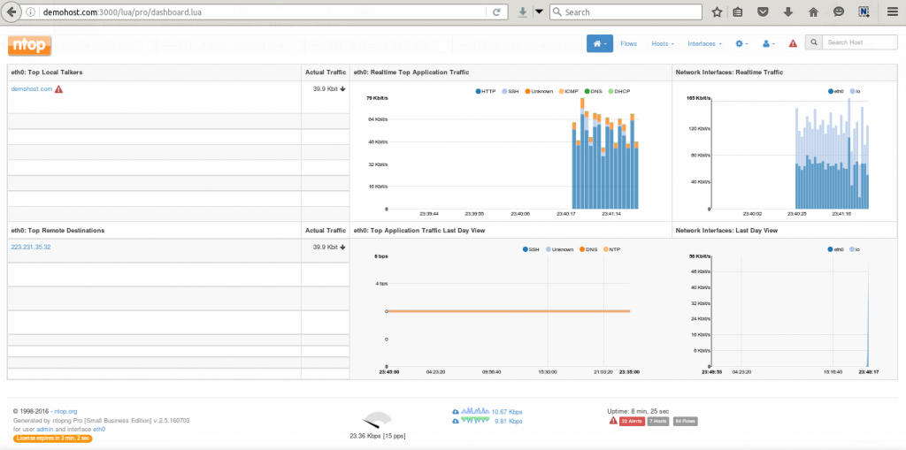

# ntop简介

ntop (ntopng) 是一个网络流量分析监控系统，提供了网络流量，最大主机数据，最高流量，应用协议，以及实时流发送观察。并且提供了ntopng的web界面方便观察。

# 安装

* 安装EPEL/NTOP repo

```
wget http://dl.fedoraproject.org/pub/epel/7/x86_64/e/epel-release-7-7.noarch.rpm
rpm -ivh epel-release-7-7.noarch.rpm

cd /etc/yum.repos.d/
wget http://packages.ntop.org/centos/ntop.repo -O ntop.repo
```

* 安装Redis

ntopng安装需要 Redis 和 Hiredis

```
yum install redis hiredis
```

* 安装ntopng

```
yum clean all
yum update
yum install pfring n2disk nprobe ntopng ntopng-data cento nbox
```

`nprobe` 软件包安装依赖 `mysql-community-libs >= 5.6` 所以要先安装mysql社区版本。参考 [Installing MySQL on Linux Using the MySQL Yum Repository](https://dev.mysql.com/doc/mysql-repo-excerpt/5.6/en/linux-installation-yum-repo.html)，首先访问 [MySQL Yum Repository](https://dev.mysql.com/downloads/repo/yum/)找到最新GA版本

```
yum localinstall https://dev.mysql.com/get/mysql57-community-release-el7-11.noarch.rpm
```

然后再次执行

```
yum clean all
yum update
yum install pfring n2disk nprobe ntopng ntopng-data cento nbox
```

* 激活Redis/NTOPNG

```
systemctl enable redis
systemctl enable ntopng
systemctl restart redis
systemctl start ntopng
```

> 此时启动`ntopng`时存在报错的，提示需要指定redis

* 配置防火墙

```
yum install firewalld
systemctl start firewalld
systemctl enable firewalld
```

* 配置防火墙

```
firewall-cmd --zone=public --add-port=3000/tcp --permanent
firewall-cmd --zone=public --add-port=6379/tcp --permanent
firewall-cmd --reload
```

* 配置 `/etc/ntopng/ntopng.start`内容如下

```
-local-network "192.168.122.0"
-interface 0
```

* 配置 `/etc/ntopng/ntopng.conf`内容如下

```
-G=/var/run/ntopng.pid
```

* 重启ntopng/redis

```
systemctl restart redis
systemctl restart ntopng
```

* 使用浏览器访问服务器的3000端口



> 注意：ntop没有购买企业版本则只能运行10分钟企业版功能，然后切换到社区版功能
>
> 很不幸，企业版本已经闭源，所以现在可用的`ntopng`功能非常有限
>
> 请参考[nettop的开源替代](ntop_alternative)

# 参考

* [How to setup ntop on Centos 7](https://hostingwikipedia.com/setup-ntop-centos-7/)
