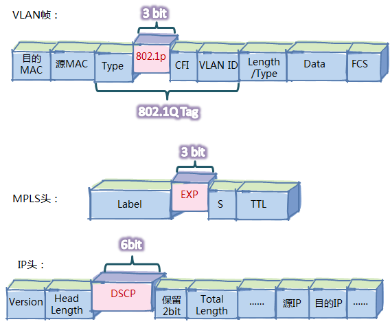
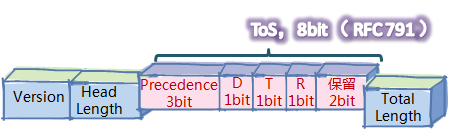
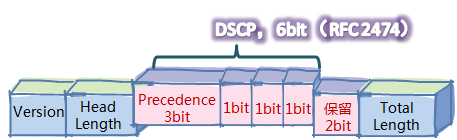

> 本文是对DSCP对好奇触发整理的一些资料，仅供自己学习参考。

IP QoS服务模型，其中比较突出的有2种：

* 集成服务（IntServ）模型
* 差分服务（DiffServ）模型

集成服务模型，要求用户要事先申请，声明想要什么样的服务，网络在资源满足的情况下，预留资源以满足该请求。就像旅游巴士一样，能保证每个人都有座位，但是有的车没坐满也照常开，座位空着就空着了。

> 可能由于资源消耗缺陷？集成服务模型从上世纪90年代中叶提出至今，没有在IP网络中商用过。目前IP网络广泛使用的是`差分服务模型`。

差分服务，其实就是将网络中的流量分成多个类，不同的类采用不同的处理。也就是说，先对流量分类，然后把类别标记在报文头中，通过报文携带到网络上，网络各节点只需要简单地识别报文中的这些标记，进行相应的处理。

# DSCP

报文头有很多，二层的帧头、2.5层的MPLS头、3层的IP头，每层都有标记，对应的标记分别被称为802.1P，EXP、DSCP。

ToS也是IP头里的字段。最初，标准定义的IPv4报文头，并没有DSCP，而是有个8bit的ToS域，且前三位才是表示优先级的，即Precedence，一共才8种等级。

标准重新定义了这个域，将保留位的其中一比特定义为C比特位，并将D、T、R和C共4个比特位称为ToS域。华为路由器遵从的是RFC 1349。

最后，标准重新定义这8个比特，前6位改名为DSCP

# PHB

PHB是`Per Hop Behavior`的缩写，即 **每跳行为** ，即设备对报文的处理。可能有人理解为PHB就是调度、丢包、监管、整形、重标记等动作，实际上不完全是，这些动作是设备具体的行为，而PHB只定义了一些外部可见的转发行为，并没有指定特定的实现方式。

RFC定义了四类标准的PHB，并用CS、EF、AF、BE这些符号来表示，每类PHB都对应一组DSCP。其实，PHB这样分类，是根据那些可见的服务特征，如时延、抖动或丢包率:

* `BE`，没有质量保证，一般对应于传统的IP分组投递服务，只关注可达性，其他方面不做任何要求。IP网络中，缺省的PHB就是BE。任何路由器都必须支持BE PHB。
* `AF`，代表带宽有保证、时延可控的服务，适用于视频、语音、企业VPN等业务 。
* `EF`，低时延、低抖动、低丢包率，对应于实际应用中的视频、语音、会议电视等实时业务。
* `CS`，因为现网有些存量设备不支持差分服务，只解析DSCP前3位，为了后向兼容，标准预留了所有格式为XXX000的DSCP值 ，这类值就对应为CS PHB。

PHB体现的是等级的高低，而不是服务质量(QoS)的好坏，不能说CS的等级最高，服务质量最好；BE等级最低，质量最差。PHB只是逐跳行为，而服务质量是端到端的。服务质量，通常用如下参数来衡量：

* 带宽/吞吐量
* 时延
* 时延变化（抖动）
* 丢包率
* 可用性

# 简单流分类（入映射与反映射）

简单流分类，是采用简单的规则（例如，只根据IP报文的优先级标记字段，如IP的DSCP、MPLS的EXP或VLAN的802.1p），对报文进行粗略的分类。而复杂流分类，采用的分类规则稍微“复杂”一点，可以根据除了优先级标记之外的字段（例如，五元组，MAC、协议号、label、TTL等等），对报文进行精细的分类。

差分服务是先分类，打标记，然后再进行各种PHB动作。但是不可能每次QoS动作，比如入队列、丢包，调度出队等，都去解析报文头。所以在设备内部为每个报文设置了两个内部标记：Service-Class和Color，对应服务等级（也称为调度优先级）和丢弃优先级。

设备在解析报文头的时候，根据报文头的优先级来设置这两个内部标记。这样，设备在执行各种QoS动作时，读取这两个标记就行了。也就是说，设备的各种QoS动作都是围绕这两个内部标记进行的。

IP网络中，缺省的PHB就是BE， 所以这两个内部标记初始值设为`<BE, Green>`。初始化之后，如果入接口配置了`trust upstream`命令，则设备上行单板（接口入方向）解析报文时，会根据报文优先级，对照入映射表来重新设置`<Service-Class, color>`，这一过程称为“入映射” 。

如果对报文配置`remark`，或者`car`后`remark`，无论在入接口或出接口，设备都会去修改`<Service-Class, color>`。之后，设备根据`<Service-Class, color>`来对报文进行队列调度等一系列QoS动作。这些QoS动作做完之后，设备下行单板（接口出方向）还要做一个动作：根据内部优先级修改报文优先级，这个过程称为“反映射”。当然，反映射也是可选的配置，毕竟有些场景是不希望改变报文优先级的。

# 复杂流分类（流策略）

复杂流分类，可以采用复杂的规则，如由五元组，对报文进行精细的分类。分类之后，要和动作关联起来才有意义。将流分类和对应的流动作关联，就是流策略。流策略在配置上采用“模板化”方式，“模板化”的最大优点是可以节省配置，支持批量修改。

流策略“模板”分为三部分：

* 流分类（Classifier）：用if-match语句设定流分类的匹配规则。
* 流动作（Behavior）：定义针对该类流量实施的流动作，例如重标记、重定向、负载分担、报文分片、流量限速、流量统计等等。
* 流策略（Policy）：将流分类Classifier和流动作Behavior关联，设置完毕后还需要应用到流量的入接口/出接口。

# 拥塞管理（队列机制）

除了流分类和标记，差分服务比较优秀的地方还有强大的队列技术。当网络拥塞，也就是进来的报文太多，设备处理不过来，就让报文排队。

## 队列调度算法

* 先进先出FIFO（First In First Out）
* 严格优先调度SP（ Strict Priority）
* 轮询调度RR（Round Robin）
* 加权公平队列WFQ（ Weighted Fair Queuing）

# 拥塞避免（丢弃策略）

两种丢弃策略:

* “尾丢弃”

“尾丢弃”就是在网络拥塞时把新到的报文丢弃。

* WRED（ Weighted Random Early Detection，加权随机早期检测）

# 流量限速（CAR和流量整形）

流量限速有两种技术

* CAR
* 流量整形

流量整形是在队列机制里使用，用于限制某个或某些队列的输出速率，超速了就暂停输出，超速的报文暂时存在缓存里，等空闲了还是会输出，不被丢弃；而CAR与队列无关，CAR是没用到缓存的，超速的报文直接丢弃。

# 微软操作系统的QoS支持

* 带宽管理

Windows Server 2012 引入了最小带宽。最小带宽在发生网络拥塞时向工作负荷提供指定级别的服务，同时仍允许此工作负荷在没有网络拥塞的情况下具有较高带宽利用率。 

* 服务器消息块直通（SMB 直通）和数据中心桥接 (DCB)

最小带宽和最大带宽由 QoS 数据包计划程序实施。 它们十分适用于流过 Windows Server 网络堆栈的流量。

但有些网络流量会绕过网络堆栈。 最值得注意的示例是服务器消息块直通（SMB 直通），这是在 **远程直接内存访问 (RDMA)**  基础上构建的 Windows Server 2012 功能。 `SMB 直通将 SMB 流量直接卸载到支持 RDMA 的 NIC` ，以减少延迟以及花费在网络方面的 CPU 周期数。 由于 SMB 直通仍会与 NIC 硬件上的其他网络流量竞争带宽，因此如果不加以抑制，流量可能会影响甚至阻止其他流量。

针对上述问题，可使用数据中心桥接 (DCB)。 DCB 由某些 NIC 供应商在网络适配器中 实现。 DCB 的工作方式与最小带宽相似：每个类别的流量（无论是否进行卸载）都具有带宽分配；发生网络拥塞时，每个类别可获取其份额 - 否则，每个类别获取尽可能多的可用带宽。

## Hyper-V QoS

QoS 中的一种新功能（称为 Hyper-V QoS）使你可以管理虚拟网络上的流量。

Hyper-V QoS 支持管理高允带宽和低允带宽限制（通常指最大带宽和最小带宽）。

# Cisco 路由器服务质量 (QoS)

> 差分服务 (DiffServ) 由中间系统基于服务类型 (ToS) 字段依照相对优先级处理流量。DiffServ 标准在 RFC 2474 和 RFC 2475 中有所定义，它取代了 RFC 791 中介绍的用于定义数据包优先级的原规范。

RFC 未规定 PHB 的实施方法；这是供应商的职责。Cisco 实施了排队技术，可将其 PHB 建立在数据包 IP 报头中的 IP 优先级或 DSCP 值的基础上。根据 DSCP 或 IP 优先级，可将流量置于特定的服务类别。以相同方法处理同一服务类别的数据包。

## 差分服务代码点

DiffServ 字段的 6 个最高有效位称为 DSCP。DiffServ 字段体系结构中未定义 DiffServ 字段的最后 2 个当前未使用 (CU) 位。这些位现在用作显式拥塞通告 (ECN) 位。网络边缘的路由器将数据包进行分类，并使用 DiffServ 网络中的 IP 优先级或 DSCP 值对其进行标记。网络核心中支持 DiffServ 的其他网络设备使用 IP 报头中的 DSCP 值为数据包选择 PHB 行为，并提供相应的 QoS 处理。

* ToS 字节
  * IP 优先级 - 3 位（P2 到 P0）
  * 延迟、吞吐量和可靠性 - 3 位（T2 到 T0）
  * CU（当前未使用）- 2 位（CU1 到 CU0）

| P2 | P1 | P0 | T2 | T1 | T0 | CU1 | CU0 |
| ---- | ---- | ---- | ---- | ---- | ---- | ---- | ---- |

* DiffServ 字段
  * DSCP - 6 位（DS5 到 DS0）
  * ECN - 2 位

| DS5 | DS4 | DS3 | DS2 | DS1 | DS0 | ECN | ECN |
| ---- | ---- | ---- | ---- | ---- | ---- | ---- | ---- |

## 使用 DSCP 字段

使用 DSCP 字段的方式有三种：

* 分类器 - 根据数据包报头的部分内容选择数据包，并根据 DSCP 值定义的服务特征应用 PHB。
* 标记器 - 根据流量配置文件设置 DSCP 字段。
* 计量 - 使用整形器或丢弃器功能根据流量配置文件检查符合性。

## 数据包分类

数据包分类涉及使用流量描述符在特定组内对数据包进行分类，使数据包可接受网络中的 QoS 处理。使用数据包分类可对网络流量进行分区，划分到多个优先级或一个服务类别 (CoS) 中。 

# 参考

* [一个报文的路由器之旅 - (4) QoS基础](http://forum.huawei.com/enterprise/zh/thread-161043-1-1.html)
* [Windows 2012 服务质量 (QoS) 概述](https://msdn.microsoft.com/zh-cn/library/hh831679(v=ws.11).aspx)
* [使用 DSCP 实施服务质量策略](https://www.cisco.com/c/zh_cn/support/docs/quality-of-service-qos/qos-packet-marking/10103-dscpvalues.html)