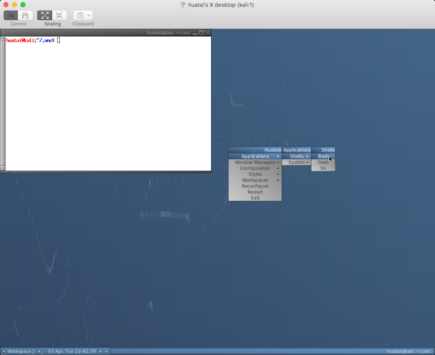

在[定制Kali Linux桌面i3窗口管理器](customise_kali_linux_i3_window_manager)之后，发现通过VNC运行i3遇到了无法使用`$mod`键的问题，暂时无法解决。所以在Kali Linux中，改为采用fluxbox来作为轻量级window manager。

> [Perfect Fluxbox Desktop on Kali Linux](https://www.howtoforge.com/tutorial/setup-fluxbox-desktop-on-kali-linux/)介绍了一些从其他平台（如Gnome）引入的小工具来增强fluxbox，不过由于我在树莓派上使用Kali Linux，只使用最基本的轻量级功能，所以没有安装桌面增强软件。

> 服务器之间的网络拓扑见[定制Kali Linux桌面i3窗口管理器](customise_kali_linux_i3_window_manager)

* 安装TightVNC server软件包：

```
apt-get install tightvncserver
```

* 安装`autocutset`以便在开户端和服务器之间激活`cut&paste`功能

```
apt-get install autocutsel
```

* 首先给自己的账号设置vnc密码：

```
vncpasswd
```

* `~/.vnc/xstartup`设置如下

```bash
#!/bin/sh

xrdb $HOME/.Xresources
xsetroot -solid grey
autocutsel -fork
#x-terminal-emulator -geometry 80x24+10+10 -ls -title "$VNCDESKTOP Desktop" &
#x-window-manager &
# Fix to make GNOME work
export XKL_XMODMAP_DISABLE=1
#/etc/X11/Xsession
fluxbox &
```

* 启动VNC

```
vncserver :1
```

* 桌面访问立即可以使用，省却了繁琐的`i3`配置，只需要通过右键点击就可以调出菜单选择需要运行的程序。

* VNC客户端访问

在macOS上，系统内置就有vnc viewer客户端，但是没有明显的程序图标入口。可以通过Safari浏览器调用：`vnc://192.168.7.10:5901` 打开Kali Linux的VNC访问，输入密码验证通过就可以看到Fluxbox桌面：



> 初始安装的最小化Kali Linux实际只是一个Debian系统，真正发挥作用的是需要安装部署[Kali Linux Metapackages](https://www.kali.org/news/kali-linux-metapackages/)来实现各种渗透工具的使用。详细请参考[Kali Linux初始化](initial_kali_linux)

# Fluxbox菜单

默认菜单文件是`~/.fluxbox/menu`，如果要定制菜单，可以将`~/.fluxbox/init`配置中设置指向自己复制出来的菜单文件：

```
sed -i 's/\/menu/\/custommenu/1' ~/.fluxbox/init
```

然后就可以直接编辑`~/.fluxbox/custommenu`，举例：

```
[begin] (Kali Fluxbox!)
[encoding] {UTF-8}
	  [exec] (Screenshot) {xfce4-screenshooter -r}
[separator]
#Favorites
	  [exec] (Terminator) {terminator}
	  [exec] (Files) {nautilus --no-desktop}
	  [exec] (Firefox) {firefox}
	  [exec] (Chrome) {google-chrome}
	  [exec] (Burp Suite) {burpsuite}
	  [exec] (Metasploit) {gnome-terminal -e msfconsole}
	  [exec] (Run...) {fbrun}
[separator]
#...
```

上述配置中：

* `[begin]`: 开始菜单和特定的菜单标题
* `[separator]`: 分割线
* `[exec]`: 执行命令的菜单内容

# Fluxbox风格：

`Debian Dark`看上去比较专业：


# 参考

* [Perfect Fluxbox Desktop on Kali Linux](https://www.howtoforge.com/tutorial/setup-fluxbox-desktop-on-kali-linux/)