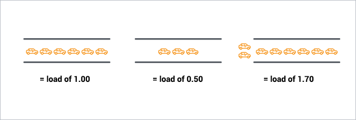

观察到一个奇怪的现象，同样的Raspberry Pi 4，区别是一个Pi4是2G版本，使用TF卡；另一个Pi4是8G版本，直接使用外接的SSD移动硬盘。
两个树莓派都是使用Ubuntu 20.04 for Raspberry Pi 64bit版本，操作系统原先是安装在TF卡，然后通过dd命令clone到另一个使用SSD移动硬盘的树莓派。

照理说两个系统应该完全一致，但是发现还是有点差异

* 8G版本，可以连接无线访问internet，我发现这个主机始终有一个负载Load 1存在，但是，却看不到运行的进程，系统进程基本都是sleep的

```
top - 22:54:18 up 1 day,  5:02,  2 users,  load average: 1.00, 1.00, 1.00
Tasks: 129 total,   1 running, 128 sleeping,   0 stopped,   0 zombie
%Cpu(s):  0.1 us,  0.1 sy,  0.0 ni, 99.8 id,  0.0 wa,  0.0 hi,  0.0 si,  0.0 st
MiB Mem :   7810.3 total,   7246.5 free,    173.0 used,    390.8 buff/cache
MiB Swap:      0.0 total,      0.0 free,      0.0 used.   7522.3 avail Mem

    PID USER      PR  NI    VIRT    RES    SHR S  %CPU  %MEM     TIME+ COMMAND
   4079 ubuntu    20   0   10700   3176   2720 R   0.7   0.0   0:00.15 top
   3852 root      20   0       0      0      0 I   0.3   0.0   0:00.10 [kworker/0:1-events]
      1 root      20   0  167624  10796   7336 S   0.0   0.1   0:06.50 /sbin/init fixrtc
      2 root      20   0       0      0      0 S   0.0   0.0   0:00.06 [kthreadd]
      3 root       0 -20       0      0      0 I   0.0   0.0   0:00.00 [rcu_gp]
      4 root       0 -20       0      0      0 I   0.0   0.0   0:00.00 [rcu_par_gp]
      6 root       0 -20       0      0      0 I   0.0   0.0   0:00.00 [kworker/0:0H-kblockd]
      8 root       0 -20       0      0      0 I   0.0   0.0   0:00.00 [mm_percpu_wq]
      9 root      20   0       0      0      0 S   0.0   0.0   0:00.08 [ksoftirqd/0]
     10 root      20   0       0      0      0 I   0.0   0.0   0:02.40 [rcu_preempt]
     11 root      rt   0       0      0      0 S   0.0   0.0   0:00.60 [migration/0]
     12 root     -51   0       0      0      0 S   0.0   0.0   0:00.00 [idle_inject/0]
     14 root      20   0       0      0      0 S   0.0   0.0   0:00.00 [cpuhp/0]
     15 root      20   0       0      0      0 S   0.0   0.0   0:00.00 [cpuhp/1]
     16 root     -51   0       0      0      0 S   0.0   0.0   0:00.00 [idle_inject/1]
     17 root      rt   0       0      0      0 S   0.0   0.0   0:00.60 [migration/1]
     18 root      20   0       0      0      0 S   0.0   0.0   0:01.06 [ksoftirqd/1]
     20 root       0 -20       0      0      0 I   0.0   0.0   0:00.00 [kworker/1:0H-kblockd]
     21 root      20   0       0      0      0 S   0.0   0.0   0:00.00 [cpuhp/2]
     22 root     -51   0       0      0      0 S   0.0   0.0   0:00.00 [idle_inject/2]
     23 root      rt   0       0      0      0 S   0.0   0.0   0:00.60 [migration/2]
     24 root      20   0       0      0      0 S   0.0   0.0   0:00.04 [ksoftirqd/2]
     26 root       0 -20       0      0      0 I   0.0   0.0   0:00.00 [kworker/2:0H-kblockd]
     27 root      20   0       0      0      0 S   0.0   0.0   0:00.00 [cpuhp/3]
     28 root     -51   0       0      0      0 S   0.0   0.0   0:00.00 [idle_inject/3]
     29 root      rt   0       0      0      0 S   0.0   0.0   0:00.58 [migration/3]
     30 root      20   0       0      0      0 S   0.0   0.0   0:00.05 [ksoftirqd/3]
     32 root       0 -20       0      0      0 I   0.0   0.0   0:00.00 [kworker/3:0H-kblockd]
     33 root      20   0       0      0      0 S   0.0   0.0   0:00.04 [kdevtmpfs]
     34 root       0 -20       0      0      0 I   0.0   0.0   0:00.00 [netns]
     35 root      20   0       0      0      0 S   0.0   0.0   0:00.00 [rcu_tasks_kthre]
     36 root      20   0       0      0      0 S   0.0   0.0   0:00.00 [kauditd]
     38 root      20   0       0      0      0 S   0.0   0.0   0:00.05 [khungtaskd]
```

* 2G版本，暂时不能连接无线访问internet，则系统负载接近0

```
top - 22:55:15 up 2 days,  7:45,  1 user,  load average: 0.00, 0.00, 0.00
Tasks: 124 total,   1 running, 123 sleeping,   0 stopped,   0 zombie
%Cpu(s):  0.1 us,  0.1 sy,  0.0 ni, 99.8 id,  0.0 wa,  0.0 hi,  0.1 si,  0.0 st
MiB Mem :   1848.2 total,   1169.1 free,    167.2 used,    511.9 buff/cache
MiB Swap:      0.0 total,      0.0 free,      0.0 used.   1645.7 avail Mem

    PID USER      PR  NI    VIRT    RES    SHR S  %CPU  %MEM     TIME+ COMMAND
   8241 ubuntu    20   0   10696   3224   2640 R   0.7   0.2   0:00.15 top
   8234 root      20   0       0      0      0 I   0.3   0.0   0:00.04 [kworker/0:1-events]
      1 root      20   0  167568  10740   7236 S   0.0   0.6   0:11.38 /sbin/init fixrtc splash
      2 root      20   0       0      0      0 S   0.0   0.0   0:00.40 [kthreadd]
      3 root       0 -20       0      0      0 I   0.0   0.0   0:00.00 [rcu_gp]
      4 root       0 -20       0      0      0 I   0.0   0.0   0:00.00 [rcu_par_gp]
      8 root       0 -20       0      0      0 I   0.0   0.0   0:00.00 [mm_percpu_wq]
      9 root      20   0       0      0      0 S   0.0   0.0   0:01.99 [ksoftirqd/0]
     10 root      20   0       0      0      0 I   0.0   0.0   0:09.14 [rcu_preempt]
     11 root      rt   0       0      0      0 S   0.0   0.0   0:01.18 [migration/0]
     12 root     -51   0       0      0      0 S   0.0   0.0   0:00.00 [idle_inject/0]
     14 root      20   0       0      0      0 S   0.0   0.0   0:00.00 [cpuhp/0]
     15 root      20   0       0      0      0 S   0.0   0.0   0:00.00 [cpuhp/1]
     16 root     -51   0       0      0      0 S   0.0   0.0   0:00.00 [idle_inject/1]
     17 root      rt   0       0      0      0 S   0.0   0.0   0:01.16 [migration/1]
     18 root      20   0       0      0      0 S   0.0   0.0   0:03.78 [ksoftirqd/1]
     21 root      20   0       0      0      0 S   0.0   0.0   0:00.00 [cpuhp/2]
     22 root     -51   0       0      0      0 S   0.0   0.0   0:00.00 [idle_inject/2]
     23 root      rt   0       0      0      0 S   0.0   0.0   0:01.19 [migration/2]
     24 root      20   0       0      0      0 S   0.0   0.0   0:00.74 [ksoftirqd/2]
     27 root      20   0       0      0      0 S   0.0   0.0   0:00.00 [cpuhp/3]
     28 root     -51   0       0      0      0 S   0.0   0.0   0:00.00 [idle_inject/3]
     29 root      rt   0       0      0      0 S   0.0   0.0   0:01.16 [migration/3]
     30 root      20   0       0      0      0 S   0.0   0.0   0:00.66 [ksoftirqd/3]
     33 root      20   0       0      0      0 S   0.0   0.0   0:00.04 [kdevtmpfs]
     34 root       0 -20       0      0      0 I   0.0   0.0   0:00.00 [netns]
     35 root      20   0       0      0      0 S   0.0   0.0   0:00.00 [rcu_tasks_kthre]
     36 root      20   0       0      0      0 S   0.0   0.0   0:00.00 [kauditd]
     39 root      20   0       0      0      0 S   0.0   0.0   0:00.10 [khungtaskd]
     40 root      20   0       0      0      0 S   0.0   0.0   0:00.00 [oom_reaper]
     41 root       0 -20       0      0      0 I   0.0   0.0   0:00.00 [writeback]
     42 root      20   0       0      0      0 S   0.0   0.0   0:00.00 [kcompactd0]
     43 root      25   5       0      0      0 S   0.0   0.0   0:00.00 [ksmd]
```

我比较奇怪，这个Load 1到底是什么原因导致的，为何看不到运行进程，也没有看到有读写磁盘的iowait。

# Load概念

虽然我们都知道在Linux上top命令显示的Load是一个统计数据，表明队列中有多少进程，通常有多少运行的进程占用cpu资源或者iowait，就会显示在Load上。但是，我们很少会仔细研究这个Load的计算方法，只知道这个值不能高于CPU核心数量，超出则表明系统负载过高。

做一个简单的比喻（假设你是一座大桥的交通调度员）：

* 对于一个单核心处理器就类似多通道高速路的一条通道
* 假设大桥的一个通道能够摆满6台汽车依次通过，则当桥上的一个通告有3台车，则负载就是 0.5(3/6=0.5))；如果一个通道有8台车，则有2辆车排在桥通道外面，则负载就是(8/6=1.7)
* 对于多处理器，相当于有多条车道，则原先一个通道只能承载6辆车，多出的2辆车现在不需要堆积在桥外，可以从其他通道通过。所以对于多处理器，高于1.0的负载也不需要担心。



# 排查

回到我们现在的问题，我们看到top显示并没有运行的进程，那么占用top中的Load是什么呢？

实际上Load计算不仅包含了运行进程，也包含了等待CPU资源的进程，例如一个进程在等待IO - 磁盘或者网络。

* 通过 `ps -e v` 命令可以检查进程状态

```
state    The state is given by a sequence of characters, for example, "RWNA". The      first character indicates the run state of the process:
D    Marks a process in disk (or other short term, uninterruptible) wait.
I    Marks a process that is idle (sleeping for longer than about 20 seconds).  
L    Marks a process that is waiting to acquire a lock.
R    Marks a runnable process.
S    Marks a process that is sleeping for less than about 20 seconds.
T    Marks a stopped process.
W    Marks an idle interrupt thread.
Z    Marks a dead process (a "zombie").
```

需要注意我们输出中进程是 `R` 和 `D` 状态的，就是影响负载的进程。

* `cat /proc/loadavg` 可以查看当前负载：

```
/proc/loadavg
          The first three fields in this file are load average figures giving
          the  number  of jobs in the run queue (state R) or waiting for disk
          I/O (state D) averaged over 1, 5, and 15  minutes. 
```

注意，Load Average是只在运行队列和等待IO的任务数量。

* 过滤出`R` 和 `D` 状态进程

```bash
ps -e v | grep -E ' R | D ' | grep -v grep
```

输出可以看到有一个D住进程

```
   7195 ?        D      0:01      0     0     0     0  0.0 [kworker/2:1+events_freezable]
```

为什么有一个 kworker 出现了D？

```bash
sudo cat /proc/7195/stack
```

查看这个进程堆栈可以看到，是存在io等待，但是这个io等待是位于 `mmc` 也就是在等待SD卡设备

```bash
[<0>] __switch_to+0x104/0x170
[<0>] mmc_wait_for_req_done+0x30/0x170
[<0>] mmc_wait_for_req+0xb0/0x108
[<0>] mmc_wait_for_cmd+0x7c/0xb0
[<0>] mmc_io_rw_direct_host+0xa0/0x138
[<0>] sdio_reset+0x74/0x98
[<0>] mmc_rescan+0x33c/0x3b8
[<0>] process_one_work+0x1c0/0x458
[<0>] worker_thread+0x50/0x428
[<0>] kthread+0x104/0x130
[<0>] ret_from_fork+0x10/0x1c
```

原因是我配置了从外接USB存储设备启动，但是eeprom配置启动顺序是先TF卡后USB设备，启动时我确实看到屏幕闪过mmc超时，可能是这个原因导致有内核进程始终在等待mmc返回信息（但是没有SD卡）。

为了测试验证这个问题是偶发还是一直存在，我先重启一次系统，看看这个问题是否消除。果然，重启发现系统依然负载是1，依然是同样的进程D住:

```
$ ps -e v | grep -E ' R | D '
    168 ?        D      0:00      0     0     0     0  0.0 [kworker/1:3+events_freezable]
```

注意到D住的进程号会变化，有时候是168，过一会再检查D住的是100，其中100的D住进程和重启前检查一样，是有关mmc的

```
$ sudo cat /proc/168/stack
[<0>] __switch_to+0x104/0x170
[<0>] worker_thread+0xdc/0x428
[<0>] kthread+0x104/0x130
[<0>] ret_from_fork+0x10/0x1c
```

```
# cat /proc/168/stat
168 (kworker/1:3-events) I 2 0 0 0 -1 69238880 0 0 0 0 0 77 0 0 20 0 1 0 327 0 0 18446744073709551615 0 0 0 0 0 0 0 2147483647 0 1 0 0 17 1 0 0 0 0 0 0 0 0 0 0 0 0 0
```

进程100如下：

```bash
# ps -e v | grep D
    PID TTY      STAT   TIME  MAJFL   TRS   DRS   RSS %MEM COMMAND
    100 ?        D      0:01      0     0     0     0  0.0 [kworker/1:1+events_freezable]

# cat /proc/100/stack
[<0>] __switch_to+0x104/0x170
[<0>] mmc_wait_for_req_done+0x30/0x170
[<0>] mmc_wait_for_req+0xb0/0x108
[<0>] mmc_wait_for_cmd+0x7c/0xb0
[<0>] mmc_io_rw_direct_host+0xa0/0x138
[<0>] sdio_reset+0x74/0x98
[<0>] mmc_rescan+0x33c/0x3b8
[<0>] process_one_work+0x1c0/0x458
[<0>] worker_thread+0x50/0x428
[<0>] kthread+0x104/0x130
[<0>] ret_from_fork+0x10/0x1c

# cat /proc/100/stat
100 (kworker/1:1-events) I 2 0 0 0 -1 69238880 0 0 0 0 0 158 0 0 20 0 1 0 82 0 0 18446744073709551615 0 0 0 0 0 0 0 2147483647 0 1 0 0 17 1 0 0 0 0 0 0 0 0 0 0 0 0 0
```

上述这个问题是因为我配置了 [树莓派4 USB启动Ubuntu Server 20.04](https://cloud-atlas.readthedocs.io/zh_CN/latest/arm/raspberry_pi/storage/usb_boot_ubuntu_pi_4.html) ，当前epprom通过USB存储启动依然会先读取SD卡，如果SD卡不存在，就会导致系统内核进程始终D住。这个问题，我暂时通过配置仅从USB外接存储启动来规避。

# 参考

* [Understanding Linux CPU Load - when should you be worried?](https://scoutapm.com/blog/understanding-load-averages)
* [How to troubleshoot high load, when there are no obvious processes [duplicate]](https://unix.stackexchange.com/questions/130955/how-to-troubleshoot-high-load-when-there-are-no-obvious-processes/130970)
* [Linux Load Averages: Solving the Mystery](http://www.brendangregg.com/blog/2017-08-08/linux-load-averages.html)