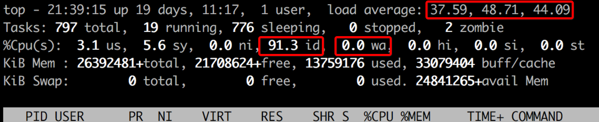

wiki导航: [首页](Home) >> [技术分享](Tech_share)

----

# 快速起步

> 如果你没有时间完整看文档，这里有一击必杀关闭带外日志输出的命令

```
sudo dmesg -n 1
```

详细见下文...

----

验证

```
cat /proc/sys/kernel/printk
```

输出类似（`dmesg -n 1`指令设置的是第一列数值，即`console_loglevel`: 消息的优先级高于此值（数字更小）则打印到控制台）

```
1	4	1	5
```

# 问题

线上有一个驱动程序存在bug，不断向串口控制台打印日志，导致系统响应缓慢。为了应急解决，决定暂时关闭内核消息输出到控制带。

在控制台大量快速输出日志（秒级数十条相同日志）会有如下特征：

* 操作系统中看`top`负载极高（load average），load average数值远超过服务器CPU数量。
* `top`显示的`us`和`sys`非常低，并且也几乎没有`iowait`，**系统显示非常idle**
* `mcelog`日志输出中没有显示cpu或内存硬件故障，系统`messages`日志中也没有硬件错误，但是有重复kernel日志
* 系统响应缓慢

以下是一个top截图



# 关闭内核日志

采用如下命令停止除了panic消息以外的所有内核消息（和驱动）输出到console：

```
sudo dmesg -n 1
```

> 这里`dmesg [-c] [-n level] [-s bufsize]`，所以设置`1`表示日志级别调整成`1`，这样只有高于`KERN_ALERT`的日志才能记录，实际上就只有系统不可用（system is unusable）的日志可以输出到控制台。

```
       -n, --console-level level
              Set the level at which logging of messages is done to the console.  The level is a level number  or  abbreviation  of
              the level name.  For all supported levels see dmesg --help output.

              For  example,  -n  1 or -n alert prevents all messages, except emergency (panic) messages, from appearing on the con‐
              sole.  All levels of messages are still written to /proc/kmsg, so syslogd(8) can still be  used  to  control  exactly
              where kernel messages appear.  When the -n option is used, dmesg will not print or clear the kernel ring buffer.
```

* loglevel（日志界别） 说明

只有低于控制台日志级别的内核消息才会打印到控制台。这个日志级别也会更改`klogd`或其他程序。日志级别定义如下：

```
0 (KERN_EMERG)		系统不可用
1 (KERN_ALERT)		必须立即采取行动
2 (KERN_CRIT)		紧急情况
3 (KERN_ERR)		错误情况
4 (KERN_WARNING)	警告情况
5 (KERN_NOTICE)		普通带需要注意的情况
6 (KERN_INFO)		信息
7 (KERN_DEBUG)		调试级别信息
```

* 内核`printk`设置说明

在内核 `/proc/sys/kernel/printk` 中设置了4个字段的内核级别，分别代表 `console_loglevel`, `default_message_loglevel`, `minimum_console_loglevel`, `default_console_loglevel` ，可以通过如下命令检查

```
cat /proc/sys/kernel/printk
```

发行版如`Red Hat`，默认配置是 `4	4	1	4`

```
console_loglevel: 消息的优先级高于此值（数字更小）则打印到控制台
default_message_loglevel: 没有设置明确优先级的消息则作为此日志级别打印
minimum_console_loglevel: 可以设置的最小（最高）的console_loglevel的数值
default_console_loglevel: console_loglevel默认值
```

参考 [Try to disable console output, console=null doesn't work](http://unix.stackexchange.com/questions/117926/try-to-disable-console-output-console-null-doesnt-work) 通过 sysctl 方式设置，可以修改成 `3 4 1 3`。这里我为了能够最小化，改成 `1 4 1 3`

```
echo '1 4 1 3' | sudo tee /proc/sys/kernel/printk
```

即

```
pssh -ih disable_console "echo '1 4 1 3' | sudo tee /proc/sys/kernel/printk"
```

# 参考

* [Silencing Linux console output](http://superuser.com/questions/29666/silencing-linux-console-output)
* [How do I disable messages or logging from printing on the console/virtual terminals?](http://askubuntu.com/questions/97256/how-do-i-disable-messages-or-logging-from-printing-on-the-console-virtual-termin)
* [How to stop kernel messages from flooding my console?](http://superuser.com/questions/351387/how-to-stop-kernel-messages-from-flooding-my-console)
