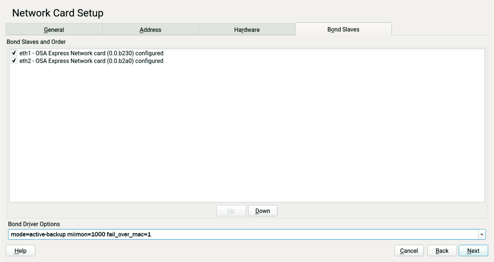

SLES 12提供了通过YaST配置channel bonding的方法：YaST的Network Settings设置提供了设置`Bond Slaves`设置，并且提供了`Bond Driver Options`：



在bonding选项可参考 [Channel bonding options and recommendations](https://www.ibm.com/support/knowledgecenter/linuxonibm/com.ibm.linux.z.l0wlcb00/l0wlcb00_channelbondingoptionsandrecommendations.html#l0wlcb00_channelbondingoptionsandrecommendations)

# 配置文件

* `/etc/sysconfig/network/ifcfg-bond0`

```ini
BONDING_MASTER='yes'
BONDING_MODULE_OPTS='mode=active-backup miimon=1000 fail_over_mac=1'
BONDING_SLAVE0='eth1'
BONDING_SLAVE1='eth2'
IPADDR='192.0.2.0/24'
BOOTPROTO='static'
STARTMODE='auto'
```

> * `BONDING_MASTER='yes'` 激活bonding master
> * `BONDING_MODULE_OPTS='mode=active-backup miimon=1000 fail_over_mac=1'` 设置bondig选项，这里是主备模式
> * `BONDING_SLAVE0='eth1'` 和 `BONDING_SLAVE1='eth2'` 定义两块物理网卡作为slave
> * `IPADDR='192.0.2.0/24'` 设置IP地址

以下为两块物理网卡配置，只需要设置MAC地址

* `/etc/sysconfig/network/ifcfg-eth1`

```ini
NAME='OSA Express Network card (0.0.b230)'
BOOTPROTO='none'
STARTMODE='auto'
LLADDR='02:00:00:0a:6c:4b'
```

* `/etc/sysconfig/network/ifcfg-eth2`

```ini
NAME='OSA Express Network card (0.0.b2a0)'
BOOTPROTO='none'
STARTMODE='auto'
LLADDR='02:0b:0c:0d:0e:02'
```

* 启动

```bash
# wicked ifdown bond0
# wicked ifup bond0
```

# 参考

* [Setting up channel bonding on SLES12](https://www.ibm.com/support/knowledgecenter/en/linuxonibm/com.ibm.linux.z.l0wlcb00/l0wlcb00_settingupchannelbondingonsles12.html)
* [SuSE 11.3 - man page for ifcfg-bonding (suse section 5)](https://www.unix.com/man-page/suse/5/ifcfg-bonding/)