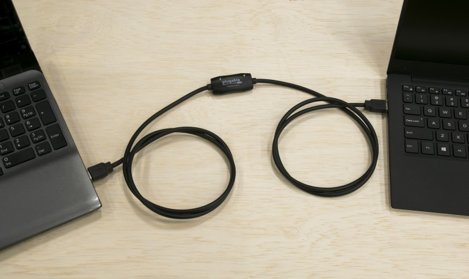

我在构建树莓派小型集群时，有一个想法是使采用非常迷你的机器配置，构建一个超级小型kubernetes集群。在这样的微型硬件上，我甚至不想安装交换机，而采用Linux自己提供交换机功能。

但是，有一个问题：树莓派只有1个千兆网口，在构建集群的环境中，我希望采用1个master管控节点，加上两个worker节点。每个树莓派只有1个千兆网口，则只能点对点连接。

我曾经在网上看到过使用USB连接实现网络的文章，所以我在想是不是可以将树莓派的两个USB 3.0接口利用起来，实现Network over USB方式构建Linux交换机。

做了一些调研，总结如下：

* 确实有一种USB连接的网络，在Linux称为usbnet，一种内核模块，加载后USB设备
* 需要使用一种比较冷门的硬件设备 `host-to-host network cable` ，这不是普通的公对公USB连接线，需要特殊的芯片。
    * 这种USB连线在淘宝上称为 `USB对拷线`，宣传的功能是鼠标键盘共享，可以直接通过对界限实现文件互相拷贝

> 是的，实际上这根连线对连接对两台服务器看到都是网络接口，所以就不再需要每个主机都安装一个USB网卡，直接就可以看到对对方服务器。

# Ethernet over USB

Ethernet over USB也就是把USB作为一个以太网，这个协议主要是允许通过USB设备交换应用无关的数据。虽然USB不是实际以太网卡，但是主流操作系统还是可以把USB作为网络堆栈来设置传输IEEE 802.3数据帧：

- 主要工业标准是 Remote NDIS(RNDIS, 是微软推出的标准)， Ethernet Control Model(ECM), Ethernet Emulation Mode(EEM)和 Network Control Model (NCM)。后3个协议是USB Implementers Form(USB-IF)的通讯设备类协议组的一部分。而RNDIS标准则由微软提供给。

> 我实际上还没有实践过这种方案，本文仅供借鉴

# 数据对拷线调研

这种小众的USB对拷线由于市场需求有限，所以单价非常贵。在连接线缆的品牌绿联这里，USB2.0接口的数据对拷线需要150元，甚至超过了购买2个标准的USB网卡。[PowerSyncUSB数据对拷线 usb3.0](https://item.taobao.com/item.htm?spm=a230r.1.14.98.4b7ce756lWNHKQ&id=565152475106&ns=1&abbucket=7#detail) 售价达到250元，即使 [杂牌USB3.0数据对拷线](https://item.taobao.com/item.htm?spm=a230r.1.14.118.4b7ce756lWNHKQ&id=562923323547&ns=1&abbucket=7#detail)售价也需要164元。

由于这种USB数据拷贝线缆性能有限(大多是USB2.0接口，数据复制速度慢)，所以实用性不强。而且，这种USB 线缆只有很长的线缆长度，对于小型设备非常不协调。所以，最终放弃这根方案。

不过，这种network over usb的方案思路可以借鉴，在特定环境下可以作为方案参考。

* Network over USB是在USB上部署网络，支持不同网络类型(Ethernet, ATM, DSL, PSTS, ISDM 等)
* 在树莓派的社区文档中，有一种无盘自动部署树莓派集群的解决方案，就是采用USB连线来提供管理网络，我觉得在特定场合下可以实现一种自动clone主机的管控网路部署，可以不占用常规以太网连接接口
    * 假设我使用3~4台树莓派构建一个mini集群(每个树莓派有2个USB3.0和2个USB2.0接口)，或者在树莓派上使用USB扩展卡，则可以实现管控多个无盘服务器，无需交换机
    * 在特定的数据中心，甚至可能没有预先部署好的管控网络，如果通过树莓派mini集群，为每台服务器提供一个USB网络连接，则可以实现一个分布式机架服务器clone安装方案：
        * 每个机架上可以几乎不占用空间实现clone节点的服务器部署
        * 在集中管理服务器上分发镜像和安装源到每个机架上的树莓派服务器上，一对多，每个树莓派可以负责本机架几十台服务器的clone重装和管控

[usbnet and Ethernet over USB](https://forums.linuxmint.com/viewtopic.php?t=300541) 介绍了使用经验：

* 需要使用特定的数据传输电缆，例如 [Plugable USB 3.0 Windows SuperSpeed Transfer Cable](https://plugable.com/products/usb3-tran/)

> 在淘宝上我找到比较类似的 [包尔星克smart km link usb3.0电脑对拷线PC数据互传键鼠共享线](https://item.taobao.com/item.htm?spm=a1z2k.11010449.931864.2.2f18509d66go71&scm=1007.13982.82927.0&id=565152475106&last_time=1603381802) 提供了USB 2.0和USB 3.0的的数据同步线，不过价格也非常惊人(USB 3.0 Type-A接口 255元；USB 3.0 Type-A+Type-C接口 288元)
>
> 比较廉价的 [深圳聆升科技高速USB3.0对拷数据线](https://item.taobao.com/item.htm?spm=a1z2k.11010449.931864.20.2f18509d66go71&scm=1007.13982.82927.0&id=562923323547&last_time=1603378407)，USB 3.0数据线 164元，USB 2.0数据线只需要 72元 (其中USB 3.0数据线厂商声称可以达到 68MB/s，并且USB 3.0线兼容Windows和Mac)

* 测试[Plugable USB 3.0 Windows SuperSpeed Transfer Cable](https://plugable.com/products/usb3-tran/)传输性能达到惊人的220MB/s(有可能是磁盘性能瓶颈，因为USB 3.0理论速率可以达到500MB/s)，是普通的千兆网卡速度的2倍。

[Prolific公司提供了PL-25A1控制芯片](http://www.prolific.com.tw/ShowProductPDF.aspx?p_id=34)，支持单芯片高速USB Host-to-Host bridge控制器，支持Windows USB Easy Transfer cable 和 Microsoft Windows Easy Transfer program.

# 参考

* [Ethernet over USB](https://en.wikipedia.org/wiki/Ethernet_over_USB) - 原理协议介绍
* [How to use USB device networking](https://developer.ridgerun.com/wiki/index.php/How_to_use_USB_device_networking)
* [The GNU/Linux "usbnet" Driver Framework](http://www.linux-usb.org/usbnet/)
* [usbnet and Ethernet over USB](https://forums.linuxmint.com/viewtopic.php?t=300541)
* [How to add usbnet driver to the Linux kernel?](https://superuser.com/questions/145933/how-to-add-usbnet-driver-to-the-linux-kernel)
* [USB to USB mimicking Ethernet?](https://raspberrypi.stackexchange.com/questions/9636/usb-to-usb-mimicking-ethernet)
* [USB to USB Networking using USBNET Cable](https://www.raspberrypi.org/forums/viewtopic.php?t=131042)