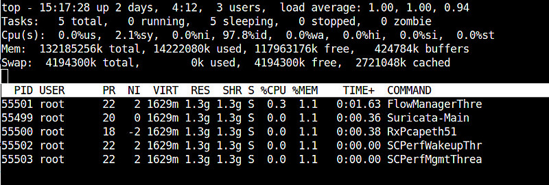

在现代操作系统中，线程是并行执行的主流编程概念。由于线程是在程序内部fork出来并发执行，这些线程共享一系列资源(如内存地址，打开的文件等)来最小化fork过载问题，并且线程可以避免使用昂贵的IPC(进程间通讯)通道。这些特性都使得线程在执行时具有高效的机制。

在Linux上，线程thread也称为轻量级进程（Lightweight Processes(LWP)），是在进程中创建的，所以会和进程具有相同的进程ID（PID）。对于Linux内核调度器来说，线程和标准进程除了共享一些资源外没有差异。

默认情况下，`ps`和`top`命令都只显示进程级别的信息。

# 通过`ps`检查线程

`ps`命令的`-T`参数可以激活线程视图，以下命令显示`<pid>`创建的所有线程：

```bash
ps -T -p <pid>
```


在显示输出中，`PID`列就是进程，`SPID`列就是线程

上述命令也可以使用 `ps -L -p <pid>`

* 通常，我们在检查java进程时候需要检查该进程的线程，则可以:

```bash
ps aux | grep java
ps -T -p <java_process_pid>
```

----

如果只需要获取线程tid，可以使用

```
ps -o ppid=<pid>
```

例如`ps -o ppid=1`就可以输出进程pid是1的所有进程和线程id:

```
$ps -o ppid=1
     1
124352
124353
```

> 上述命令就是显示

还有一个神奇的`-o ppid= `使用方法，如果`-o ppid= `没有带参数，则会输出指定进程的父进程pid

```
ps -o ppid= 768
```

显示进程`768`的父进程pid，或者使用`ps -f 768`则可以完整显示进程命令，其中也包含了父进程PPID字段，则通过脚本可以截取字段。

> 参考 [How do I get the parent process ID of a given child process?](https://askubuntu.com/questions/153976/how-do-i-get-the-parent-process-id-of-a-given-child-process)

* 显示所有线程方法一：

```
ps -efj
```

输出显示如下：

```
UID         PID   PPID   PGID    SID  C STIME TTY          TIME CMD
root          1      0      1      1  0 Feb02 ?        01:24:06 /usr/lib/systemd/systemd
root          2      0      0      0  0 Feb02 ?        00:00:16 [kthreadd]
root          3      2      0      0  0 Feb02 ?        00:00:00 [rcu_gp]
root          4      2      0      0  0 Feb02 ?        00:00:00 [rcu_par_gp]
root          6      2      0      0  0 Feb02 ?        00:00:00 [kworker/0:0H-kblockd]
root          9      2      0      0  0 Feb02 ?        00:00:00 [mm_percpu_wq]
...
```

* 显示所有线程方法二：

```
ps xao pid,ppid,pgid,sid,comm 
```

输出显示如下:

```
   PID   PPID   PGID    SID COMMAND
     1      0      1      1 systemd
     2      0      0      0 kthreadd
     3      2      0      0 rcu_gp
     4      2      0      0 rcu_par_gp
     6      2      0      0 kworker/0:0H-kblockd
     9      2      0      0 mm_percpu_wq
    10      2      0      0 ksoftirqd/0
    11      2      0      0 rcu_sched
```

* 显示指定进程所有线程:

```
ps -To pid,tid,tgid,tty,time,comm -p 3692
```

输出类似

```
  PID   TID  TGID TT           TIME COMMAND
 3692  3692  3692 ?        00:00:27 mysqld
 3692  3707  3692 ?        00:02:26 mysqld
 3692  3708  3692 ?        00:02:30 mysqld
 ...
```

# 获取指定进程所有线程数量

* 使用以下命令可以获得一个指定进程所有线程数量

```
ps -o nlwp <pid>
```

* 要获得整个系统所有线程数量

```
ps -eo nlwp | tail -n +2 | awk '{ num_threads += $1 } END { print num_threads }'
```


# 通过`top`检查线程

`top`命令启动的时候，参数`-H`可以显示线程输出。在`top`的交互界面中，`H`按键可以切换`线程`或`进程`视图。

> 当`H`按键切换进程视图到线程视图时，可以看到`top`显示左上角`Tasks`（表示进程）转换成显示`Threads`（表示线程），并且数量倍数增加。


要检查某个进程`<pid>`对应的线程，可以使用

```bash
top -H -p <pid>
```



# 通过`htop`

[htop](http://ask.xmodulo.com/install-htop-centos-rhel.html)是一个加强的进程观察工具。进入`htop`之后，按下`<F2>`可以进入设置菜单，选择`Display option`，并选择`Three View`和`Show custom thread names`选项，然后按下`<F10>`推出设置。


然后就可以观察每个进程的线程


# 通过 proc 文件系统观察线程

通过检查 `/proc/[pid]/task` 可以看到指定进程的所有线程

```bash
# ls -l /proc/3692/task
total 0
dr-xr-xr-x 7 mysql mysql 0 Apr 17 21:30 3692
dr-xr-xr-x 7 mysql mysql 0 Apr 17 21:30 3707
dr-xr-xr-x 7 mysql mysql 0 Apr 17 21:30 3708
dr-xr-xr-x 7 mysql mysql 0 Apr 17 21:30 3709
...
```


# 参考

* [Linux中查看进程的多线程](http://os.51cto.com/art/201312/420289.htm)
* [Is there a way to see details of all the threads that a process has in Linux?](http://unix.stackexchange.com/questions/892/is-there-a-way-to-see-details-of-all-the-threads-that-a-process-has-in-linux)
* [How to view threads of a process on Linux](http://ask.xmodulo.com/view-threads-process-linux.html)
* [Linux: How to View Threads of a Process](https://stackpointer.io/unix/linux-view-threads-process/536/)
* [How to get (from terminal) total number of threads (per process and total for all processes)](https://askubuntu.com/questions/88972/how-to-get-from-terminal-total-number-of-threads-per-process-and-total-for-al)
* [Linux: How to View Threads of a Process](https://stackpointer.io/unix/linux-view-threads-process/536/)
* [How to view threads of a process on Linux](https://unixhealthcheck.com/blog?id=465)