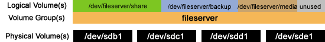
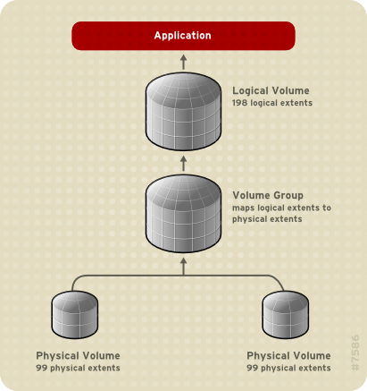

# 简介

> Wikipedia:

LVM是基于Linux kernel的逻辑卷管理，通过将多个磁盘或类似的存储设备组合成大存储。LVM最初由Heinz Mauelshagen公司开发，基于HP-UX的LVM设计。多个Linux发行版本已经支持在逻辑卷上的根文件系统上安装一个启动系统。

LVM适合以下情况:

* 管理大容量磁盘集，允许增加磁盘、替换磁盘、复制和共享磁盘，但不需要停止服务
* 对于小型系统如桌面系统，可以方便进行磁盘分区调整
* 可以通过快照方式进行备份
* 在多个物理磁盘卷或整个磁盘驱器上创建单一的逻辑卷（类似RAID 0），可以动态改变卷大小。

可以将LVM视为硬件驱动器和分区之上的一个很薄的软件层，可以创造出持续和易于使用的硬件驱动器替换，重新分区和备份的模拟。

## VM功能

* 通过加入新的物理卷（physical volumes, PV）或弹出已加入物理卷来实现在线重设置卷组（volume groups）大小。
* 通过连接在线扩展逻辑卷（logical volume, LV）以及通过收缩逻辑卷来减小逻辑卷大小。
* LVM1支持创建只读快照（snapshots）
* LVM2支持创建读写快照
* 通过条带化或串联在多个PV上创建逻辑卷，实现和RAID 0类似功能。
* 通过镜像整个或部分逻辑卷，实现和RAID 1类似功能。
* 在线在不同PV间迁移逻辑卷
* 分割或合并卷组，用于将整个逻辑卷从离线存储迁入或迁出。

LVM也可以工作于一个共享存储的集群（磁盘由PV处理，并在多台主机间共享），不过这需要一个附加daemon来处理不同群集节点的状态。

LVM不能实现基于校验的冗余，也就是不能实现RAID 4 - RAID 6的冗余类型。这种校验类型的冗余是通过Linux metadisks来实现的，然后将其作为LVM的物理卷（PV）。

# LVM实现

LVM在每个物理卷的开头部分维护一个metadata头，每个metadata头通过UUID来唯一标识。每个PV头部包含一个完整的整个卷组布局的副本，包括所有其他PV的UUID，以及所有逻辑卷的UUID和PE至LE的分配映射关系表。这实现了当PV损坏时候可以实现简单的数据恢复。

在2.6系列的Linux内核中，LVM实现是通过一个 [device mapper](http://en.wikipedia.org/wiki/Device_mapper) 概念来实现的，这是一个简单的基于块级别的方案，实现通过创建虚拟块设备和映射这些块内容到另外其他块设备。LVM的这种device mapper也允许I/O重定向服务，这样可以和其他卷管理共享（如EVMS）。

为了将一个卷组online，`vgchange`工具完成：

* 搜索所有可用块设备上的PV
* 对每个找到的PV分析metadata头部
* 计算所有可访问逻辑卷组的布局
* loop over卷组中每个逻辑卷，使之在线并且：
  * 检查已经online的逻辑卷确保所有的PV可用
  * 创建一个新的，空的设备映射
  * 映射PV的数据区域到逻辑卷。

为了将一个在线逻辑卷在不同PV间迁移，`pvmove`工具完成：

* 创建一个新的，空的设备映射
* 在源和目的创建一个`mirror`映射。内核将开始在`degraded`模式下启动镜像并且从源盘向目标盘复制数据。
* 当同步完成，以目标盘替换源盘。

# Logical Volume Management解释

逻辑卷管理提供了磁盘存储的高层视图，以便管理员能够灵活分配存储给应用程序和用户。
逻辑卷是使用逻辑卷管理器来进行大小分配。

逻辑卷管理允许以用户定义组来分配存储卷，允许将存储设置为卷组名如"development"和"sales"，而不用使用设备名，如"sda"和"sdb"。

* LVM示意图

```
    hda1   hdc1      (PV:s on partitions or whole disks)                        
       \   /                                                                    
        \ /                                                                     
       diskvg        (VG)                                                       
       /  |  \                                                                  
      /   |   \                                                                 
  usrlv rootlv varlv (LV:s)
    |      |     |                                                              
 ext2  reiserfs  xfs (filesystems)
```

* LVM示意图（ [A Beginner's Guide To LVM](http://www.howtoforge.com/linux_lvm)）



## 定义

* physical volume (`PV`) 物理卷通常指硬盘，但也可能指已经建立底层RAID的设备（包括软RAID和硬RAID）
* physical extent (`PE`) 每个物理卷被划分为数据集，称为physical extents，这些扩展在VG中大小相同。
* volume group (`VG`) 卷组是LVM中的最高抽象层，将一组逻辑卷和物理卷包含到一个管理单元。
* logical volume (`LV`) 相当于磁盘分区，LV可以被视为标准的块设备。
* ogical extent (`LE`) 每个逻辑卷被分割为数据块，视为logical extent。这个逻辑扩展大小在相同的逻辑卷组中的所有逻辑卷相同。

## 映射模式（线性／条带化）

有两种使用逻辑卷管理的映射逻辑扩展（LE）和物理扩展的方法（PE）

* 线性映射： 将一系列PE安装线性顺序映射为LV
* 条带化映射：交叉把逻辑块存放到不同的物理卷

## 快照snapshot

LVM的一个优点是可以使用`snapshot`，管理员可以创建一个新的块设备来表示一个逻辑卷的实际副本，在时间的一些节点上冻结。

通常是用于一些批处理，备份会话，但是不希望在备份的时候在线系统仍在更改数据。当一个`snapshot`设备设备完成后，管理员也可以删除该设备。这个情况需要`snapshot`在逻辑卷上处于`consistent`（一致性）状态 -- `LVM1`的`VFS-lock`补丁可以确保在`snapshot`创建时文件系统保持，而`2.6`系列内核可以不需要补丁也可以在`snapshot`创建时自动完成持续状态。

完全`snapshot`是自动禁止的

如果一个`snapshot`逻辑卷被填充满了，则该`snapshot`将被抛弃（因为已经不可用了）所以分配充足的空间是非常重要的。需要的空间取决于`snapshot`的使用，所以没有明确的规则。不过，如果`snapshot`和原来系统大小相同，则永远不会`overflow`。

> 注：使用Linux的LVM做快照进行数据备份的时候，一定要估算好空间，确保在整个备份过程中，源LVM卷的数据变化不超过分配的`snapshot`空间，否则就会发生数据还没有备份完，快照就因为源LVM卷变化量超出预设容量而报废，这样备份也就不完整了。

`LVM1`使用只读（`read-only`）snapshot。只读`snapshot`通过创建一个例外表（`exception table`）来实现，该表跟踪哪些块被修改了。如果一个块在原有基础上被修改，则该数据库被复制到`snapshot`中，在`exception table`中被标记，然后新的数据被写入到原来的卷上。

`LVM2`系统中，默认的`snapshot`是可读写的。可读写`snapshot`工作方式和只读的`snapshot`类似，但增加了附加功能，即在`exception table`中标记为已使用，但并不从原始卷中复制过来。这种工作方式提供了很多`LVM1`只读`snapshot`中所没有的特性。例如，对以前工作不满意，可以`unmount`这个`snapshot`，删除这个`snapshot`，然后把原始文件系统挂载在这个位置。并且可以创建用于Xen的卷。可以创建一个`disk image`，然后`snapshot`这个磁盘映像，再针对一个`domU`会话修改`snapshot`。然后又可以从原始卷上创建另外一个`snapshot`，并将其用于其他的`domU`会话。由于存储仅消耗和原始卷不同的`snapshot`块，则主要的卷是在不同的`domU`上共享的。

当前的`LVM2/device-mapper`代码限制，原始的卷可以增长，但是不能缩减。对于`LVM1`，则不能调整卷大小。（这句话翻译自2010年，请自行参考当前资料）

## 单个LV的最大容量

单个LV的最大容量取决于CPU的构架和运行的内核

* 2.4系列内核，最大的LV是2TB。从Red Hat Enterprise Linux 3 Update 5可以较好支持2TB LVs。
* 2.6系列内核，32位系统，最大支持16TB的LV。
* 2.6系列内核，64位系统，最大支持8EB的LV。

## 使用限制

* boot目录不能包括在LV中，这是因为当前的bootloader不能理解LVM卷。
* 在LVM上建立root分区需要内核具备 initrd image。如果内核升级没有包含需要的initrd image，则内核将不能启动。较新的发行版本大多包含了initrd image。

> 译注：没有永远的金科玉律，所有的知识以自己实践为准 ^_^

# LVM原理

> 本段落翻译自《Redhat Logical Volume Manager Administration手册》

卷管理在物理存储之上创建了一个抽象层，允许创建逻辑存储卷。逻辑卷功能比直接使用物理存储提供一系列更具伸缩性。当使用逻辑卷，可以不受到物理磁盘大小的限制。并且，由于物理存储的配置被软件所隐蔽，所以可以不停止应用程序或不unmount文件系统进行卷扩展或移动。

逻辑卷提供以下优于直接使用物理存储的优点：

* 可伸缩的容量 - 当使用逻辑卷，文件系统可以跨多个磁盘，所以可以集聚多个磁盘和分区为一个逻辑卷。
* 改变存储池大小 - 可以扩大和缩小逻辑卷，而不需要重新分区底层磁盘设备。
* 在线数据重定位 - 在部署了较新和较快存储子系统，可以在系统工作时移动数据。数据将重新分布到磁盘。例如，可以在移动`hot-swap`磁盘前清理。
* 转换设备命名 - 逻辑存储卷可以在用户定义组中使用，可以按照需要命名逻辑卷。
* 磁盘条带化 - 可以把逻辑卷条带化到多个磁盘上，这样会戏剧化地增强存储性能。
* 镜像卷 - 逻辑卷提供了一个配置镜像的转换方法。
* 卷`snapshot` - 使用逻辑卷的`snapshot`功能可以一致性备份或进行测试而不会影响真实数据。 

## LVM构架概览

从RHEL 4开始，原始的`LVM1`被`LVM2`所替代。LVM2向后兼容LVM1，并提供了`snapshot`和`cluster`支持。

> 可以使用命令`vgconvert`命令把`LVM1`格式转换为`LVM2`格式。

## 集群化逻辑卷管理（Clustered Logical Volume Manager, CLVM）

集群化逻辑卷管理（Clustered Logical Volume Manager, `CLVM`）是LVM的一系列集群化扩展。这些扩展允许一个群集使用`LVM`（例如，在`SAN`上）。

是否使用`CLVM`取决于系统要求：

* 如果只有一个系统请求访问存储，则可以只配置`LVM`，此时可以使用`LVM`而不用`CLVM`扩展并且这个节点创建的逻辑卷只是该节点本地使用。
* 如果是一个`failover`方式的群集系统，即在任何时间只有一个节点实际访问存储，则需要使用高可用逻辑卷管理代理（High Availability Logical Volume Management agents，`HA-LVM`）。有关配置`HA-LVM`参考`Configuring and Managing a Red Hat Cluster`。
* 当群集中有多个节点同时访问存储，并且存储是在多个活跃节点共享的，则 **必须** 使用`CLVM`。`CLVM`允许用户在配置一个逻辑卷的时候通过锁定物理存储来配置共享存储上的逻辑卷，并且，还需要使用群集锁服务来管理共享的存储。

要使用`CLVM`，Red Hat Cluster Suite软件，包含了 `clvmd` 服务，该服务必须运行。

这个 `clvmd` 服务是`LVM`的群集扩展的关键因素。这个 `clvmd` 服务在每个群集节点上运行并且在一个群集中分发`LVM metadata`更新，这样可以对每个群集节点显示相同的逻辑卷视图。

有关安装和管理Red Hat Cluster Suite，参考 《Configuring and Managing a Red Hat Cluster》。

要确保 clvmd 在启动时运行，使用以下命令

    chkconfig clvmd on

要启动clvmd使用命令

    service clvmd start

在群集环境创建`LVM`逻辑卷和单一节点创建`LVM`没有什么命令或管理界面的区别。不过，在群集中创建`LVM`要确保群集基础构架已经运行并且群集处于`quorate`状态。

默认，在共享存储上使用`CLVM`创建的逻辑卷对整个存储共享存储的各节点都是可见的。当群集中只有一个节点可以访问共享存储，可以创建卷组。并且，也可以把本地卷组的状态改为群集状态卷组。

* `CLVM`构架


> **`警告`**：
>
> 在Red Hat Cluster Suite中使用的共享存储要求在群集节点上运行 群集逻辑卷管理服务进程（cluster logical volume manager daemon, `clvmd`） 或 高可用逻辑卷管理代理 （High Availability Logical Volume Management agents, `HA-LVM`）。
>
> 如果不运行`clvmd`或`HA-LVM`或者不具备等同服务，则不能在共享磁盘上使用单会话`LVM`，否则可能导致数据损坏。

## LVM组件

### 物理卷（Physical Volumes）

一个`LVM`逻辑卷的底层物理存储单元是一个块设备，可以是一个分区或整个磁盘。要在LVM逻辑卷中使用块设备，该设备必须作为一个物理卷（physical volume, `PV`）来进行初始化。把一个块设备初始化为一个物理卷会在设备的起始部分增加一个标签。

默认，`LVM`标签位于存储块设备的 **第`2`个扇区**（the second `512-byte` sector）。也可以修改这个默认配置，把LVM标签存放到块设备的前4个扇区中的一个。这样，可以允许LVM和其他使用这些扇区的应用程序共存。

一个`LVM`标记提供一个物理驱动器的正确标识和设备顺序，因为当系统启动时，设备的启动是随机的。一个`LVM`标记可以保证在一个cluster中，重启后仍然以一致的表达方式标记该设备。（ 译注： 这点非常重要！ ）

`LVM`标记标识了设备作为一个`LVM`物理卷。`LVM`标记包含一个随机的唯一标识（`UUID`），并且也把块设备的大小以字节方式记录下来，并且记录了设备的存储`LVM`元数据的位置。

`LVM`元数据包含了系统中`LVM`卷的配置详细信息。默认情况下，有一个元数据标记副本在卷组的每个物理卷上的每个元数据区域上存储着。`LVM`元数据是`ASCII`编码的小数据。

当前`LVM`允许在每个物理卷上存储`0`个，`1`个或`2`个标志副本。默认是`1`个副本。 **一旦在物理卷上配置元数据副本的数量，以后就不能再修改这个元数据副本的数量了。** 

第一个元数据副本存储在设备的开始部分，位于`label`之后。如果有第`2`个副本，则存放在设备的结尾。如果由于写入一个不同的磁盘，偶尔覆盖了磁盘开始部分的元数据区域，则设备末尾的元数据副本可以用来恢复元数据。

* LVM物理卷布局


* 一个磁盘上的多分区

LVM允许使用磁盘分区来创建物理卷。 **通常建议使用整个磁盘创建一个单一的磁盘分区并将其作为一个LVM的物理卷** ，原因如下：

  * 管理便捷性

在系统中如果每个物理磁盘只出现一次，则容易跟踪。特别是当一个磁盘故障时更是如此。此外，在一个物理磁盘上构建多个物理卷可能导致启动时内核告警`unknown partition`。

  * 条带化性能

`LVM`不会提示两个物理卷被创建在相同的物理磁盘上。如果在相同的物理磁盘上使用两个物理卷（这两个物理卷实际上是这个磁盘的两个分区）来创建一个条带化逻辑卷。这将导致磁盘性能的下降而不是常规的条带化提高磁盘性能。

### 卷组（Volume Groups）

物理卷组合成卷组（volume groups,`VGs`），卷组是准备用于分配逻辑卷的磁盘空间池。

在一个卷组，磁盘空间分配是基于划分为一个固定大小的单元extent来实现的。一个extent是磁盘分配的最小空间单元。在一个物理卷中，extent就是物理extent。

**一个逻辑卷所使用的逻辑extent和物理extent的大小相同**。

在一个卷组中，所有逻辑卷的extent的大小都是相同的。卷组把逻辑extent映射到物理extent。

### LVM逻辑卷

在LVM中，一个卷组划分到逻辑卷。有3种类型的LVM逻辑卷：

* 线性逻辑卷
* 条带化逻辑卷
* 镜像逻辑卷

----

* 线性逻辑卷

一个线性逻辑卷就是聚合多个物理卷成为一个逻辑卷，目的就是扩展磁盘空间。



> 在线性逻辑卷配置中，不要求每个物理卷的大小一致。

* 条带化逻辑卷

当在LVM逻辑卷上写入数据，文件系统把数据分布到底层的物理卷。可以通过创建一个条带化的逻辑卷来控制数据写入到物理卷。对于大型的顺序读写，可以提高数据I/O的效率。

条带化通过`round-round`方式将数据写入不同物理卷，磁盘`I/O`是并行的。某些情况下，可以达到物理卷性能的线性叠加。


> 要扩展一个条带化逻辑卷，必须有足够的磁盘来完成条带化分布。例如，如果已经使用了一个2路条带化的磁盘构建的卷组，则添加一块物理磁盘是无法扩展条带化的，必须添加至少2块磁盘到卷组。

* 镜像逻辑卷

镜像逻辑卷是在不同的磁盘设备上构建数据副本。当数据写入到一个磁盘设备，会同时写入到第二块设备，以镜像数据。这种方式在设备故障时可以保护数据。

LVM支持镜像卷。当创建一个镜像逻辑卷，LVM确保数据以镜像方式写入到独立的物理卷。使用LVM可以在多个镜像磁盘上再创建镜像逻辑卷。

一个LVM镜像通常以512KB为单位划分镜像块。LVM会维护一个小型日志用于跟踪镜像块是否完成了镜像同步。这个镜像日志可以可以保存于磁盘，这样可以在重启后继续访问，或者将日志维持在内存中。

从RHEL 5.3开始，支持在群集中镜像逻辑卷。


* 快照卷

`snapshot`提供了不中断服务的情况下瞬间创建一个设备虚拟映像的方式。如果在一个snapshot执行之后对原始设备进行的修改，则snapshot将生成一个变化数据区域的副本，这样可以用来重构设备的状态。

> 注意：`LVM snapshot`不支持在集群中访问，所以不能在集群卷组上创建`snapshot`。

**由于一个snapshot副本只是snapshot创建后数据变化的区域，所以snapshot功能只要求最少的存储。** 例如，对于一个很少修改的系统，3-5%的空间就能够满足维护snapshot。

> 注意：`snapshot`只是一个文件系统的虚拟copy，并不是实际备份文件系统，所以不能作为备份手段。

**`snapshot`占用的磁盘空间大小取决于原始卷的数据变化。**

如果被填满，则该`snapshot`将损坏，此时这个`snapshot`将不能跟踪原始卷的变化。需要经常监控`snapshot`的大小。`snapsho`t支持完善的重定义大小，所以，如果存储空间充足可以增加`snapshot`的大小来避免该snapshot被破坏。相反，如果发现`snapshot`比需要的大，则可以缩减`snapshot`的大小。

有关`snapshot`的一些有用的特性：

* 多数情况下，一个`snapshot`可以用来执行原始逻辑卷的备份，而不需要停止在线系统。
* 可以在一个`snapshot`文件系统上执行`fsck`命令来检查文件系统的完整性和检查是否需要修复系统。
* 由于`snapshot`是可以读写的，可以在`snapshot`上测试生产环境数据的应用程序，运行在线测试，而不会影响真实的生产数据。
* 可以配合`Xen`虚拟机管理创建卷，使用`snapshot`来创建一个磁盘映像，然后`snapshot`，并修改`snapshot`作为另一个`domU`会话。然后再创建另外一个`snapshot`并修改用于另一个`domU`会话。由于存储使用只修改原始数据或`snapshot`，所以主卷可以作为共享。

# LVM管理概览

## 在集群创建LVM卷

在集群环境上创建逻辑卷，需要使用集群化逻辑卷管理（Clustered Logical Volume Manager, `CLVM`），这是一个LVM的集群化扩展。CLVM扩展允许一个主机集群管理共享存储（例如，在一个`SAN`）来使用LVM。为了使用`CLVM`，Red Hat Cluster Suite软件，包括 `clvmd` 服务，必须在启动时候启动。

在集群环境中创建`LVM`逻辑卷和在单一主机上创建`LVM`逻辑卷是相同的。整个`LVM`命令没有区别，在`LVM GUI`接口上也是相同的。为了在集群创建LVM卷，在集群上必须运行`cluster infrastructure`，并且`cluster`必须是法定的（`quorate`）。

`CLVM`需要修改`lvm.conf`配置文件以便集群范围锁定。在配置文件`lvm.conf`配置信息支持集群锁也是由`lvm.conf`来提供的。

默认， **由`CLVM`在共享存储上创建逻辑卷对于所有访问共享存储的系统都是可见的，但是只有一个节点在某个时间点访问存储。**

## 逻辑卷创建概览

以下步骤创建LVM逻辑卷：

* 初始化分区用于LVM卷作为物理卷
* 创建卷组
* 创建逻辑卷

在创建逻辑卷之后可以创建和挂载文件系统。例如创建`GFS`文件系统：

* 使用gfs_mkfs命令在逻辑卷上创建GFS文件系统。
* 使用mkdir命令创建挂载点。在一个集群系统中，需要在所有节点上创建挂载点。
* 故在文件系统。可能需要在系统的每个节点上添加`fstab`配置项。

创建LVM卷是主机无关的，这是因为LVM卷设置信息是存储在物理卷上的，而不是存放在当时创建卷的主机上。使用存储的服务器会具备LVM的本地配置信息，但是也可以从物理卷重新创建配置。只要LVM版本兼容，可以把物理卷连接到不同的服务器。

## 在逻辑卷上扩展文件系统

要扩展一个逻辑卷上的文件系统，执行以下步骤：

* 创建一个物理卷
* 扩展包含文件系统的卷组以包含这个新的物理卷
* 扩展逻辑卷包含新的物理卷
* 扩展文件系统

## 逻辑卷备份

`metadata`备份和归档是由每个卷组和逻辑卷配置更改时自动完成的，除非在`lvm.conf`配置中禁止。默认情况下，`metadata`数据备份存储在`/etc/lvm/backup`文件而`metadata`归档存储在`/etc/lvm/archive`文件。至于存储在`/etc/lvm/archive`的`metadata`归档时间和多少个归档会保留则取决于`lvm.conf`配置。一个每日的系统备份应该包括备份`/etc/lvm`目录下的内容。

> 注意，metadata的备份并不包括逻辑卷中的用户和系统数据。

可以通过`vgcfbackup`命令手工备份`metadata`数据到`/etc/lvm/backup`文件。并且，可以通过`vgcfgrestore`命令恢复`metadata`。

## 日志

所有数据消息通过一个日志模块根据记录级别记录：

* standard output/error
* syslog
* log file
* external log function

日志级别设置位于 `/etc/lvm/lvm.conf` 配置。

# LVM管理命令

> 在运行LVM命令时，可以添加 `-v`，`-vv`，`-vvv` 或 `-vvvv`，分别可以打印不同级别的显示信息。

## 物理卷管理

可以通过以下命令删除磁盘现存的分区表信息（译注：请参考前述有关物理卷的说明）

    dd if=/dev/zero of=PhysicalVolume bs=512 count=1

* 初始化物理卷 - 以下命令初始化 `/dev/sdd1`, `/dev/sde1`, and `/dev/sdf1`

        pvcreate /dev/sdd1 /dev/sde1 /dev/sdf1

* 扫描可以用于物理卷的块设备

        lvmdiskscan

* 显示物理卷

        pvdisplay

输出类似

    --- Physical volume ---
    PV Name               /dev/sdb1
    VG Name               VGvms
    PV Size               372.52 GiB / not usable 1.28 MiB
    Allocatable           yes 
    PE Size               4.00 MiB
    Total PE              95366
    Free PE               59526
    Allocated PE          35840
    PV UUID               e8dnaG-VgJZ-oKFp-ZPbv-jhKv-mO6C-Xp222z 

* 如果需要扫描所有系统中的物理卷

        pvscan

输出显示

    PV /dev/sdb1   VG VGvms   lvm2 [372.52 GiB / 232.52 GiB free]
      Total: 1 [372.52 GiB] / in use: 1 [372.52 GiB] / in no VG: 0 [0   ] 

* 重定义物理卷大小

可以采用`pvresize`命令更新LVM物理卷的大小。并且可以在LVM使用这个物理卷的时候操作。

* 删除物理卷

        pvremvoe /dev/ram15

## 卷组管理

* 创建卷组

        vgcreate vg1 /dev/sdd1 /dev/sde1

> 当物理卷用于创建卷组的时候，它的磁盘空间默认被划分为以4MB为单位的`extent`。这个`extent`是用于逻辑卷增长和缩减的最小大小。`extent`的数量不会影响逻辑卷的I/O性能。
>
> 在使用vgcreate命令时可以添加`-s`参数来设置`extent`的大小。并且可以通过使用`-p`和`-l`参数来限制用于卷组的物理卷活逻辑卷的数量。
>
> 默认，卷组分配物理extent的规则遵循一些常规，如不将条带化分布在相同的物理卷。这是常规的分配规则。

### 在集群创建卷组

和在单一节点创建卷组方式相同，使用`vgcreate`命令在集群环境创建卷组。

默认情况下，使用`CLVM`方式可以在集群共享存储上创建卷组，该卷组对可以访问这个共享存储的所有节点都是存取的。然而，也可以创建一个卷组作为本地卷组，只能在一个节点访问，只要附加参数 `-c n`。

以下命令是在集群环境创建一个本地卷组

    vgcreate -c n vg1 /dev/sdd1 /dev/sde1

> 任何时候，都可以使用 `-c` 参数的`vgchange`命令将卷组由本地模式改为集群模式。
>
> 通过 `vgs` 命令可以检查一个现存卷组是本地还是集群卷组，卷组的属性如果带有 `c` 则表明是集群模式卷组。

### 在卷组中添加物理卷

以下命令在`vg1`卷组中添加`/dev/sdf1`物理卷来扩展卷组的大小

    vgextend vg1 /dev/sdf1

### 卷组显示、卷组扫描和删除物理卷

显示卷组

    vgdisplay new_vg

扫描卷组

    vgscan

删除物理卷

    vgreduce my_volume_group /dev/hda1

### 激活或非激活卷组

以下命令`deactivate`卷组`my_volume_group`

    vgchange -a n my_volume_group

### 合并卷组

可以使用 `vgmerge` 命令来合并两个现存卷组。可以合并一个非活跃卷组到一个活跃卷组

    vgmerge -v database my_vg

## 逻辑卷管理

### 创建线性逻辑卷

以下命令在`vg1`卷组上创建`10G`大小的逻辑卷

    lvcreate -L 10G vg1

以下命令在`testvg`卷组上创建名字为`test1v`的逻辑卷，大小是50GB

    lvcreate -L 50G -n test1v testvg

也支持按照百分比来创建逻辑卷，例如60%

    lvcreate -l 60%VG -n mylv testvg

或者将剩余所有空间都分配给需要创建的逻辑卷（`100%FREE`）

    lvcreate -l 100%FREE -n yourlv testvg

### 创建条带化逻辑卷

对于大型的顺序读写，创建条带化逻辑卷可以提升数据I/O性能。

要创建条带化逻辑卷，需要使用参数`-i`来指定条带化的条带数量。这个参数将基于将要被条带化的逻辑卷的物理卷数量。注意，条带数量不能大于卷组的物理卷的数量（除非使用了`--alloc anywehre`参数）

如果构建一个条带化逻辑卷的底层物理设备具有不同的大小，则条带化卷的条带最大大小取决于最小的底层设备的条带化卷。例如，对于`two-legged`（双设备）条带化，最大的条带就较小的设备的两倍。在`three-legged`（3设备）条带化，条带大小则是最小设备的三倍大小。

以下命令在两个物理卷创建条带为`64KB`的条带的条带化逻辑卷。这个逻辑卷的大小是50G，名字是`gfslv`，创建在卷组`vg0`上

    lvcreate -L 50G -i2 -I64 -n gfslv vg0

作为线性卷，可以设置用于条带化的物理卷的扩展，以下命令创建一个大小是100扩展在2个物理卷上条带化的条带化卷，名字是`stripelv`，位于卷组`testvg`，这样条带将使用`/dev/sda1`的第`0-49`个扇区和`/dec/sdb1`的第`50-99`扇区

    lvcreate -l 100 -i2 -nstripelv testvg /dev/sda1:0-49 /dev/sdb1:50-99

### 创建镜像卷

当创建镜像卷的时候，需要使用`-m`参数设置数据镜像的副本数量，例如`-m1`则创建`1`个镜像，也就是文件系统的双副本：一个线性逻辑卷加一个副本；类似，设置`-m2`则创建2个镜像，也就是文件系统的3副本设置

    lvcreate -L 50G -m1 -n mirrorlv vg0

> LVM维护了一个小的日志来跟踪镜像的同步，这个镜像位于磁盘可以确保服务器重启不丢失，这样重启或crash不需要执行re-synced

# 实践案例

> 这里举例一个实际的部署案例

按照第三方软件安装要求，需要建立如下类似的LVM卷

	/dev/mapper/VG-pamtlv        14G  164M   13G    2% /cnaps/pamt
	/dev/mapper/VG-pmtslv        14G  276M   13G    3% /pmts
	/dev/mapper/VG-pmtsloglv     56G  189M   53G    1% /pmts/log
	/dev/mapper/VG-mqmlv         14G  180M   13G    2% /var/mqm
	/dev/mapper/VG-mqmpmtslv     14G  164M   13G    2% /var/mqm/pmts
	/dev/mapper/VG-mqpmtsloglv   14G  164M   13G    2% /var/mqm/pmts/log

初始化物理卷 - 即在物理分区或物理磁盘上标记，这里案例我们是对`/dev/sda4`的LVM分区进行

    pvcreate /dev/sda4
	
> 提示

    Physical volume "/dev/sda4" successfully created
	
扫描可以用于物理卷的块设备

    lvmdiskscan
	
> 提示可以看到`/dev/dsa4`是可用的`LVM物理卷`

    /dev/sda1 [     255.00 MiB]
    /dev/root [      50.00 GiB]
    /dev/sda3 [       2.00 GiB]
    /dev/sda4 [       1.04 TiB] LVM physical volume
    1 disk
    2 partitions
    0 LVM physical volume whole disks
    1 LVM physical volume
	
显示物理卷

    pvdisplay
	
> 显示输出

    "/dev/sda4" is a new physical volume of "1.04 TiB"
    --- NEW Physical volume ---
    PV Name               /dev/sda4
    VG Name
    PV Size               1.04 TiB
    Allocatable           NO
    PE Size               0
    Total PE              0
    Free PE               0
    Allocated PE          0
    PV UUID               An0rGY-5XqT-HLKZ-OFIV-QJf7-eDJ0-TLYxj6
	
如果需要扫描所有系统中的物理卷

    pvscan
	
> 显示输出

    PV /dev/sda4                      lvm2 [1.04 TiB]
    Total: 1 [1.04 TiB] / in use: 0 [0   ] / in no VG: 1 [1.04 TiB]
	 
创建逻辑组 - 逻辑组建立在物理卷上，请注意软件安装要求该卷组的名字是`VG`

    vgcreate VG /dev/sda4

`vgdisplay`查看逻辑组，可以看到总共的可用空间是 `1.04 T`

    --- Volume group ---
    VG Name               VG
    System ID
    Format                lvm2
    Metadata Areas        1
    Metadata Sequence No  1
    VG Access             read/write
    VG Status             resizable
    MAX LV                0
    Cur LV                0
    Open LV               0
    Max PV                0
    Cur PV                1
    Act PV                1
    VG Size               1.04 TiB
    PE Size               4.00 MiB
    Total PE              272770
    Alloc PE / Size       0 / 0
    Free  PE / Size       272770 / 1.04 TiB
    VG UUID               tdq3Zc-16z2-ZMo1-H7xM-EHaJ-GC8d-YFNjTY
	
创建逻辑卷

	/dev/mapper/VG-pamtlv        14G  164M   13G    2% /cnaps/pamt
	/dev/mapper/VG-pmtslv        14G  276M   13G    3% /pmts
	/dev/mapper/VG-pmtsloglv     56G  189M   53G    1% /pmts/log
	/dev/mapper/VG-mqmlv         14G  180M   13G    2% /var/mqm
	/dev/mapper/VG-mqmpmtslv     14G  164M   13G    2% /var/mqm/pmts
	/dev/mapper/VG-mqpmtsloglv   14G  164M   13G    2% /var/mqm/pmts/log
    
	lvcreate --size 30G -n pamtlv VG
	lvcreate --size 30G -n pmtslv VG
	lvcreate --size 100G -n pmtsloglv VG
	lvcreate --size 30G -n mqmlv VG
	lvcreate --size 30G -n mqmpmtslv VG
	lvcreate --size 30G -n mqpmtsloglv VG
	lvcreate --size 600G -n home VG
	
> 通过`vgdisplay`可以看到还剩余`200G`作为机动预留

# 文件系统格式化

    
	mkfs.ext3 -L mqmpmtslv /dev/VG/mqmpmtslv
	mkfs.ext3 -L mqmpmtsloglv /dev/VG/mqmpmtsloglv
	mkfs.ext3 -L pmtslv /dev/VG/pmtslv
	mkfs.ext3 -L pmtsloglv /dev/VG/pmtsloglv
	mkfs.ext3 -L mqmlv /dev/VG/mqmlv
	mkfs.ext3 -L pamtlv /dev/VG/pamtlv

	
> 文件系统格式化要使用`-L`参数提供label，后续文件系统挂载都是使用label来标记要挂载的逻辑卷

# 挂载
	
在`/etc/fstab`中添加以下内容

	LABEL=mqmlv          /var/mqm             ext3       acl,user_xattr        1 2
	LABEL=mqmpmtslv      /var/mqm/pmts        ext3       acl,user_xattr        1 2
	LABEL=mqmpmtsloglv   /var/mqm/pmts/log    ext3       acl,user_xattr        1 2
	LABEL=pamtlv         /cnaps/pamt          ext3       acl,user_xattr        1 2
	LABEL=pmtslv         /pmts                ext3       acl,user_xattr        1 2
	LABEL=pmtsloglv      /pmts/log            ext3       acl,user_xattr        1 2
	
挂载

    mv /var/mqm /var/mqm.local
    mkdir /var/mqm
    mount /var/mqm
    mkdir /var/mqm/pmts
    mount /var/mqm/pmts
    mkdir /var/mqm/pmts/log
    mount /var/mqm/pmts/log
    mkdir -p /cnaps/pamt
    mount /cnaps/pamt
	
> 目录挂载有依赖关系，请注意`/etc/fstab`配置按顺序排列，确保上级目录挂载后再创建子目录，再挂子文件系统

完成后检查`df -h`可以看到如下输出

	/dev/mapper/VG-mqmlv          30G  222M   28G   1% /var/mqm
	/dev/mapper/VG-mqmpmtslv      30G  173M   28G   1% /var/mqm/pmts
	/dev/mapper/VG-mqmpmtsloglv   30G  173M   28G   1% /var/mqm/pmts/log
	/dev/mapper/VG-pamtlv         30G  173M   28G   1% /cnaps/pamt
	/dev/mapper/VG-pmtslv         30G  173M   28G   1% /pmts
	/dev/mapper/VG-pmtsloglv      99G  188M   94G   1% /pmts/log

# LVM2常见FAQ摘要


# 参考

* [Logical Volume Manager (Linux)](http://en.wikipedia.org/wiki/Logical_Volume_Manager_(Linux))
* [A Beginner's Guide To LVM](http://www.howtoforge.com/linux_lvm)
* [Linux Logical Volume Manager (LVM) on Software RAID](http://aplawrence.com/Linux/lvm.html)
* [Managing RAID and LVM with Linux (v0.5)](http://www.gagme.com/greg/linux/raid-lvm.php)
* [LVM HOWTO](http://www.ibiblio.org/pub/Linux/docs/HOWTO/other-formats/html_single/LVM-HOWTO.html)
* 「Logical_Volume_Manager_Administration.pdf」 - Redhat文档（结合LVM和GFS集群文件系统）
* [学习Linux LVM](http://www.ibm.com/developerworks/cn/linux/filesystem/lvm/lvm-1/index.htm)
* [逻辑卷管理-使用 LVM2 工具执行卷的构建和管理、建立备份快照等各种功能](http://www.ibm.com/developerworks/cn/linux/l-lvm2/) 这个文档比较详细介绍原理和备份快照方法，可以参考。