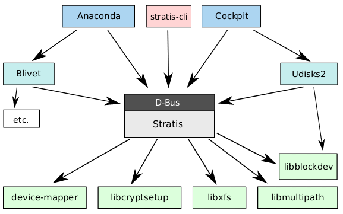

# 起因

我整理和汇总这篇文档的原因是最近一次在Btrfs上运行KVM虚拟机的时候，会出现Btrfs报错`csum failed`，随后出现CPU超过限值：

```
[Tue Oct  1 23:44:37 2019] BTRFS warning (device sda4): csum failed root 257
 ino 293 off 15661608960 csum 0x445ced74 expected csum 0x2f7d82ec mirror 1
[Tue Oct  1 23:44:38 2019] BTRFS warning (device sda4): csum failed root 257
 ino 293 off 15661608960 csum 0x445ced74 expected csum 0x2f7d82ec mirror 1
...
[Tue Oct  1 23:44:47 2019] mce: CPU2: Core temperature above threshold, cpu 
clock throttled (total events = 73235)
[Tue Oct  1 23:44:47 2019] mce: CPU3: Core temperature above threshold, cpu 
clock throttled (total events = 73235)
```

此时 `top` 观察系统处理器use和sys都不高，还有较多idle，但是系统负载达到10+，超过了主机cpu个数，运行非常缓慢。强制杀掉VM后回复正常。

另外一个现象是在 ``/var/lib/libvirt/images`` 目录下压缩30G大小Windows镜像，压缩非常缓慢远超过1小时，并且压缩文件解压缩以后，Wiondows虚拟机运行时显示磁盘文件系统损坏，而且Windows自动修复重启guest，但显示无法找到启动磁盘。这意味着虚拟机镜像破坏。

对比配置，可以看到我在这次arch linux的实践配置btrfs和之前在Ubuntu 18.04上配置的差异是，arch linux上的btrfs启用了磁盘压缩功能，启用了zstd。这个压缩功能可能引入了不稳定的因素。

最近(2019年9月底)，CentOS 8终于release，我惊讶发现，CentOS 8移除了btrfs文件系统支持。实际上，是上游 [Red Hat Enterprise Linux 8终止了btrfs支持](https://access.redhat.com/documentation/en-us/red_hat_enterprise_linux/8/html/considerations_in_adopting_rhel_8/file-systems-and-storage_considerations-in-adopting-rhel-8)，已经不能在RHEL 8/CentOS 8中创建和挂载Btrfs文件系统，[除非你自己编译内核支持btrfs并编译安装btrfs工具](https://unix.stackexchange.com/questions/543831/mounting-btrfs-in-rhel-8)，但这带来极大的维护成本（每次内核升级都需要自己维护版本）。

> 早在2017年phoronix新闻[Red Hat Appears To Be Abandoning Their Btrfs Hopes](https://www.phoronix.com/scan.php?page=news_item&px=Red-Hat-Deprecates-Btrfs-Again)已经公布了Red Hat放弃btrfs，并且在[Stratis Is Red Hat's Plan For Next-Gen Linux Storage Without Btrfs](https://phoronix.com/scan.php?page=news_item&px=Stratis-Red-Hat-Project)介绍了Red Hat的[Stratis项目](https://stratis-storage.github.io/)（一种本地文件系统），结合XFS和device-mapper来实现类似ZFS的技术。当前的实现是采用用户空间daemon来管理：



当前支持Btrfs的主流发行版本是SUSE，企业级应用案例是FaceBook。相信FaceBook这样的体量能够在内部针对btrfs进行深度定制和bug修复，以便能够充分发挥其特定优势。实际上大厂都有这样的开发团队来维护开源软件的特定分支，针对其业务特殊性定制。

从 2017 年LWN讨论 [Btrfs has been deprecated?](https://lwn.net/Articles/729488/) 提到了btrfs的一些缺陷:

* 不能稳定支持RAID5/6（官方wiki也这样说明）：
    * 对于大型公司(例如FaceBook)可能可以通过底层RAID硬件来弥补这个缺陷。

> 但是，随着现代化大型服务器使用的海量存储磁盘，如果发生磁盘故障，不论是软件RAID还是硬件RAID，底层RAID的同步复制会导致其他磁盘巨大的压力，由于同步时间周期极长，在同步期间，极有可能发生连锁的磁盘故障而导致数据丢失。
>
> 所以，在现代数据中心海量存储中，不建议使用RAID 5，而建议采用类似Ceph这样的分布式文件系统，将数据块部分分散到集群海量数量磁盘上，降低单磁盘故障风险。如果不得已要使用RAID，也至少要使用RAID6，推荐RAID10，并配置足够多的spare盘以便故障自动替换。

实际上，在Linux平台的文件系统中，ZFS由于较为完善地内建了RAID功能，所以比Btrfs有很大的优势。ZFS不需要底层RAID系统，直接控制单盘并实现RAID，可以较好地在文件系统层感知底层的硬件故障。所以，Red Hat的客户可能大多使用ZFS而不使用Btrfs，这样Red Hat抛弃Btrfs才能实行。

对于大型数据中心，Ceph分布式存储系统将数据块分散到海量服务器磁盘中，避免了硬件故障以及强制的整块故障硬盘数据复制(对数据修复的源、目的磁盘压力极大)。这也是当前大型集群的优选存储方案。并且Ceph已经发展成不需要底层文件系统，也是Red Hat主推的数据存储解决方案(Red Hat已经收购了Ceph)

* 如果文件系统发起TRIM请求(discard丢弃)，这个请求除了会转发给硬盘外，MD（即RAID）会记录一个或多个条代(strip)不再存储有用的信息（这个标志位会因为对条代的写入而失效）。在恢复过程中，进入每个条代的状态，MD只能处理RAID阵列的有效部分。
  * 对于大型TRIM请求，TRIM请求是块细粒度的。为了正确跟踪哪些条代有有效数据，MD需要为每个数据块记录这个数据块是否有有效数据。否则，就不能确定某些TRIM请求是否已经从条代中删除了最后使用的块。

> 以上对话似乎是表示MD对TRIM跟踪不利

* anton用户提供信息[BTRFS and RAID1](https://www.complang.tuwien.ac.at/anton/btrfs-raid1.html)信息介绍Btrfs组建RAID1遇到bug导致一块磁盘fail并进入只读文件系统模式，通过复制进行恢复，但没有丢失数据。

----

在Haker News上有关讨论：[Btrfs has been deprecated in RHEL](https://news.ycombinator.com/item?id=14907771)

* Red Hat放弃支持Btrfs可能是为了迫使下游发行Oracle Linux的Oracle公司加强合作并投入资源推动Btrfs稳定进入RHEL。因为没有Red Hat上游支持，Oracle要投入更多资源才能在clone lnux中稳定运行Btrfs
* Red Hat雇佣了大量的XFS开发人员，其内部主要的本地文件系统开发团队都围绕XFS进行，所以XFS是Red Hat主要支持技术
* Red Hat擅长雇佣不知名的开源开发者并帮助其获得开源影响力；但Red Hat待遇比Facebook,Google等大厂要低。如果能在Red Hat公司中成长起来，往往能够得业界较好的职位。
* XFS在数据库类型的高端应用上有较大性能优势（比EXT4性能要好），ZFS需要相应调整数据库参数，例如ZFS已经提供了保障就不需要开启InnoDB的双写缓存，此外还要条增数据库内存页大小，否则ZFS不能发挥良好的性能。
* 需要结合LVM来使用ext4/xfs，否则不能获得类似ZFS的快照功能。
* btrfs在创建或删除快照的时候影响存储性能：Btrfs不区分clone和snapshot，两者相同，并带有标志位。
    * 这种设计表面看起来简单方便，但是副作用是效率很低。
    * ZFS的快照归数据集所有，几乎没有刷新计数的开销，只是根据简单的交易ID编号将区块移动到deadlist。如果你修改了一个块，并且其事务ID大于最新快照，就以对其进行处理;否则就将其添加到快照deadlist(并添加新的更新块)。如果删除快照，则执行相同操作：对于每个块，如果块事务ID早于上一个快照的事务ID，则其丢弃，否则将其移至上一个快照的deadlist。除了减量处置外，没有其他变更。只有在创建clone时候ZFS才有开销，所以ZFS快照非常轻松。
    * 但是Btrfs的快照则代价高昂。
* ZFS具有细粒度的权限委派体系，这个体系通过数据集关系而不是功能继承。
* XFS缺乏透明压缩功能，这个功能可能在MD层面可以实现？
* XFS最新支持了CoW功能 - 见 [XFS now supports shared copy-on-write data extents](https://access.redhat.com/documentation/en-us/red_hat_enterprise_linux/8/html/considerations_in_adopting_rhel_8/file-systems-and-storage_considerations-in-adopting-rhel-8#xfs-now-supports-shared-copy-on-write-data-extents_file-systems-and-storage)，即 RHEL 8默认激活XFS的CoW功能，这个功能的工具支持从xfsprogs的4.17.0-2.el8开始。

----

Rad Hat有一篇技术介绍文档 [How to Choose Your Red Hat Enterprise Linux File System](https://access.redhat.com/articles/3129891):

# 存储技术未来 - 数据删重和数据压缩

[Red Hat 2017年收购了提供重复数据删除和数据压缩技术公司Permabit Technology Corporation](https://www.redhat.com/it/about/press-releases/red-hat-acquires-permabit-assets-eases-barriers-cloud-portability-data-deduplication-technology)这意味着企业级数据存储需要有效的存储增强技术。

