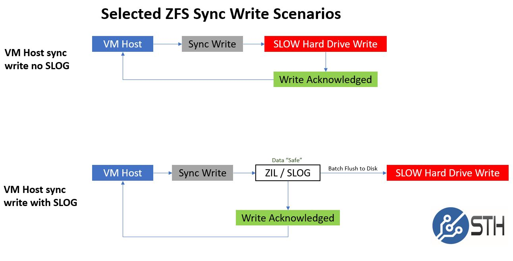
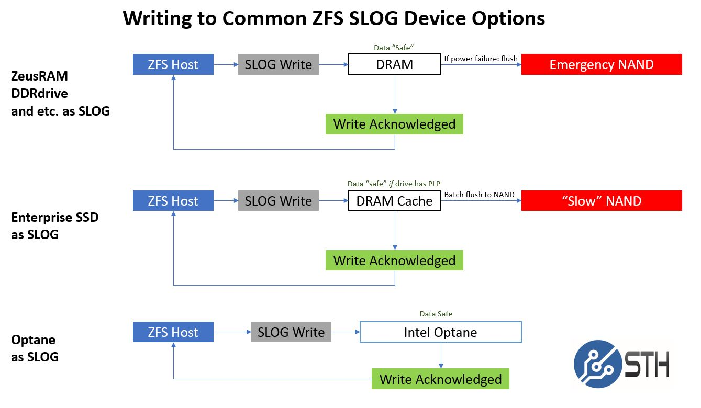

ZFS是一个具有强鲁棒性的文件系统，在数据写入磁盘和重要的元数据是会校验每个数据块，并将checksum写入多个位置。zfs可能会丢数据，但是它保证你不会有错误数据。

ZFS pool的冗余是通过底层的VDEVs来获得的，通过添加高速SSD和NVMe设备可以提高读写性能。

ZFS性能和缓存以及文件系统日志有很大关系，所以分两部分做优化：

* 写入性能和zil(ZFS Intent Log)相关，所以将ZFS日志存放到独立磁盘，特别是高速SSD磁盘能够带来写入性能的极大提高
* 读取性能和ARC和L2ARC相关，也就是内存预先划分的ARC区域可以缓存文件系统的数据结构，可以提高数据读取性能

# 同步和异步写

ZFS和其他文件系统类似，会尝试在内存中维护一个写操作的buffer，然后再回写到磁盘，而不是直接写入磁盘。这种异步写入可以提高应用程序的写入性能但是也带来了数据安全性问题。所以，对于高数据安全要求的，例如数据库系统，以及NFS，都要求任何时候都采用同步写入机制(synchronous write)。

```bash
zfs set sync=always mypool/dataset1
```

如果要求极高的读写性能而不在意文件是否是同步写入模式，则可以考虑ZIL优化。

> 也就是如果允许写入失败，允许数据丢失，但是依然能够保证数据完整性，则可以使用异步写入模式，通过ZIL来保证数据完整正确，同时通过独立的LOG设备来提高写入性能。

# ZFS Intent Log(ZIL)和SLOG设备

ZFS Intent Log作为ZFS存储池的组成部分，在数据实际写入主存储池之前用于存储新建或修改数据，默认ZIL是分布在所有VDEVs设备上的。对于使用传统的机械磁盘，ZIL的写入性能会影响实际的数据写入速度。所以，通过将ZIL分离到独立的高速(较小的)NVMe或SSD存储设备，可以提高写入性能。这种独立的日志设备，称为 SLOG (Seperate Intent Log) :

```bash
zpool add tank log ada3
```

上述 `tank` 是存储池名字，关键字 `log` 表示设备 `ada3` 被是为SLOG设备。

然后，通过一下命令可以检查设别状态：

```bash
zpool status tank
```

当然，需要考虑SSD设备故障，可以使用多个SSD设备镜像模式或者RAIDZ模式:

```bash
zpool add tank log mirror ada3 ada4
```

这样再使用 `zpool status tank` 可以看到log设备是镜像模式的。

## SLOG设备容量

SLOG设备的容量和ZFS的存储池写入数据速度有关，越是大量数据写操作，就要求更大的SLOG设备容量。不过，通常SLOG设备要求空间并不是很大。[size the write cache ZFS](https://serverfault.com/questions/556714/size-the-write-cache-zfs)推荐的SSD磁盘容量约4~8G，不过具体还是需要和你存储写入数据有关，需要记录的ZIL数据量有关。

# Adaptive Replacement Cache(ARC)和L2ARC

对于读操作缓存，ZFS采用了一种称为Adaptive Replacement Cache(ARC)。对于传统的读缓存(read caching)最近使用对象缓存，ZFS更加强了数据访问的频率。也就是ZFS不仅是对最近访问的对象进行缓存，还对频繁使用的数据对象进行缓存。

L2ARC，也称为 Level 2 ARC，是ARC的扩展。如果你有一个独立的存储设备作为L2ARC，就可以用来存储不那么重要没有被缓存在ARC中的数据。你可以将这种结构视为二级ARC呼缓存，也就是ARC是内存缓存，L2ARC是高速存储缓存。通常L2ARC是使用比内存慢一些的NVMe设备。

以下命令可以添加一个L2ARC设备到ZFS存储池

```bash
zpool add tank cache ada3
```

有关SLOG设备的架构原理，请参考 [What is the ZFS ZIL SLOG and what makes a good one](https://www.servethehome.com/what-is-the-zfs-zil-slog-and-what-makes-a-good-one/) 有很详细的示意图，可以帮助理解这个架构。



> 不过，这个文档主要针对Intel最新的Optane存储对比



> 我记得默认ARC是1/2的物理内存，如果你的服务器设别仅用于存储目的，并没有其他应用需要使用大量的内存（如数据库），则可以考虑调整ARC容量，用更大的ARC容量来加速读取性能。

# 参考

* [Configuring ZFS Cache for High Speed IO](https://linuxhint.com/configuring-zfs-cache/)
* [ZFS Intent Log](http://nex7.blogspot.com/2013/04/zfs-intent-log.html)
* [size the write cache ZFS](https://serverfault.com/questions/556714/size-the-write-cache-zfs)
* [What is the ZFS ZIL SLOG and what makes a good one](https://www.servethehome.com/what-is-the-zfs-zil-slog-and-what-makes-a-good-one/)
* [Calculation of SSD size for SLOG/ZIL device](https://www.ixsystems.com/community/threads/calculation-of-ssd-size-for-slog-zil-device.17515/)