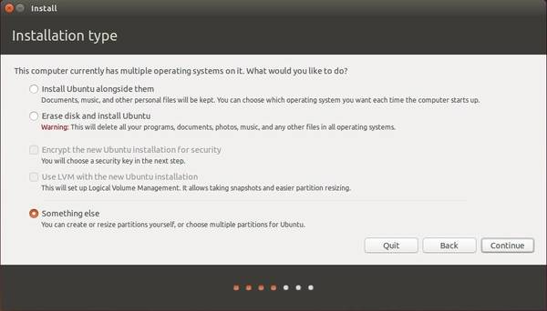

在部署[Linux from Stratch](../../lfs/introduce)时，考虑到在只有64GB磁盘空间的MacBook Air上安装LFS，磁盘空间有限，所以决定把编译LFS的host系统（采用Ubuntu）安装到U盘上。

尝试了几次，包括在笔记本上插2个U盘，其中一个U盘采用`dd`命令将ISO文件写入作为Live-CD，启动后将操作系统安装到另外一个U盘。但是，没有想到，MacBook Air启动时按下`option`键并没有看到安装后的Ubuntu磁盘。

参考了[How to Install The Real Ubuntu System on USB Flash Drive](http://ubuntuhandbook.org/index.php/2014/11/install-real-ubuntu-os-usb-drive/)发现我有一步做错了：

* 安装过程中，不能使用默认的`Install Ubuntu alonside MacOS`（原先我的笔记本有一个分区时Mac，但是这个是笔记本内置硬盘`/dev/sda`），这会导致GRUB启动管理器被安装到`sda`磁盘（虽然在Mac上启动按下`option`键可以跳过GRUB没有导致实际产生破坏），而不是安装到U盘`sdb`。所以启动时，Mac操作系统无法使用`option`键选择U盘启动。

# 具体操作

> 操作需要2个U盘，一个是LiveCD磁盘，一个是安装目标磁盘。这两个磁盘都在MacOS操作系统中格式成FAT文件格式，磁盘分区表类型MBR。这步操作是为了生成标准的DOS分区，实际在Liunx下也能操作。

## 对LiveCD的U盘操作

### 使用`dd`命令创建LiveCD启动U盘（实际操作）

```
sudo dd bs=4M if=xubuntu-16.04.3-desktop-amd64.iso of=/dev/sdb
```

### 使用UNetbooin创建LiveCD启动U盘（可选方法）

* 首先将U盘格式化成`FAT32`文件系统，然后挂载到`/mnt`目录（这是 [UNetbootin](http://unetbootin.github.io/) 的使用要求)

```
sudo mount /dev/sdb1 /mnt
```

* 使用[UNetbootin](http://unetbootin.github.io/)选择安装ISO镜像，写入到上述FAT32分区中。

```
sudo QT_X11_NO_MITSHM=1 /usr/bin/unetbootin
```

> 注意：这个LiveCD磁盘被是被成`sdb`

## 对目标安装U盘分处理

* 使用`GParted`工具直接删除目标U盘的FAT32分区，这样可以空出完整的U盘用于安装Ubuntu。注意：这个磁盘被识别成`sdc`

## 安装操作系统Ubuntu

* 选择安装类型时一定要选择`Something else`，这样就可以选择分区表：



* 最重要的一点是将boot-loader安装到USB flash驱动器`/dev/sdc`上，这样才能够在启动时选择该磁盘。