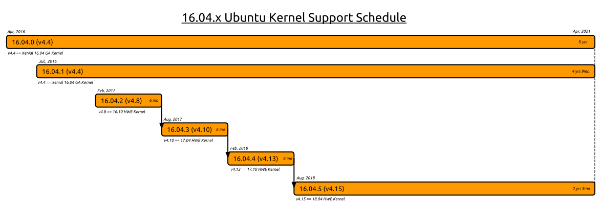

在安装Ubuntu Linux时，默认选项是`Install Server`，在这个选项下方还有一个选项`Install Server with HWE kernel`。那么，什么是HWE内核呢？

在Ubuntu发布之后，到下一个release发布时间间隔为6个月。在此期间，新的硬件设备更新发布非常频繁。为了能够及时获取最新的硬件技术支持，Ubuntu提供了一种称为Hardware Enablement(HWE)的内核，这种内核采用滚动发布方式，一旦新的内核发布，立即由Ubuntu打包并测试，然后提供给Ubuntu用户。这种方式带来了一些缺点：新内核发布过于快速，可能引入一些bug和问题，并且可能不适合企业使用。

Ubuntu提供至少2中内核：`General Avaliability(GA)`内核，是最稳定的内核，不会在release点更新；另一种是`Hardware Enablement(HWE)`内核，提供最快速更新发布。

以上两个内核也就是`linux-generic`和`linux-hwe-generic`软件包。

# LTS EnablementStack Stacks

Ubuntu LTS enablement(HWE) stacks提供较新的内核和X支持，可以手工安装也可以在安装系统是安装：

* 桌面安装HWE stack:

```
sudo apt-get install --install-recommends linux-generic-hwe-16.04 xserver-xorg-hwe-16.0
```

* 服务器安装HWE stack:

```
sudo apt-get install --install-recommends linux-generic-hwe-16.04 
```

* 检查当前支持状态：

```
hwe-support-status --verbose
```



# 升级内核

注意：在安装了Ubuntu系统后，使用`apt-get update`和`apt-get upgrade`更新系统，依然会有一个提示

```
The following packages have been kept back:
  libdrm2 linux-generic-hwe-16.04 linux-headers-generic-hwe-16.04 linux-image-generic-hwe-16.04
```

则以上软件包并没有更新。

这是为何？


# 参考

* [What is hardware enablement (HWE)?](https://askubuntu.com/questions/248914/what-is-hardware-enablement-hwe)
* [LTSEnablementStack](https://wiki.ubuntu.com/Kernel/LTSEnablementStack)
* [RollingLTSEnablementStack](https://wiki.ubuntu.com/Kernel/RollingLTSEnablementStack)