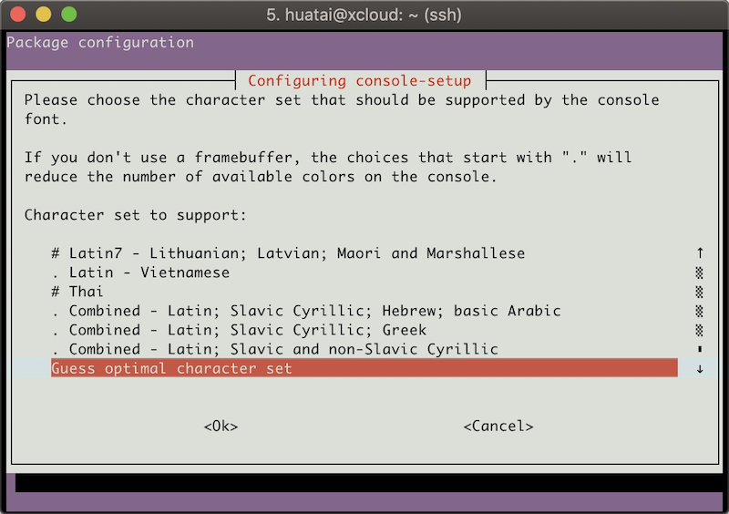

在使用MacBook Pro这样的Retina屏幕的时候，Ubuntu Linux字符终端启动后，字体会显得非常细小难以看清。

解决的方法是使用 `sudo dpkg-reconfigure console-setup` 来重新设置字符终端使用的字体：

* 首先选择默认编码 `UTF-8`


* 选择默认字符集 `Guess optimal character set`



* 选择字体 `Terminus` （这个字体支持framebuffer，可以支持多种分辨率；如果选择 `Fixed` 则只适合纯文本终端，可选的字体最大只有8x18，这样在Retina屏幕依然看不清）


* 选择字体 `11x22` 字体 或 `11x24` 字体 （或者字体更清晰的 `14x28`字体）        


# SPARC Console font

在[archlinux: MacBookPro11,x](https://wiki.archlinux.org/index.php/MacBookPro11,x#Kernel_parameters) 也提到了在高分辨率的MacBook Pro上使用更大字体的方法：

```
setfont sun12x22
```

不过，这种sun字体是sparc console font，需要从 `kbd` 源下载（不过这个源可能要搜索找到）

```
apt-get source kbd
```

另外，在 https://github.com/talamus/solarize-12x29-psf 有下载 Solarris 12x29.psfu.gz 软件包，保存到目录 `/usr/share/consolefonts/` 目录下，就可以使用 `setfront` 进行设置字体了。

# 参考

* [How do I change the font or the font size in the TTY (console)?](https://askubuntu.com/questions/173220/how-do-i-change-the-font-or-the-font-size-in-the-tty-console)
* [SPARC Console font from Sun machines](https://ubuntuforums.org/showthread.php?t=2356167)