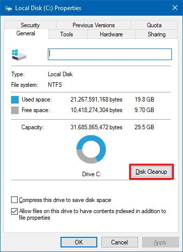
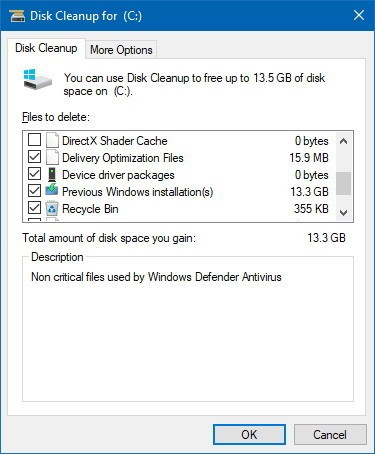
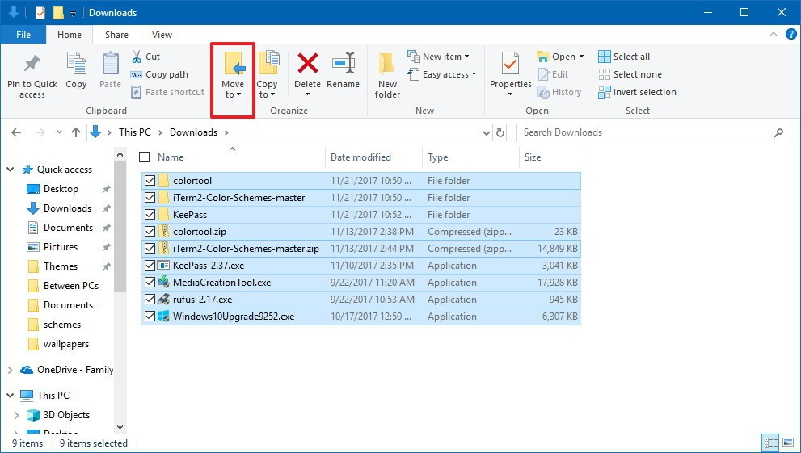
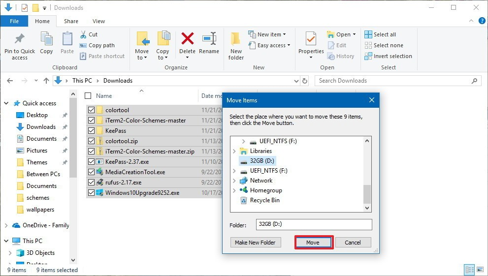
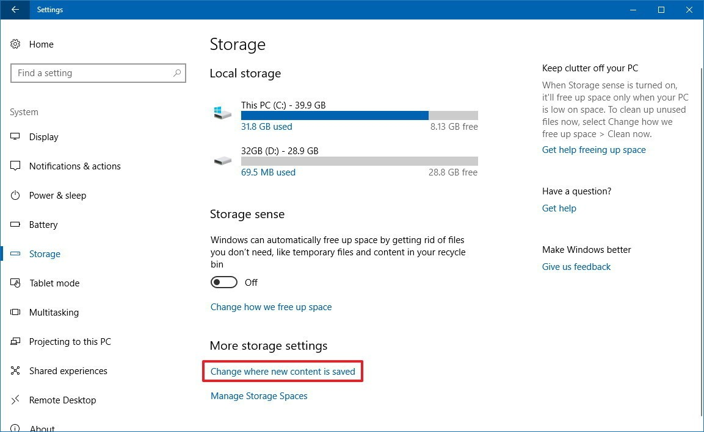
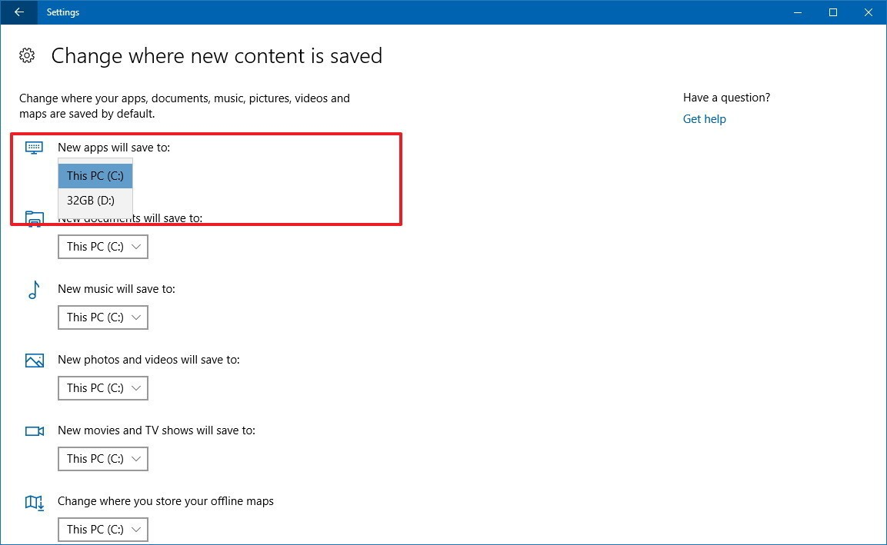
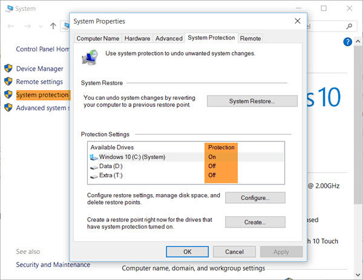

现代的Windows操作系统功能繁杂，初始安装的操作系统就非常占用磁盘空间。

> 我的笔记本硬件非常弱，创建的Windosw 10虚拟机磁盘非常小。为了能够清理出尽可能多的磁盘空间，我参考[7 best ways to free up hard drive space on Windows 10](https://www.windowscentral.com/best-7-ways-free-hard-drive-space-windows-10)做了磁盘空间清理，原文翻译整理如下：

# 使用Storage sense(存储检测)删除垃圾文件

Windows 10的Storage sense提供了一个基本选项可以用来删除磁盘中的垃圾文件，包括升级以后以前版本的Windows，能够释放出大量磁盘空间

* 打开`Settings`
* 点击`System`
* 点击`Storage`然后点击`Change how we free up space`链接


* 在`Temporary files`选项下可以选择你希望删除的文件，包括：
  * 删除应用程序不再使用的临时文件
  * 删除回收站里超过30天的文件
  * 删除下载目录下没有修改过的超过30天的文件

* 在`Free up space now`选项下，可以删除以前安装版本的Windows 10文件。不过这个选项只在安装了新版本升级之后10天以后才提供


完成以上步骤后，点击`Clean now`按钮就可以立即清理空间。

> 注意：如果你开启了 `Storage sense`（存储检测）功能（见上图），则激活了系统自动清理磁盘空间功能。

# 使用Disk Cleanup（磁盘清理）清理系统垃圾文件

Disk Cleanup(磁盘清理)功能已经在Windows操作系统提供了很多年，可以用来删除磁盘中不需要的文件，包括系统文件，系统恢复和影子副本，以便释放出系统可用空间。

## 删除系统文件

* 打开文件管理器`File Explorer`
* 在`This PC`栏，右击主系统磁盘驱动器（一般就是`C:`磁盘），然后选择属性`Properties`


* 点击"磁盘清理"`Disk Cleanup`按钮



* 点击"清理系统文件"`Cleanup system files`按钮


* 选择你希望删除的文件来释放空间，包括
  * Windows升级文件
  * Windows升级日志文件
  * 下载的程序文件
  * 临时Internet文件
  * 系统创建的Windows错误报告
  * 发送优化文件
  * 回收箱
  * 临时文件
  * 临时Windows安装文件
  * 以前的Windows安装文件



> 以上可见的选项随系统状态不同而不同。例如，如果Windows 10已经删除了以前版本文件，则不会有"以前的Windows安装文件"`Previous Windows installation(s)`选项。

* 点击`OK`
* 点击"删除文件"`Delete Files`

## 删除系统恢复和影子副本

如果你经常创建系统恢复点`System Restore points`并使用影子副本`Shadow Copies`（通常卷快照是由Windows Backup使用的），你就可以通过删除这些文件来释放附加的空间。

* 打开"文件管理器"`File Explorer`
* 在`This PC`栏，右击主系统磁盘驱动器（一般就是`C:`磁盘），然后选择属性`Properties`
* 点击"磁盘清理"`Disk Cleanup`按钮
* 点击"清理系统文件"`Cleanup system files`按钮
* 点击"更多选项"`More options`页面
* 在"系统恢复和影子副本"`System Restore and Shadow Copies`栏，点击"清理"`Cleanup`按钮
* 点击"Delete"`Delete`确认


# 卸载永不使用的应用和游戏

从Microsoft Store和其他软件源安装的软件和游戏会占用大量的存储资源，所以移除不使用的软件和游戏可以释放大量的磁盘资源：

* 打开"设置"`Settings`
* 点击"应用"`Apps`
* 点击"应用和特性"`Apps & features`
* 选择应用或游戏，然后点击`Uninstall`按钮


> 选择`Sort by`下拉菜单和选择`Size`来列出应用和游戏，可以快速找到需要的对象然后卸载

# 使用OneDrive文件的`On-Demand`（按需）功能

OneDrive文件的`On-Demand`是一个允许文件存储在云存储无需同步到本地存储的功能。当本地存储空间不足，可以使用文件的`On-Demand`上传到OneDrive云存储并仅在需要的时候下载。

## 激活OneDrive文件On-Demand功能

* 在通知区域鼠标右击`OneDrive`云存储图标，然后选择`Settings`


* 点击`Settings`面板

* 在`Files On-Demand`，选择`Save space and download files as you use them`来激活这个功能


* 然后点击OK

## 释放空间

* 打开`OneDrive`文件目录
* 选择 **只希望保留在云存储** 的文件和目录
* 鼠标右击这些选择对象，然后选择`Free up space`（释放空间）


以上设置将文件始终存储在OneDrive云存储，这样可以释放本地磁盘的空间。

> 免费的OneDrive存储空间5G，超出需要订阅收费

# 通过压缩操作系统(Compact OS)肩上Windows 10占用空间

Compact OS（压缩操作系统）是一个Windows 10引入的功能，允许压缩安装的文件和内建的桌面应用程序来降低磁盘空间占用。

> 警告：虽然压缩操作系统是安全的操作，但是在操作之前建议先完整备份一次系统。

* 点击"启动"`Start`
* 搜索`Command Prompt`，右击鼠标，然后选择`Run as administrator`
* 输入以下命令并执行以启动Windows 10和应用程序压缩：

```
Compact.exe /CompactOS:always
```


压缩操作系统`Compact OS`大约花费10到20分钟。

任何时候，都可以恢复回滚压缩 `Compact.exe /CompactOS:never`

# 禁用Windows 10的Hibernation

Hibernation是一个将内存中内容存储到硬盘，允许不丢失当前会话的情况下完全关闭设备。

虽然`Hibernation`是一个有用的功能，但是需要在磁盘中保留数G和内存相当容量的磁盘空间：


如果需要释放磁盘空间，可以禁用这个Hibernation功能：

* 点击"启动"`Start`
* 搜索`Command Prompt`，右击鼠标，然后选择`Run as administrator`
* 输入以下命令关闭Hibernation功能：

```
powercfg /hibernate off
```


> 上述设置会关闭hibernate功能，也就不能使用`Hibernation`了，但是可以立即释放出可用空间

# 将文件、应用和游戏移动到外部硬盘驱动器

使用外部驱动器，你可以移动现有文件，并配置Windows 10将新文件存储到新存储上。也可以移动一些Microsoft Store apps和games到新驱动器以便释放更多系统磁盘空间。

## 移动现有文件到新位置

* 连接外接移动存储
* 打开文件管理器`File Explorer`
* 找到需要移动的文件和目录
* 在`Home`面板，点击`Move`按钮



* 选择`Choose location`选项
* 选择新的驱动器
* 然后点击`Move`按钮



## 保存新文件到新驱动器

为了自动将文件保存到新的位置，采用如下步骤

* 连接外接移动存储
* 打开"设置"`Settings`
* 点击"系统"`System`
* 点击"存储"`Storage`
* 在`More storage settings`（更多存储选项）中，选择`Change where new content is saved`（修改新内容存储位置）这个链接



* 在下拉菜单中，选择Windows为每个内容类型自动存储文件的位置：



## 移动应用和游戏到新的驱动器

* 连接外接移动存储
* 打开"设置"`Settings`
* 点击"应用"`Apps`
* 点击"应用与特性"`应用与特性`
* 选择一个应用或者游戏
* 点击"移动"`Move`按钮
* 在下啦菜单中选择新的位置
* 点击"移动"`Move`按钮


----

# System Restore

Windows 10提供了内置的System Restore，和System Backup有所不同。System Restore是捕获常驻程序，程序设置以及Windows注册表到一个镜像，并且备份一些在恢复系统是需要存储的信息。这样程序意外时可以通过System Restore来恢复。

选择 `System` > `System protection` => 选择`System Protection`面板可以看到 `Protection Settings`设置。如果要启用，则针对磁盘驱动器配置启用，否则可关闭。




如果上述选项灰色不能选择，则可能需要命令行激活。注意需要在PowerShell窗口中激活

```
Enable-ComputerRestore -Drive "C:\"
```

# 参考

* [7 best ways to free up hard drive space on Windows 10](https://www.windowscentral.com/best-7-ways-free-hard-drive-space-windows-10)