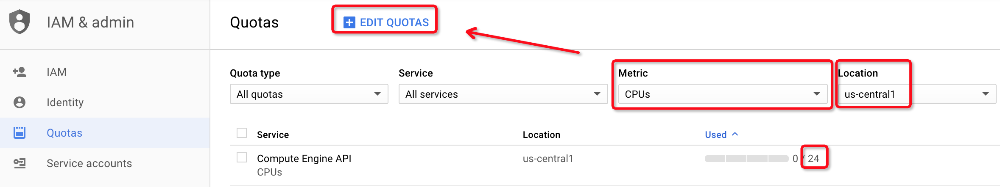

# 启用结算

在创建虚拟机之前，需要先在Google Cloud Platform平台启用Compute Engine的结算功能。

> [Google Compute Engine Pricing](https://cloud.google.com/compute/pricing?hl=zh_CN&_ga=2.261644878.-234204476.1523272028)

# 安装gcloud

python版本客户端安装参考[GoogleCloudPlatform/google-cloud-python](https://github.com/GoogleCloudPlatform/google-cloud-python)

```
curl https://sdk.cloud.google.com | bash
```

> RedHat平台需要先安装`python-devel`软件包才能执行上述安装命令。

设置授权：

```
gcloud auth login
```

# 激活Compute Engine API

开始时候Compute Engine API尚未激活，此时直接执行测试会提示错误：

```
STDOUT:
STDERR: ERROR: (gcloud.compute.networks.create) HTTPError 403: Access Not Configured. Compute Engine API has not been used in project XXXXXXXXXXX before or it is disabled. Enable it by visiting https://console.developers.google.com/apis/api/compute.googleapis.com/overview?project=XXXXXXXXXXX then retry. If you enabled this API recently, wait a few minutes for the action to propagate to our systems and retry.
```

激活此Compute Engine API之后，再次测试

```
./pkb.py  --cloud=GCP --zones=us-central1-a --machine_type=f1-micro --benchmarks=cluster_boot
```

# 升级收费账号

免费账号在单个区域只能使用8个core

```
ERROR: (gcloud.compute.instances.create) Could not fetch resource:
 - Quota 'CPUS' exceeded. Limit: 8.0 in region us-central1.
```

升级成收费账号后，默认每个region可以创建24核实例，若继续申请，则需要在自己的`Compute Engine => Quotas`中编辑对应的区域。当执行`EDIT QUOTAS`时，系统会引导你提交一个申请



提交后，联系邮箱会收到支付指导邮件，按照邮件提供的参考文档，在`Billing`中手工通过信用卡支付一定费用，然后答复支付指导邮件。