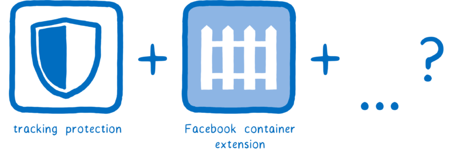

> 2018年6月1日[Mozilla 邀请用户测试 DNS over HTTPS](https://www.solidot.org/story?sid=56697)，这是自2016年4月1日[Google提供公共DNS-over-HTTPS](https://developers.google.com/speed/public-dns/docs/dns-over-https)之后，浏览器客户端重要的改进。
>
> 本文是开源浏览器Firefox开发组织[Mozilla](https://www.mozilla.org) hacks网站一篇介绍DNS over HTTPS技术的科普文章[A cartoon intro to DNS over HTTPS](https://hacks.mozilla.org/2018/05/a-cartoon-intro-to-dns-over-https/)的翻译。

用户隐私和安全的威胁日益增加。在Mozilla，我们仔细地跟踪这些威胁。我们相信我们有责任做任何能够保护Firefox用户和他们的数据。

我们将讨论那些想要安全搜集和发送用户数据的有关公司和组织。这就是为何我们增加了[跟踪保护](https://blog.mozilla.org/firefox/tracking-protection-always-on/)并创建了[Facebook容器扩展](https://blog.mozilla.org/firefox/facebook-container-extension/)的原因。并且你将看到我们将在接下来几个月内做更多的事情来保护我们的用户。

我们加上了以下列表中2个附加保护：

* DNS over HTTPS，一个我们所倡导的IETF新标准
* 可信赖递归解析器，我们和[Cloudflare](https://www.cloudflare.com/)合作的提供的一个用来解析DNS新的安全方式

通过这两种措施，我们杜绝了已经有35年历史的域名解析系统的数据泄漏。我们希望你帮助测试它们。所以让我们来看看DNS over HTTPS和可信赖递归解析器如何保护我们的用户。

不过首先让我们看看web网页是如何在Internet上传递的。

> 如果你已经知道DNS和HTTPS是如何工作的，你可以直接跳到[how DNS over HTTPS helps](https://hacks.mozilla.org/2018/05/a-cartoon-intro-to-dns-over-https/#trr-and-doh)部分阅读。

# 一个简短的HTTP速成课程

当人们解释浏览器如何下载一个web网页，他们通常解释如下：

* 你的浏览器向服务器发出一个GET请求
* 服务器发送一个响应，这个响应就是一个包含了HTML的文件

这个系统被称为HTTP。

但是这个图解有一点过于简化了。你的浏览器不是直接和服务器对话的。这是因为它们并不是彼此接近的。

相反，服务器可能举例数千英里之外。并且并没有你的计算机和服务器之间的直接连接。

所以这个请求需要从浏览器发送到服务器，并且它（请求）将经过多人之手才能到达。同样的，从服务器返回的响应也是经过多人之手。

我想这个过程就类似课堂上小孩传递小本本。在小本本的封面上写着它希望传递给谁。那个写了小本本的小孩将它传递给他的邻桌。然后另一个小孩再传递给另一个邻桌 -- 如果他不是最终的收件人，但是他却是目标方向的中间人。

这里有一个问题就是任何在这个传递路径上的人都可以打开小本本并阅读它。并且我们没有办法知道本子传递采用的路径，所以也不能知道哪些人会访问它。

这个小本本也可能会落入作恶之人的手中...

类似将小本本的内容公开给每个人。

或者修改响应。（想想学校里恶作剧的恋爱妒忌者）

为了解决这些问题，一个新的，安全版本的HTTP被创建出来。这个协议称为HTTPS。通过HTTPS，就好像每个消息有一把锁在上面。

浏览器和服务器都知道锁的组合，但是它们中间经过者则不知道。

通过使用HTTPS，即使消息经过多个路由器，只有你和web网站知道如何阅读内容。

这个方法解决了很多安全问题。但是依然有一些在你的浏览器和服务器之间传递的消息没有加密。这意味着所经过路径上的人依然能够窥探你在做什么。

一个暴露数据的地方就是和服务器建立连接的过程。当你发送初始化数据给服务器，你发送服务器的名字（在一个称为"服务器名字标识"的字段）。这就让工作在相同的服务器上多个网站的服务器操作员就能够知道你所通讯的目标。这个初始化请求是设置加密的部分，但是初始化请求自身并没有加密。

另外一个泄漏数据的地方是DNS。但是什么是DNS？

# DNS：域名系统

在上述传递小本本的比喻，我说到在小本本的外封面上的接受者的名字。对于HTTP请求这实际上...嗯，它们说